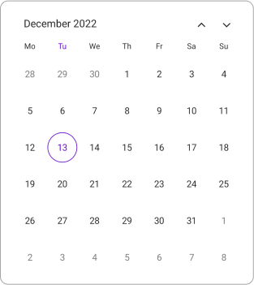
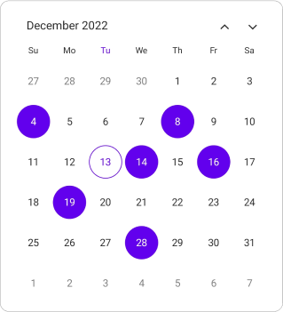

# Getting started with .NET MAUI Calendar (SfCalendar)
This section explains how to add the Calendar control. This section covers only the basic features needed to get started with Syncfusion Calendar.

To get start quickly with our .NET MAUI Calendar, you can check the below video.



## Creating an application using the .NET MAUI Calendar

1. Create a new .NET MAUI application in Visual Studio.

2. Syncfusion .NET MAUI components are available on [nuget.org](https://www.nuget.org/). To add `SfCalendar` to your project, open the NuGet package manager in Visual Studio, search for [Syncfusion.Maui.Calendar](https://www.nuget.org/packages/Syncfusion.Maui.Calendar), and then install it.

3. To initialize the control, import the control namespace `Syncfusion.Maui.Calendar` in XAML or C# code.

4. Initialize `SfCalendar.`




<ContentPage   
    . . .
    xmlns:calendar="clr-namespace:Syncfusion.Maui.Calendar;assembly=Syncfusion.Maui.Calendar">

    <calendar:SfCalendar />
</ContentPage>




using Syncfusion.Maui.Calendar;
. . .

public partial class MainPage : ContentPage
{
    public MainPage()
    {
        InitializeComponent();
        SfCalendar calendar = new SfCalendar();
        this.Content = calendar;
    }
}




## Register the handler

The `Syncfusion.Maui.Core` NuGet is a dependent package for all Syncfusion controls of .NET MAUI. In the `MauiProgram.cs` file, register the handler for Syncfusion core.




using Syncfusion.Maui.Core.Hosting;
namespace GettingStarted
{
    public static class MauiProgram
    {
        public static MauiApp CreateMauiApp()
        {
            var builder = MauiApp.CreateBuilder();

            builder.ConfigureSyncfusionCore();
            builder
            .UseMauiApp<App>()
            .ConfigureFonts(fonts =>
            {
                fonts.AddFont("OpenSans-Regular.ttf", "OpenSansRegular");
                fonts.AddFont("Segoe-mdl2.ttf", "SegoeMDL2");
            });

            return builder.Build();
        }
    }
}




## Change different calendar views

The [.NET MAUI Calendar](https://help.syncfusion.com/cr/maui/Syncfusion.Maui.Calendar.SfCalendar.html) control provides four different types of views to display dates, and it can be assigned to the control using the [View](https://help.syncfusion.com/cr/maui/Syncfusion.Maui.Calendar.SfCalendar.html#Syncfusion_Maui_Calendar_SfCalendar_View) property. By default, the control is assigned to the [Month](https://help.syncfusion.com/cr/maui/Syncfusion.Maui.Calendar.CalendarView.html#Syncfusion_Maui_Calendar_CalendarView_Month) view. Initially, all Calendar views will show the current date.




<calendar:SfCalendar  x:Name="Calendar" 
                        View="Month">
</calendar:SfCalendar>




this.Calendar.View = CalendarView.Month;




## Change first day of week

The Calendar control is rendered with `Sunday` as the first day of the week and it allows customization to change the first day of the week using the [FirstDayOfWeek](https://help.syncfusion.com/cr/maui/Syncfusion.Maui.Calendar.CalendarMonthView.html#Syncfusion_Maui_Calendar_CalendarMonthView_FirstDayOfWeek) property in month view.

The following code explains how to show the Calendar with `Monday` as the first day of the week.

  


<calendar:SfCalendar x:Name="calendar">
    <calendar:SfCalendar.MonthView>
        <calendar:CalendarMonthView FirstDayOfWeek="Monday"/>
    </calendar:SfCalendar.MonthView>
 </calendar:SfCalendar>




this.Calendar.MonthView.FirstDayOfWeek = DayOfWeek.Monday;

  


## Date selection

The [Calendar](https://help.syncfusion.com/cr/maui/Syncfusion.Maui.Calendar.SfCalendar.html) allows the user to select a single date, multiple dates, or a range of dates by interaction or programmatic selection. The default selection mode is `Single`.

The selection details can be obtained by using the [SelectionChanged](https://help.syncfusion.com/cr/maui/Syncfusion.Maui.Calendar.SfCalendar.html#Syncfusion_Maui_Calendar_SfCalendar_SelectionChanged) event of the calendar. It returns `CalendarSelectionChangedEventArgs`, which holds the details about the selected date or range.

The following code explains how to show the Calendar with `Multiple` as the Selection mode.

  


<calendar:SfCalendar  x:Name="Calendar" 
                      SelectionMode="Multiple">
</calendar:SfCalendar>




this.Calendar.SelectionMode = CalendarSelectionMode.Multiple;

  


## Action buttons

You can display action buttons at the bottom of the calendar by using the `ShowActionButtons` property of the SfCalendar. It allows you to confirm or cancel the selected date, dates, and range of dates in calendar views of the `SfCalendar`.

  


<calendar:SfCalendar x:Name="Calendar" 
                     View="Month" 
                     ShowActionButtons="True">
 </calendar:SfCalendar>




this.Calendar.ShowActionButtons = true;

  


## Today button

The today button can be displayed at the bottom of the calendar using the `ShowTodayButton` property of the `SfCalendar`, allowing you to quickly navigate from current view to the today view.

  


<calendar:SfCalendar x:Name="Calendar" 
                     View="Month"
                     ShowTodayButton="True">
 </calendar:SfCalendar>




this.Calendar.ShowTodayButton = true;




