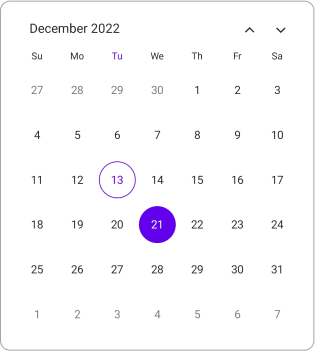
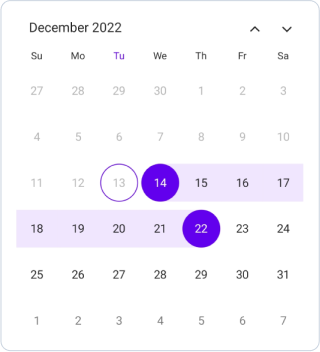

# Selections in MAUI Calendar (SfCalendar)
The Selection mode is specified in the calendar property enumeration. Can select the dates by tap the cell in the calendar. `SfCalendar` provides three types mode such as `Single`, `Multiple` and `Range` Selection. The default `SelectionMode` is Single that allows the user to select one date at a time.

>**NOTE** Can able to select the cells in the Year, Decade and Century views in the calendar only when the `AllowViewNavigation` property is set to false.

## Single selection
The `Single` selection can be performed in the Calendar by setting the `CalendarSelectionMode` property to `Single`. In this Selection, you can able to select a single date from the cell.




<calendar:SfCalendar  x:Name="Calendar" 
                        View="Month"
                        SelectionMode="Single">
</calendar:SfCalendar>




this.Calendar.SelectionMode = CalendarSelectionMode.Single;






>**NOTE**
* In the Year, Decade and Century views can able to select the cells, only when the `AllowViewNavigation` property is set to false.
* In this scenario, the `selection changed` callback will return the first date of the month, year, decade or century of the selected cell.
Eg: 
* In the year view, when the Dec month cell is selected then the selected date value will be 01-12-2022.
* In the decade view, when the (2022) year cell is selected then the selected date value will be 01-01-2022.
* In the century view, when the (2020-2029) decade cell is selected then the selected date value will be 01-01-2020.

## Multiple selection
The `Multiple` selection can be performed in the Calendar by setting the `CalendarSelectionMode` property to `Multiple`. In this Selection, you can able to select a multiple dates from the cell. If you want to remove the selected cell by clicking the same cell again.




<calendar:SfCalendar  x:Name="Calendar" 
                        View="Month"
                        SelectionMode="Multiple">
</calendar:SfCalendar>




this.Calendar.SelectionMode = CalendarSelectionMode.Multiple;




## Range selection
The `Range` selection can be performed in the Calendar by setting the `CalendarSelectionMode` property to `Range`. In this Selection, you can able to select a range of dates from the cell by interacting the cell either tap or swipe action. Swipe action can only performed by setting the [enableSwipeSelection] property to `true` in the calendar.




<calendar:SfCalendar  x:Name="Calendar" 
                        View="Month"
                        SelectionMode="Range">
</calendar:SfCalendar>




this.Calendar.SelectionMode = CalendarSelectionMode.Range;




>**NOTE**
* In the Year, Decade and Century views can able to select the cells, only when the `allowViewNavigation` property is set to false.
* In this scenario, the `selection changed` callback will return the first  and last date of the month, year, decade or century of the selected cell when the seletionmodeis set to `range `.
Eg: 
* In the year view, when the range is selected as Sep - Dec, then the range value will be 01-09-2022 to 31-12-2022.
* In the decade view, when the range is selected as 2022 - 2025, then the range value will be 01-01-2022 to 31-12-2025.
* In the century view, when the range is selected as 2020-2029 to 2030-2039, then the range value will be 01-01-2020 to 31-12-2039.

### Range Selection Direction
The Range Selection Direction is specified in the calendar property enumeration which is uesd to select the range based on the direction. The `RangeSelectionDirection` provides five types of direction such as `Default`, `Forward`, `Backward`, `Both` and `None`. The default `RangeSelectionDirection` is `Default` in the SfCalendar.

#### Range Selection Direction - Forward
If the `RangeSelectionDirection` property to `Forward` allows you to select only the dates after the selected range start date and the dates before the range start date is considered as disabled date. The start date will not be changed.




<calendar:SfCalendar  x:Name="Calendar" 
                        View="Month"
                        SelectionMode="Range"
                        RangeSelectionDirection="Forward">
</calendar:SfCalendar>




this.Calendar.SelectionMode = CalendarSelectionMode.Range;
this.Calendar.RangeSelectionDirection = CalendarRangeSelectionDirection.Forward;




#### Range Selection Direction - Backward
If the `RangeSelectionDirection` property to `Backward` allows you to select only the dates before the selected range end date and the dates after the range end date is considered as disabled date. The end date will not be changed.




<calendar:SfCalendar  x:Name="Calendar" 
                        View="Month"
                        SelectionMode="Range"
                        RangeSelectionDirection="Backward">
</calendar:SfCalendar>




this.Calendar.SelectionMode = CalendarSelectionMode.Range;
this.Calendar.RangeSelectionDirection = CalendarRangeSelectionDirection.Backward;




#### Range Selection Direction - Both
If the `RangeSelectionDirection` property to `Both` allows you to extend the selection from the selected range. Then the tapped date is considered based on (if the date is nearby start date then start date is updated, else if the date is nearby end date then end date is updated, else if in-between the start and end date and both have same distance then the start date is updated.




<calendar:SfCalendar  x:Name="Calendar" 
                        View="Month"
                        SelectionMode="Range"
                        RangeSelectionDirection="Both">
</calendar:SfCalendar>




this.Calendar.SelectionMode = CalendarSelectionMode.Range;
this.Calendar.RangeSelectionDirection = CalendarRangeSelectionDirection.Both;




#### Range Selection Direction - None
If the `RangeSelectionDirection` property to `None` allows you to select only the single range and the dates after the range end date and before start date is considered as disabled date. It will remain in the initial range.




<calendar:SfCalendar  x:Name="Calendar" 
                        View="Month"
                        SelectionMode="Range"
                        RangeSelectionDirection="None">
</calendar:SfCalendar>




this.Calendar.SelectionMode = CalendarSelectionMode.Range;
this.Calendar.RangeSelectionDirection = CalendarRangeSelectionDirection.None;




## Selection shape
The Selected date will render based on the `SelectionShape` property. The default selection shape is `Circle`. You can customize the selection shape either `Rectangle` or `Circle`.




<calendar:SfCalendar  x:Name="Calendar"
                      View="Month"
                      SelectionShape="Rectangle">
</calendar:SfCalendar>




this.Calendar.SelectionShape = CalendarSelectionShape.Rectangle;




## Enable swipe selection
You can select the dates by swiping using the `EnableSwipeSelection` property. By default, `EnableSwipeSelection` property is true.




<calendar:SfCalendar  x:Name="Calendar"
                      View="Month"
                      EnableSwipeSelection="true">
</calendar:SfCalendar>




this.Calendar.EnableSwipeSelection = true;




## Toggle day selection
You can deselect the date by using the `CanToggleDaySelection` property. By default, `CanToggleDaySelection` property is false.




<calendar:SfCalendar  x:Name="Calendar"
                      View="Month"
                      CanToggleDaySelection="true">
</calendar:SfCalendar>




this.Calendar.CanToggleDaySelection = true;


