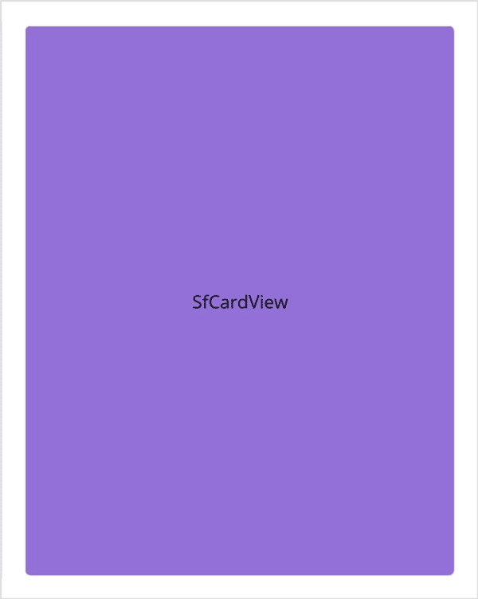

# Getting started with .NET MAUI Card (SfCard)
This section details the process of integrating the Card control and focuses solely on the fundamental features required for initiating your exploration of Syncfusion Card.

## Creating an application using the .NET MAUI Card

1. Create a new .NET MAUI application in Visual Studio.

2. Syncfusion .NET MAUI components are available on [nuget.org](https://www.nuget.org/). To add `SfCards` to your project, open the NuGet package manager in Visual Studio, search for [Syncfusion.Maui.Card](), and then install.

3. To initialize the control, import the control namespace `Syncfusion.Maui.Cards` in XAML or C# code.

4. Initialize `SfCards.`




<ContentPage   
    . . .
    xmlns:card="clr-namespace:Syncfusion.Maui.Cards;assembly=Syncfusion.Maui.Cards">

<cards:SfCardView>
    <Label Text="Label" Background="LightGoldenrodYellow" HorizontalTextAlignment="Center" VerticalTextAlignment="Center"/>
</cards:SfCardView>

</ContentPage>




using Syncfusion.Maui.Cards;
. . .

public partial class MainPage : ContentPage
{
    public MainPage()
    {
        InitializeComponent();
        SfCardView cardView = new SfCardView();

        cardView.Content = new Label()
        {
            Text = "Label",
            HorizontalTextAlignment = TextAlignment.Center,
            VerticalTextAlignment = TextAlignment.Center,
            BackgroundColor = Colors.LightGoldenrodYellow
        };
        this.Content = cardView;
    }
}




## Register the handler

The `Syncfusion.Maui.Core` NuGet is a dependent package for all the Syncfusion controls of .NET MAUI. In the `MauiProgram.cs` file, register the handler for Syncfusion core.




using Syncfusion.Maui.Core.Hosting;
namespace GettingStarted
{
    public static class MauiProgram
    {
        public static MauiApp CreateMauiApp()
        {
            var builder = MauiApp.CreateBuilder();

            builder.ConfigureSyncfusionCore();
            builder
            .UseMauiApp<App>()
            .ConfigureFonts(fonts =>
            {
                fonts.AddFont("OpenSans-Regular.ttf", "OpenSansRegular");
                fonts.AddFont("Segoe-mdl2.ttf", "SegoeMDL2");
            });

            return builder.Build();
        }
    }
}




## SwipeToDismiss

The `SwipeToDismiss` property enables or disables the swiping feature in SfCardView.




<cards:SfCardView SwipeToDismiss="true">
    <Label Text="SfCardView" Background="LightGoldenrodYellow" HorizontalTextAlignment="Center" VerticalTextAlignment="Center"/>
</cards:SfCardView>




using Syncfusion.Maui.Cards;
. . .

public partial class MainPage : ContentPage
{
    public MainPage()
    {
        InitializeComponent();
        SfCardView cardView = new SfCardView();
        cardView.SwipeToDismiss = true;
        cardView.Content = new Label(){ Text="SfCardView" };
        this.Content = cardView;
    }
}


	

## Dismiss the card programmatically

The `IsDismissed` property enables you to retrieve the view state of the card, and also provides the capability for the user to programmatically modify the card's view state.




<card:SfCardView IsDismissed="true">
     <Label Text="SfCardView"/>
</card:SfCardView>




using Syncfusion.Maui.Cards;
. . .

public partial class MainPage : ContentPage
{
    public MainPage()
    {
        InitializeComponent();
        SfCardView cardView = new SfCardView();
        cardView.SwipeToDismiss = true;
        cardView.Content = new Label(){ Text="SfCardView" };
        this.Content = cardView;
    }
}


	

### SfCardLayout

Initialize a card layout with a card view using the provided code sample below.




<cards:SfCardLayout HeightRequest="500" BackgroundColor="#F0F0F0">

    <cards:SfCardView CornerRadius="10">
        <Label  Text="Cyan" BackgroundColor="Cyan" VerticalTextAlignment="Center" HorizontalTextAlignment="Center"/>
    </cards:SfCardView>

    <cards:SfCardView CornerRadius="10">
        <Label  Text="LightPink" BackgroundColor="LightPink" VerticalTextAlignment="Center" HorizontalTextAlignment="Center"/>
    </cards:SfCardView>

    <cards:SfCardView CornerRadius="10" >
        <Label  Text="LightGreen" BackgroundColor="LightGreen" VerticalTextAlignment="Center" HorizontalTextAlignment="Center"/>
    </cards:SfCardView>

</cards:SfCardLayout>




using Syncfusion.Maui.Cards;
. . .

public partial class MainPage : ContentPage
{
	public MainPage()
	{
		InitializeComponent();
		SfCardLayout cardLayout = new SfCardLayout();

		//Add children for card layout 
		cardLayout.Children.Add(new SfCardView() { Content = new Label() { Text = "Cyan", BackgroundColor = Colors.Cyan, HorizontalTextAlignment = TextAlignment.Center, VerticalTextAlignment = TextAlignment.Center }, CornerRadius = 15 });

		cardLayout.Children.Add(new SfCardView() { Content = new Label() { Text = "Yellow", BackgroundColor = Colors.LightPink, HorizontalTextAlignment = TextAlignment.Center, VerticalTextAlignment = TextAlignment.Center },CornerRadius = 15 });

		cardLayout.Children.Add(new SfCardView() { Content = new Label() { Text = "Orange", BackgroundColor = Colors.LightGreen, HorizontalTextAlignment = TextAlignment.Center, VerticalTextAlignment = TextAlignment.Center },CornerRadius = 15 });

		this.Content = cardLayout;
	}
}


	

