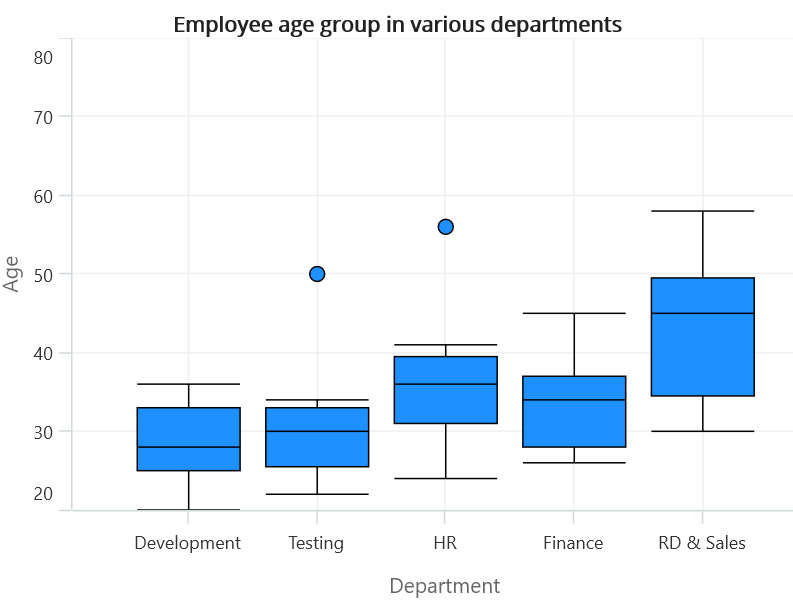
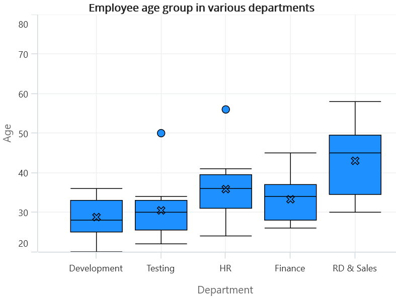
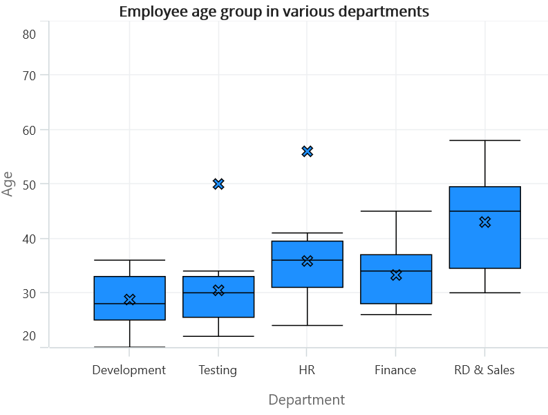

# Box And Whisker Chart in .NET MAUI Chart

BoxAndWhisker chart is used to show the distribution of data within a population. To render a BoxAndWhisker chart, create an instance of [BoxAndWhiskerSeries](), and add it to the [Series]() collection property of [SfCartesianChart](https://help.syncfusion.com/cr/maui/Syncfusion.Maui.Charts.SfCartesianChart.html?tabs=tabid-1).The following code illustrates how to define the series in chart.

N> The Cartesian chart has [Series](https://help.syncfusion.com/cr/maui/Syncfusion.Maui.Charts.SfCartesianChart.html#Syncfusion_Maui_Charts_SfCartesianChart_Series) as its default content.

N>  In Exclusive mode, the whiskers extend to the most extreme data point within 1.5 times the interquartile range (IQR). Any points beyond this range are considered outliers.
By default,the BoxPlotMode property value is Exclusive.





    <chart:SfCartesianChart>

    <chart:SfCartesianChart.XAxes>
        <chart:CategoryAxis />
    </chart:SfCartesianChart.XAxes>

    <chart:SfCartesianChart.YAxes>
        <chart:NumericalAxis />
    </chart:SfCartesianChart.YAxes>   

    <chart:BoxAndWhiskerSeries ItemsSource="{Binding BoxWhiskerData}"
                               XBindingPath="Department"
                               YBindingPath="Age"/>

    </chart:SfCartesianChart>





    SfCartesianChart chart = new SfCartesianChart();
    CategoryAxis primaryAxis = new CategoryAxis();
    chart.XAxes.Add(primaryAxis);
    NumericalAxis secondaryAxis = new NumericalAxis();
    chart.YAxes.Add(secondaryAxis);

    BoxAndWhiskerSeries series = new BoxAndWhiskerSeries()
    {
        ItemsSource = new ViewModel().BoxWhiskerData,
        XBindingPath = "Department",
        YBindingPath = "Age",
    };

    chart.Series.Add(series);
    this.Content = chart;





## Customize the series BoxPlot mode

The series box plotting mode can be changed by using [BoxPlotMode]() property of [BoxAndWhiskerSeries](). The plotting mode of series can be calculated as follows:

*`Exclusive`-The quartile values are calculated by using the formula (N+1) * P (N count, P percentile) and its index value starts from 1 in the list.

*`Inclusive`- The quartile values are calculated by using the formula (N−1) * P (N count, P percentile) and its index value starts from 0 in the list.

*`Normal`-The quartile values are calculated by splitting the list and getting the median values.

## Normal

In Normal mode, the whiskers extend to the minimum and maximum data points within 2 times the standard deviation of the data. This method assumes that the data is normally distributed.
The following code illustrate how to define property [BoxPlotMode] value as Normal.





    <chart:SfCartesianChart>

    <chart:SfCartesianChart.XAxes>
        <chart:CategoryAxis />
    </chart:SfCartesianChart.XAxes>

    <chart:SfCartesianChart.YAxes>
        <chart:NumericalAxis />
    </chart:SfCartesianChart.YAxes>  

    <chart:BoxAndWhiskerSeries ItemsSource="{Binding BoxWhiskerData}"
                               XBindingPath="Department"
                               YBindingPath="Age"
                               BoxPlotMode="Normal"/>

    </chart:SfCartesianChart>





    SfCartesianChart chart = new SfCartesianChart();
    CategoryAxis primaryAxis = new CategoryAxis();
    chart.XAxes.Add(primaryAxis);
    NumericalAxis secondaryAxis = new NumericalAxis();
    chart.YAxes.Add(secondaryAxis);

    BoxAndWhiskerSeries series = new BoxAndWhiskerSeries()
    {
        ItemsSource = new ViewModel().BoxWhiskerData,
        XBindingPath = "Department",
        YBindingPath = "Age",
        BoxPlotMode="Normal"/>
    };

    chart.Series.Add(series);
    this.Content = chart;





## Inclusive

In Inclusive mode, the whiskers extend to the minimum and maximum data points within 1.5 times the IQR. Any points beyond this range are considered outliers.
The following code illustrate how to define property [BoxPlotMode] value as Inclusive.





    <chart:SfCartesianChart>

    <chart:SfCartesianChart.XAxes>
        <chart:CategoryAxis />
    </chart:SfCartesianChart.XAxes>

    <chart:SfCartesianChart.YAxes>
        <chart:NumericalAxis />
    </chart:SfCartesianChart.YAxes>  

    <chart:BoxAndWhiskerSeries ItemsSource="{Binding BoxWhiskerData}"
                               XBindingPath="Department"
                               YBindingPath="Age"
                               BoxPlotMode="Inclusive"/>

    </chart:SfCartesianChart>





    SfCartesianChart chart = new SfCartesianChart();
    CategoryAxis primaryAxis = new CategoryAxis();
    chart.XAxes.Add(primaryAxis);
    NumericalAxis secondaryAxis = new NumericalAxis();
    chart.YAxes.Add(secondaryAxis);

    BoxAndWhiskerSeries series = new BoxAndWhiskerSeries()
    {
        ItemsSource = new ViewModel().BoxWhiskerData,
        XBindingPath = "Department",
        YBindingPath = "Age",
        BoxPlotMode="Inclusive"/>
    };

    chart.Series.Add(series);
    this.Content = chart;





## ShowMedian

The Median values of given dataset is viewed by enabling the [ShowMedian]() property of [BoxAndWhiskerSeries](). The following code illustrates how to enable the [ShowMedian]() property.

N> By default, the ShowMedian property value is False.





    <chart:SfCartesianChart>

    <chart:SfCartesianChart.XAxes>
        <chart:CategoryAxis />
    </chart:SfCartesianChart.XAxes>

    <chart:SfCartesianChart.YAxes>
        <chart:NumericalAxis />
    </chart:SfCartesianChart.YAxes>  

    <chart:BoxAndWhiskerSeries ItemsSource="{Binding BoxWhiskerData}"
                               XBindingPath="Department"
                               YBindingPath="Age"
                               ShowMedian="True"/>

    </chart:SfCartesianChart>





    SfCartesianChart chart = new SfCartesianChart();
    CategoryAxis primaryAxis = new CategoryAxis();
    chart.XAxes.Add(primaryAxis);
    NumericalAxis secondaryAxis = new NumericalAxis();
    chart.YAxes.Add(secondaryAxis);

    BoxAndWhiskerSeries series = new BoxAndWhiskerSeries()
    {
        ItemsSource = new ViewModel().BoxWhiskerData,
        XBindingPath = "Department",
        YBindingPath = "Age",
        ShowMedian="True"/>
    };

    chart.Series.Add(series);
    this.Content = chart;





N>

* The middle number of data points is the median for the odd number of data points.
* The average of the middle two numbers is a median for the even number of data points.

## Outlier

The outlier is used to display the outlier point that lies either below the lower whisker or above the upper whisker line and it is an observation that is numerically distant from the rest of the data.

## ShowOutlier

The outlier value in the box plot can be viewed by enabling the [ShowOutlier]() property of [BoxAndWhiskerSeries].The following code demonstrates how to disable the [ShowOutlier]() property.

N> By default, [ShowOutlier] value is true.





    <chart:SfCartesianChart>

    <chart:SfCartesianChart.XAxes>
        <chart:CategoryAxis />
    </chart:SfCartesianChart.XAxes>

    <chart:SfCartesianChart.YAxes>
        <chart:NumericalAxis />
    </chart:SfCartesianChart.YAxes>  

    <chart:BoxAndWhiskerSeries ItemsSource="{Binding BoxWhiskerData}"
                                XBindingPath="Department"
                                YBindingPath="Age"
                                ShowOutlier="False"/>

    </chart:SfCartesianChart>





    SfCartesianChart chart = new SfCartesianChart();
    CategoryAxis primaryAxis = new CategoryAxis();
    chart.XAxes.Add(primaryAxis);
    NumericalAxis secondaryAxis = new NumericalAxis();
    chart.YAxes.Add(secondaryAxis);

    BoxAndWhiskerSeries series = new BoxAndWhiskerSeries()
    {
        ItemsSource = new ViewModel().BoxWhiskerData,
        XBindingPath = "Department",
        YBindingPath = "Age",
        ShowOutlier="False"/>
    };

    chart.Series.Add(series);
    this.Content = chart;





## OutlierShapeType

The [OutlierShapeType]() is used to display the outlier point with different types of symbols. The available symbols are Cross, Diamond, Ellipse, Hexagon, InvertedTriangle, Pentagon, Plus, Rectangle and Triangle. By default, [OutlierShapeType]() value is [Ellipse]().

The following code shows how to set the [SymbolType]() value as [Cross]().OutlierShapeType





    <chart:SfCartesianChart>

    <chart:SfCartesianChart.XAxes>
        <chart:CategoryAxis />
    </chart:SfCartesianChart.XAxes>

    <chart:SfCartesianChart.YAxes>
        <chart:NumericalAxis />
    </chart:SfCartesianChart.YAxes>  

    <chart:BoxAndWhiskerSeries ItemsSource="{Binding BoxWhiskerData}"
                                XBindingPath="Department"
                                YBindingPath="Age"
                                OutlierShapeType="Cross"/>

    </chart:SfCartesianChart>





    SfCartesianChart chart = new SfCartesianChart();
    CategoryAxis primaryAxis = new CategoryAxis();
    chart.XAxes.Add(primaryAxis);
    NumericalAxis secondaryAxis = new NumericalAxis();
    chart.YAxes.Add(secondaryAxis);

    BoxAndWhiskerSeries series = new BoxAndWhiskerSeries()
    {
        ItemsSource = new ViewModel().BoxWhiskerData,
        XBindingPath = "Department",
        YBindingPath = "Age",
        OutlierShapeType = ShapeType.Cross/>
    };

    chart.Series.Add(series);
    this.Content = chart;





