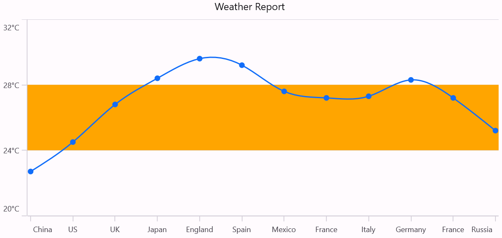
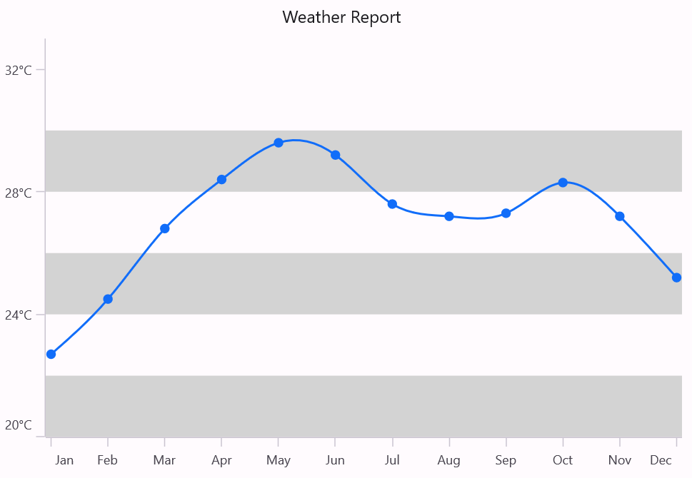
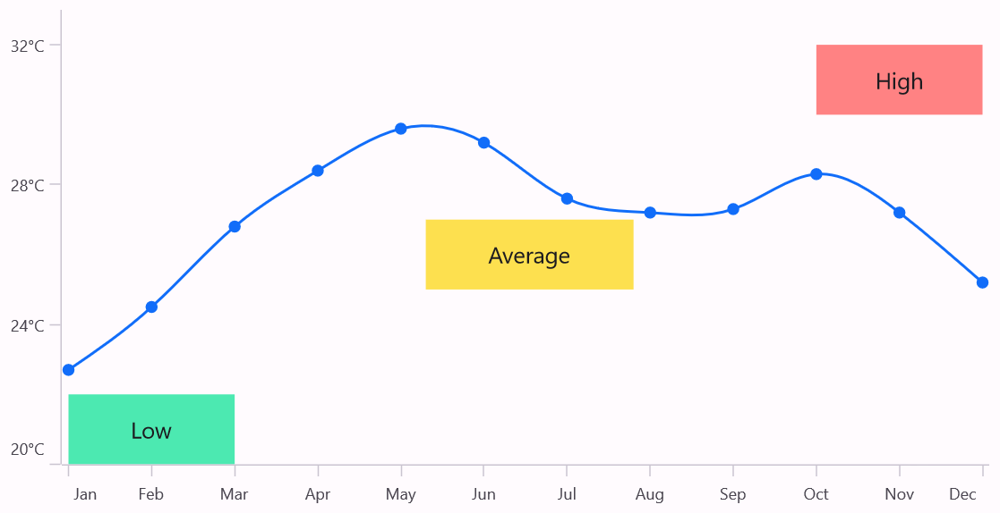

# Plot band in .NET MAUI Chart

A plot band, also known as a stripline, allows for shading specific regions or ranges in the plot area background at regular or custom intervals. It also provides options to customize the size of these bands. Text can be added to plot band and indicate the significance of each particular region.

Plot bands are classified into [NumericalPlotBand]() and [DateTimePlotBand](). Based on the axis, plot bands are drawn using these classifications. The following properties are used to configure the plot band:

* [`Start`]() - change the start position of the plot bands.
* [`End`]() - change the end position of the plot bands.
* [`Size`]() - changes how long plot band should be expanded. This is applicable only when end is not specified.
* [`SizeType`]() - changes the date-time unit of the value specified in the `Size` property. The values can be year, month, day, hour, minute, second, and millisecond.
* [`Text`]()- changes the text of the plot band.
* [`Fill`]() - changes the fill of the plot band.
* [`Stroke`]() - changes the stroke color of the plot band.
* [`StrokeWidth`]() - changes the stroke width of the plot band.
* [`StrokeDashArray`]() - changes the stoke in dash array.
* [`IsVisible`]() - changes the visibility of the plot band in chart axis.
* [`IsRepeatable`]()- specifies the plot band need to be repeated in specified interval.

## Numerical PlotBand 

[NumericalPlotBands]() are used to draw plot bands for [NumericalAxis]() and [CategoryAxis](). To add a plot band, create an instance of [NumericalPlotBandCollection]() and specify numerical value for the [Start]() parameter. This parameter determines the beginning of the plot band, along with the specified [Size]().





    <chart:SfCartesianChart>
        . . .
        <chart:SfCartesianChart.YAxes>
            <chart:NumericalAxis>
                <chart:NumericalAxis.PlotBands>
                    <chart:NumericalPlotBandCollection>
                        <chart:NumericalPlotBand Start="24" Size="4" 
                                                 Fill="Orange"/>
                    </chart:NumericalPlotBandCollection>
                </chart:NumericalAxis.PlotBands>
            </chart:NumericalAxis>
        </chart:SfCartesianChart.YAxes>
        . . .
    </chart:SfCartesianChart>





    SfCartesianChart chart = new SfCartesianChart();
    . . .
    
    NumericalAxis numericalAxis = new NumericalAxis();
    NumericalPlotBandCollection numericalPlotBandCollection = new NumericalPlotBandCollection();
    NumericalPlotBand plotBand = new NumericalPlotBand
    {
        Start = 24,
        Size = 4,
        Fill = Colors.Orange
    };

    numericalPlotBandCollection.Add(plotBand);
    numericalAxis.PlotBands = numericalPlotBandCollection;
    chart.YAxes.Add(numericalAxis);
    ...





## DateTime PlotBand

[DateTimePlotBands]() are used to draw plot bands for [DateTimeAxis](). To add a plot band, create an instance of [DateTimePlotBandCollection]() and specifying the [Start]() date and [Size]() values. The start value determines the beginning of the plot band, along with the specified size. The [SizeType]() parameter determines which unit of measurement to use on the date-time axis.





    <chart:SfCartesianChart>
        . . .
     <chart:SfCartesianChart.XAxes>
         <chart:DateTimeAxis>
          <chart:DateTimeAxis.PlotBands>
             <chart:DateTimePlotBandCollection >
                 <chart:DateTimePlotBand Start="2023-04-01"
                                         Size="2" SizeType="Months"
                                         Fill="Orange"/>
                    </chart:DateTimePlotBandCollection >
                </chart:DateTimeAxis.PlotBands>
            </chart:DateTimeAxis>
        </chart:SfCartesianChart.XAxes>

        <chart:SfCartesianChart.YAxes>
            <chart:NumericalAxis/>
        </chart:SfCartesianChart.YAxes>
    </chart:SfCartesianChart>





    SfCartesianChart chart = new SfCartesianChart();
    . . .
    DateTimeAxis dateTimeAxis = new DateTimeAxis();
    DateTimePlotBandCollection dateTimePlotBandCollection = new DateTimePlotBandCollection();
    DateTimePlotBand plotBand = new DateTimePlotBand
    {
        Start = new DateTime(2023, 04, 01),
        Size = 2,
        WidthType = DateTimeUnits.Months,
        Fill = Color.Orange
    };

    dateTimePlotBandCollection.Add(plotBand);
    dateTimeAxis.PlotBands = dateTimePlotBandCollection;
    chart.XAxes.Add(dateTimeAxis);

    NumericalAxis secondaryAxis = new NumericalAxis();
    chart.YAxes.Add(secondaryAxis);
    ...





## Recursive plot band

The Plot band recurrence feature enables plot bands to be drawn repeatedly at regular intervals. This functionality is particularly useful when you need to mark events that occur recursively along the timeline of the chart.

* [`RepeatEvery`]() - Specifies the frequency at which the plot band is repeated.
* [`RepeatEveryType`]() - Specifies the date time unit for `DateTimePlotBand`.
* [`RepeatUntil`]() - Specifies the end value at which the plot band stops repeating.





    <chart:SfCartesianChart>
        . . .
        <chart:SfCartesianChart.XAxes>
            <chart:CategoryAxis/>
        </chart:SfCartesianChart.XAxes>

        <chart:SfCartesianChart.YAxes>
          <chart:NumericalAxis>
           <chart:NumericalAxis.PlotBands>
               <chart:NumericalPlotBandCollection>
                    <chart:NumericalPlotBand Start="20"  End="22"
                                             IsRepeatable="True"
                                             RepeatUntil="32"
                                             RepeatEvery="4"
                                             Fill="LightGray" />
                    </chart:NumericalPlotBandCollection>
                </chart:NumericalAxis.PlotBands>
            </chart:NumericalAxis>
        </chart:SfCartesianChart.YAxes>
    </chart:SfCartesianChart>





    SfCartesianChart chart = new SfCartesianChart();
    . . .
    CategoryAxis primaryAxis = new CategoryAxis();
    chart.XAxes.Add(primaryAxis);

    NumericalAxis numericalAxis = new NumericalAxis();
    NumericalPlotBandCollection numericalPlotBandCollection = new NumericalPlotBandCollection();
    NumericalPlotBand plotBand = new NumericalPlotBand
    {
        Start = 20,
        End = 22,
        IsRepeatable = True
        RepeatUntil = 32
        RepeatEvery = 4                                  
        Fill = Colors.LightGray
    };

    numericalPlotBandCollection.Add(plotBand);
    numericalAxis.PlotBands = numericalPlotBandCollection;
    chart.YAxes.Add(numericalAxis);
    ...





## Segmented plot band

Typically, if you draw a plot band for a vertical axis, the height of the plot band is determined by the start and end properties. The end of the plot band is equivalent to the end of its associated horizontal axis, meaning the plot band is drawn horizontally across the entire stretch of its associated horizontal axis. Similarly, for a horizontal axis, the width is determined by the start and width properties. Vertically, it is drawn across the entire stretch of the associated vertical axis

Suppose, you want to draw a plot band that should not stretch along its associated axis, you have to set [AssociatedAxisStart]() and [AssociatedAxisEnd]() properties. The values provided in these two properties correspond to its associated axis specified by [AssociatedAxisName]() property. 





    <chart:SfCartesianChart>
        . . .
    <chart:SfCartesianChart.XAxes>
       <chart:CategoryAxis/>
     </chart:SfCartesianChart.XAxes>

    <chart:SfCartesianChart.YAxes>
      <chart:NumericalAxis>
         <chart:NumericalAxis.PlotBands>
             <chart:NumericalPlotBandCollection>
                  <chart:NumericalPlotBand Start="20" 
                                           End="22" 
                                           AssociatedAxisEnd="2"
                                           Fill="#B300E190"
                                           Text="Low"/>

                 <chart:NumericalPlotBand Start="25" 
                                           End="27" 
                                           AssociatedAxisStart = 4.3,
                                           AssociatedAxisEnd="6.8"
                                           Fill="#B3FCD404"
                                           Text="Average"/>

                 <chart:NumericalPlotBand Start="30" 
                                          End="32" 
                                          AssociatedAxisStart="9"
                                          Fill="#B3FF4E4E"
                                          Text="High"/>                       

                    </chart:NumericalPlotBandCollection>
                </chart:NumericalAxis.PlotBands>
            </chart:NumericalAxis>
        </chart:SfCartesianChart.YAxes>
        . . .
    </chart:SfCartesianChart>





    SfCartesianChart chart = new SfCartesianChart();
    . . .
    CategoryAxis primaryAxis = new CategoryAxis();
    chart.XAxes.Add(primaryAxis);

    NumericalAxis numericalAxis = new NumericalAxis();
    NumericalPlotBandCollection numericalPlotBandCollection =  new NumericalPlotBandCollection();
    NumericalPlotBand plotBand1 = new NumericalPlotBand()
    {
        Start = 20,
        End = 22,
        AssociatedAxisEnd = 2,
        Text = "Low",
        Fill = new SolidColorBrush(Color.FromArgb("#B300E190"))
    };

   NumericalPlotBand plotBand2 = new NumericalPlotBand()
   {
       Start = 25,
       End = 27,
       AssociatedAxisStart = 4.3,
       AssociatedAxisEnd = 6.8,
       Text = "Average",
       Fill = new SolidColorBrush(Color.FromArgb("#B3FCD404"))
   };

   NumericalPlotBand plotBand3 = new NumericalPlotBand()
   {
       Start = 30,
       End = 32,
       AssociatedAxisStart = 9,
       Text = "High",
       Fill = new SolidColorBrush(Color.FromArgb("#B3FF4E4E"))
   };

     numericalPlotBandCollection.Add(plotBand1);
     numericalPlotBandCollection.Add(plotBand2);
     numericalPlotBandCollection.Add(plotBand3); 
     numericalAxis.PlotBands = numericalPlotBandCollection;
     chart.YAxes.Add(numericalAxis);
    ...





## Plot Line
When specifying the same value for both start and end, a plot line will be drawn.





    <chart:SfCartesianChart>
        . . .
    <chart:SfCartesianChart.XAxes>
       <chart:CategoryAxis/>
     </chart:SfCartesianChart.XAxes>

    <chart:SfCartesianChart.YAxes>
      <chart:NumericalAxis>
         <chart:NumericalAxis.PlotBands>
             <chart:NumericalPlotBandCollection>
                  <chart:NumericalPlotBand Start="24" 
                                           End="24" 
                                           Fill="#B300E190"
                                           Stroke="#B300E190"
                                           StrokeWidth="2"
                                           Text="Low Temperature"/>

                 <chart:NumericalPlotBand Start="28" 
                                          End="28" 
                                          Stroke="#FCD404"
                                          StrokeWidth="2"
                                          Fill="#FCD404"
                                         Text="Average Temperature"/>

                 <chart:NumericalPlotBand Start="32" 
                                          End="32" 
                                          Stroke="#FF4E4E"
                                          StrokeWidth="2"
                                          Fill="#FF4E4E"
                                          Text="High Temperature"/>                       

                    </chart:NumericalPlotBandCollection>
                </chart:NumericalAxis.PlotBands>
            </chart:NumericalAxis>
        </chart:SfCartesianChart.YAxes>
        . . .
    </chart:SfCartesianChart>





    SfCartesianChart chart = new SfCartesianChart();
    . . .
    CategoryAxis primaryAxis = new CategoryAxis();
    chart.XAxes.Add(primaryAxis);

    NumericalAxis numericalAxis = new NumericalAxis();
    NumericalPlotBandCollection numericalPlotBandCollection =  new NumericalPlotBandCollection();
     NumericalPlotBand plotBand1 = new NumericalPlotBand()
     {
        Start = 24,
        End = 24,
        Stroke = new SolidColorBrush(Color.FromArgb("#00E190")),
        StrokeWidth = 2,
        Fill = new SolidColorBrush(Color.FromArgb("#00E190")),
        Text = "Low Temperature"
     };

     NumericalPlotBand plotBand2 = new NumericalPlotBand()
     {
        Start = 28,
        End = 28,
        Stroke = new SolidColorBrush(Color.FromArgb("#FCD404")),
        StrokeWidth = 2,
        Fill = new SolidColorBrush(Color.FromArgb("#FCD404")),
        Text = "Average Temperature"
    };

    NumericalPlotBand plotBand3 = new NumericalPlotBand()
    {
        Start = 32,
        End = 32,
        Stroke = new SolidColorBrush(Color.FromArgb("#FF4E4E")),
        StrokeWidth = 2,
        Fill = new SolidColorBrush(Color.FromArgb("#FF4E4E")),
        Text = "High Temperature"
     };

     numericalPlotBandCollection.Add(plotBand1);
     numericalPlotBandCollection.Add(plotBand2);
     numericalPlotBandCollection.Add(plotBand3); 
     numericalAxis.PlotBands = numericalPlotBandCollection;
     chart.YAxes.Add(numericalAxis);
    ...





## Text Customization 

[Text]() can be added to plot bands to indicate the significance of each particular region. The [LabelStyle]() property provides options to customize plot band text.Following are the options available,

* `HorizontalTextAlignment` -  changes the horizontal alignment of text.
* `VerticalTextAlignment` - changes the vertical alignment of text.
* `Angle` - used to rotate the text.
* `OffsetX` - changes the horizontal padding to the plot band text.
* `OffsetY` - changes the vertical padding to the plot band text.





    <chart:SfCartesianChart>
        . . .
     <chart:SfCartesianChart.XAxes>
       <chart:CategoryAxis/>
      </chart:SfCartesianChart.XAxes>

      <chart:SfCartesianChart.YAxes>
        <chart:NumericalAxis>
          <chart:NumericalAxis.PlotBands>
            <chart:NumericalPlotBandCollection>
             <chart:NumericalPlotBand Start="28" 
                                      Size="10" 
                                      Fill="Orange"
                                      Text="Plot Band">
              <chart:NumericalPlotBand.LabelStyle>
               <chart:ChartPlotBandLabelStyle TextColor="Blue"
                                              FontSize="12" 
                                     FontAttributes="Bold"/>
              </chart:NumericalPlotBand.LabelStyle>
           </chart:NumericalPlotBandCollection>
         </chart:NumericalAxis.PlotBands>
       </chart:NumericalAxis>
     </chart:SfCartesianChart.YAxes>
        . . .
    </chart:SfCartesianChart>





    SfCartesianChart chart = new SfCartesianChart();
    . . .
    CategoryAxis primaryAxis = new CategoryAxis();
    chart.XAxes.Add(primaryAxis);

    NumericalAxis numericalAxis = new NumericalAxis();
    NumericalPlotBandCollection numericalPlotBandCollection = new NumericalPlotBandCollection();
    NumericalPlotBand plotBand = new NumericalPlotBand
    {
        Start = 28,
        Width = 10,
        Fill = Color.Orange,
        Text = "Plot Band"
    };

    ChartPlotBandLabelStyle labelStyle = new ChartPlotBandLabelStyle
    {
        TextColor = Color.Blue,
        FontSize = 12,
        FontAttributes = FontAttributes.Bold
    };

    plotBand.LabelStyle = labelStyle;
    numericalPlotBandCollection.Add(plotBand);
    numericalAxis.PlotBands= numericalPlotBandCollection;
    chart.YAxes.Add(numericalAxis);
    ...




