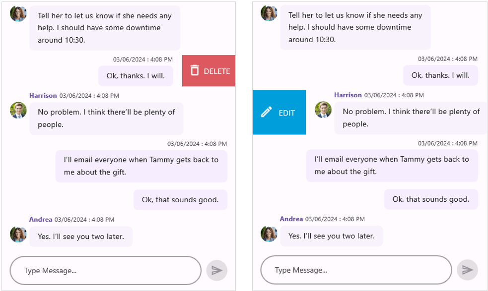

# Swiping in .NET MAUI Chat (SfChat)

In `SfChat`, you can enable swiping by setting the `SfChat.AllowSwiping` property to `true`. When you swipe left or right on a message, swipe views appear. It provides customizable swipe templates for swiping on the left and right sides. You can also limit how far you can swipe on a message by setting the `SfChat.MaxSwipeOffset` property.

### Swipe templates

The Swiping can be customized by using the `SfChat.StartSwipeTemplate` when swiping towards the `right` and `SfListView.EndSwipeTemplate` when swiping towards the `left`. The content inside the swipe template is arranged based on the offset values when swiping a message. 



<?xml version="1.0" encoding="utf-8" ?>
<ContentPage xmlns="http://schemas.microsoft.com/dotnet/2021/maui"
             xmlns:x="http://schemas.microsoft.com/winfx/2009/xaml"
             xmlns:sfchat="clr-namespace:Syncfusion.Maui.Chat;assembly=Syncfusion.Maui.Chat"
             xmlns:local="clr-namespace:GettingStarted"
             x:Class="GettingStarted.MainPage">

    <ContentPage.BindingContext>
        <local:ViewModel/>
    </ContentPage.BindingContext>
    
    <ContentPage.Content>
        <sfchat:SfChat x:Name="sfChat"                
                       Messages="{Binding Messages}"     
                       CurrentUser="{Binding CurrentUser}"
                       AllowSwiping="True">
            <sfchat:SfChat.StartSwipeTemplate>
                <DataTemplate>
                    <Grid BackgroundColor="#009EDA" Padding="9">
                        <Grid.ColumnDefinitions>
                            <ColumnDefinition Width="50"/>
                            <ColumnDefinition Width="50"/>
                        </Grid.ColumnDefinitions>

                        <Image Grid.Column="0"
                               BackgroundColor="Transparent"                             
                               HorizontalOptions="Center"
                               Source="edit.png"/>

                        <Label Grid.Column="1"
                               BackgroundColor="Transparent"
                               LineBreakMode="NoWrap"
                               Text="EDIT"
                               TextColor="White"
                               HorizontalTextAlignment="Start"
                               VerticalTextAlignment="Center"/>
                    </Grid>
                </DataTemplate>
            </sfchat:SfChat.StartSwipeTemplate>

            <sfchat:SfChat.EndSwipeTemplate>
                <DataTemplate>
                    <Grid BackgroundColor="#DC595F" Padding="4">
                        <Grid.ColumnDefinitions>
                            <ColumnDefinition Width="40"/>
                            <ColumnDefinition Width="60"/>
                        </Grid.ColumnDefinitions>

                        <Image Grid.Column="0"
                           BackgroundColor="Transparent"                          
                           HorizontalOptions="Center">
                            Source="delete.png"/>

                        <Label Grid.Column="1"
                           BackgroundColor="Transparent"
                           LineBreakMode="NoWrap"
                           Text="DELETE"
                           TextColor="White"
                           HorizontalTextAlignment="Start"
                           VerticalTextAlignment="Center"/>
                    </Grid>
                </DataTemplate>
            </sfchat:SfChat.EndSwipeTemplate>
        </sfchat:SfChat>
    </ContentPage.Content>
</ContentPage>




using Syncfusion.Maui.Chat;
namespace GettingStarted
{
    public partial class MainPage : ContentPage
    {
        SfChat sfChat;
        ViewModel viewModel;

        public MainPage()
        {
            InitializeComponent();
            sfChat = new SfChat();
            viewModel = new ViewModel();
            sfChat.Messages = viewModel.Messages;
            sfChat.CurrentUser = viewModel.CurrentUser;
            sfChat.AllowSwiping = true;
            sfChat.StartSwipeTemplate = new DataTemplate(() =>
            { 
              var grid = new Grid()
              {
                ColumnDefinitions =
                {
                     new ColumnDefinition(){Width=50 },
                     new ColumnDefinition(){Width=50 }
                },
                Padding = 9,
                BackgroundColor = Color.FromArgb("#009EDA"),
              } ;

             var image = new Image()
             {
                HorizontalOptions = LayoutOptions.Center,
                Source = "edit.png",
             };

             var label = new Label()
             {
                VerticalTextAlignment = TextAlignment.Center,
                HorizontalTextAlignment = TextAlignment.Start,
                TextColor = Colors.White,
                Text = "EDIT",
                LineBreakMode = LineBreakMode.NoWrap,
             };

             grid.Children.Add(image);
             Grid.SetColumn(image, 0);
             grid.Children.Add(label);
             Grid.SetColumn(label, 1);
             return grid;
           });

           sfChat.EndSwipeTemplate = new DataTemplate(() =>
           {
             var grid = new Grid()
             {
               ColumnDefinitions =
                {
                     new ColumnDefinition(){Width=40 },
                     new ColumnDefinition(){Width=60 }
                },
                Padding = 4,
                BackgroundColor = Color.FromArgb("#DC595F"),
             };

             var image = new Image()
             {
                HorizontalOptions = LayoutOptions.Center,
                Source = "delete.png",
             };

             var label = new Label()
             {
                VerticalTextAlignment = TextAlignment.Center,
                HorizontalTextAlignment = TextAlignment.Start,
                TextColor = Colors.White,
                Text = "DELETE",
                LineBreakMode = LineBreakMode.NoWrap,
             };

              grid.Children.Add(image);
              Grid.SetColumn(image, 0);
              grid.Children.Add(label);
              Grid.SetColumn(label, 1);

              return grid;
           });
          this.Content = sfChat;
        }
    }
}




### Swipe Events

### SwipeStarted Event

The `SfChat.SwipeStarted` event is raised when the swipe offset changes from its initial value. This event is triggered with `MessageSwipeStartedEventArgs`.

The `SwipeStarted` event provides the following properties in their arguments:

* `Message`: Defines the underlying data associated with the swiped message.
* `SwipeDirection`: Defines the swipe direction of the message being swiped.
* `Cancel`: Defines that the swipe action can be canceled by setting the `Cancel` property of the `MessageSwipeStartedEventArgs` to `true`.



  <sfchat:SfChat x:Name="sfChat"
                 Messages="{Binding Messages}"     
                 CurrentUser="{Binding CurrentUser}"
                 AllowSwiping="True"
                 SwipeStarted="sfChat_SwipeStarted"/>






 sfChat.SwipeStarted += sfChat_SwipeStarted;

  private void sfChat_SwipeStarted(object sender, MessageSwipeStartedEventArgs e)
  {
    var index = sfChat.Messages.IndexOf(e.Message);
    if (index == 1)
     {
        e.Cancel = true;
     }
  }




### Swiping Event

The `SfChat.Swiping` event is raised while swiping a message is in progress. This event is triggered with `MessageSwipingEventArgs`.

The `Swiping` event provides the following properties in their arguments:

* `Message`: Defines the underlying data associated with the swiped message.
* `SwipeDirection`: Defines the swipe direction of the message being swiped.
* `SwipeOffSet`: Defines the current swipe offset of the message that is being swiped.
* `Handled`: Defines that if it is true, the current swipe offset value remains the same for the swiped message until the `SwipeEnded` event is raised.



    <sfchat:SfChat x:Name="sfChat"
                   Messages="{Binding Messages}"     
                   CurrentUser="{Binding CurrentUser}"
                   AllowSwiping="True"
                   MaxSwipeOffset="130"
                   Swiping="sfChat_Swiping"/>






    sfChat.Swiping += sfChat_Swiping;

    private void sfChat_Swiping(object sender, MessageSwipingEventArgs e)
    {
        var index = sfChat.Messages.IndexOf(e.Message);
        if (index == 1 && e.SwipeOffset > 70)
        {
             e.Handled = true;
        }
    }




### SwipeEnded Event

The `SfChat.SwipeEnded` event is fired when the swipe offset value reaches the `SfChat.MaxSwipeOffset` value indicating that the swipe action is completed. This event is triggered with `MessageSwipeEndedEventArgs`.

The `SwipeEnded` event provides the following properties in their arguments:

* `Message`: Defines the underlying data associated with the swiped message.
* `SwipeDirection`: Defines the swipe direction of the message being swiped.
* `SwipeOffSet`: Defines the current swipe offset of the message that is being swiped.



    <sfchat:SfChat x:Name="sfChat"                
                   Messages="{Binding Messages}"     
                   CurrentUser="{Binding CurrentUser}"
                   MaxSwipeOffset="130"
                   AllowSwiping="True"
                   SwipeEnded="sfChat_SwipeEnded"/>             






 sfChat.SwipeEnded += sfChat_SwipeEnded;

 private void sfChat_SwipeEnded(object sender, MessageSwipeEndedEventArgs e)
 {
    if (e.SwipeOffset > 100)
    {
       sfChat.ResetSwipeOffset();
    }
 }
   



## Reset Swipe view Programmatically 

The `SfChat` allows you to cancel the swipe programmatically by calling the `SfChat.ResetSwipeOffset` method in the `SfChat.SwipeEnded` event.



 <sfchat:SfChat x:Name="sfChat"                
                Messages="{Binding Messages}"     
                CurrentUser="{Binding CurrentUser}"
                AllowSwiping="True" 
                SwipeEnded="sfChat_SwipeEnded" />             
    





 sfChat.SwipeEnded += sfChat_SwipeEnded;

 private void sfChat_SwipeEnded(object sender, MessageSwipeEndedEventArgs e)
 {
    if (e.SwipeOffset > 100)
    {
       sfChat.ResetSwipeOffset();
    }
 }
   


