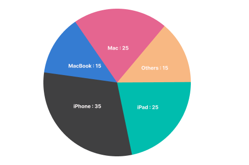

# Data Label in .NET MAUI Chart

Data labels are used to display values related to a chart segment. Values from data point(x, y) or other custom properties from a data source can be displayed. 

Each data label can be represented by the following:

* Label - displays the segment label content at the (X, Y) point.
* Connector line - used to connect the (X, Y) point and the label element.

## Enable Data Label 

[ShowDataLabels](https://help.syncfusion.com/cr/maui/Syncfusion.Maui.Charts.ChartSeries.html#Syncfusion_Maui_Charts_ChartSeries_ShowDataLabels) property of series is used to enable the data labels.





<chart:SfCircularChart>
. . .
<chart:PieSeries ShowDataLabels="True"
                ItemsSource="{Binding Data}"  
                XBindingPath="Product" 
                YBindingPath="SalesRate"/>
. . .
</chart:SfCircularChart>





SfCircularChart chart = new SfCircularChart();
. . .
PieSeries series = new PieSeries();
series.ShowDataLabels = true;
. . .
chart.Series.Add(series);



 

Data labels can be customized by using the [DataLabelSettings](https://help.syncfusion.com/cr/maui/Syncfusion.Maui.Charts.CircularSeries.html#Syncfusion_Maui_Charts_CircularSeries_DataLabelSettings) property of chart series. For customizing, need to create an instance of [CircularDataLabelSettings](https://help.syncfusion.com/cr/maui/Syncfusion.Maui.Charts.CircularDataLabelSettings.html) and set to the [DataLabelSettings](https://help.syncfusion.com/cr/maui/Syncfusion.Maui.Charts.CircularSeries.html#Syncfusion_Maui_Charts_CircularSeries_DataLabelSettings) property. Following properties are used to customize the data labels which are available in [CircularDataLabelSettings](https://help.syncfusion.com/cr/maui/Syncfusion.Maui.Charts.CircularDataLabelSettings.html).

* [ConnectorType](https://help.syncfusion.com/cr/maui/Syncfusion.Maui.Charts.CircularDataLabelSettings.html#Syncfusion_Maui_Charts_CircularDataLabelSettings_ConnectorType) - Gets or sets the type of connector line to be drawn.
* [LabelStyle](https://help.syncfusion.com/cr/maui/Syncfusion.Maui.Charts.ChartDataLabelSettings.html#Syncfusion_Maui_Charts_ChartDataLabelSettings_LabelStyle) - Gets or sets the options for customizing the data labels. 
* [UseSeriesPalette](https://help.syncfusion.com/cr/maui/Syncfusion.Maui.Charts.ChartDataLabelSettings.html#Syncfusion_Maui_Charts_ChartDataLabelSettings_UseSeriesPalette) - Gets or sets a value indicating whether the data label should reflect the series interior.

 

## Applying Series Brush

[UseSeriesPalette](https://help.syncfusion.com/cr/maui/Syncfusion.Maui.Charts.ChartDataLabelSettings.html#Syncfusion_Maui_Charts_ChartDataLabelSettings_UseSeriesPalette) property is used to set the interior of the series to the data label background. 





<chart:SfCircularChart>
. . .
<chart:PieSeries ShowDataLabels="True">
    <chart:PieSeries.DataLabelSettings>
        <chart:CircularDataLabelSettings UseSeriesPalette="True"/>
    </chart:PieSeries.DataLabelSettings>
</chart:PieSeries>

</chart:SfCircularChart>





SfCircularChart chart = new SfCircularChart();
. . .
PieSeries series = new PieSeries();
series.ShowDataLabels = true;
series.DataLabelSettings = new CircularDataLabelSettings()
{
    UseSeriesPalette = true,
};

chart.Series.Add(series);





## Formatting Label Context

The content of the label can be customized using the [LabelContext]() property. Following are the two options that are supported now,

* [Percentage]() - This will show the percentage value of corresponding data point Y value

* [YValue]() - This will show the corresponding Y value.





<chart:SfCircularChart>
    
    <chart:PieSeries ItemsSource="{Binding Data}" 
                     LabelContext="Percentage"
                     ShowDataLabels="True"
                     XBindingPath="Product" 
                     YBindingPath="SalesRate"/>  
    
</chart:SfCircularChart>





    SfCircularChart chart = new SfCircularChart();
    . . .
    PieSeries series = new PieSeries()
    {
        ItemsSource = new ViewModel().Data,
        XBindingPath = "Product";
        YBindingPath = "SalesRate";
        ShowDataLabels = true,
        LabelContext = LabelContext.Percentage
    };

    chart.Series.Add(series);
    this.Content = chart;
        




## LabelTemplate

The [SfCircularChart](https://help.syncfusion.com/cr/maui/Syncfusion.Maui.Charts.SfCircularChart.html) provides support to customize the appearance of the datalabel by using the [LabelTemplate]() property.





    <chart:SfCircularChart>

    <chart:SfCircularChart.Resources>
        <DataTemplate x:Key="LabelTemplate1">
            <HorizontalStackLayout Spacing="5">
                <Label Text="{Binding Item.Product}"
                TextColor="White" 
                FontAttributes="Bold"
                FontSize="13"      
				HorizontalOptions="Center"
				VerticalOptions="Center"/>
                <Label Text=" : " 
				TextColor="White"
				FontAttributes="Bold"
				FontSize="13"
				HorizontalOptions="Center"
				VerticalOptions="Center"/>
                <Label Text="{Binding Item.SalesRate}"
				TextColor="White"
				FontAttributes="Bold"
				FontSize="13"
				HorizontalOptions="Center"
				VerticalOptions="Center"/>
            </HorizontalStackLayout>
        </DataTemplate>
    </chart:SfCircularChart.Resources>

    <chart:PieSeries ItemsSource="{Binding Data}" 
                     ShowDataLabels="True"
                     LabelTemplate="{StaticResource LabelTemplate1}"
                     XBindingPath="Product" 
                     YBindingPath="SalesRate">
    </chart:PieSeries>

</chart:SfCircularChart>





    SfCircularChart chart = new SfCircularChart();
    . . .
    PieSeries series = new PieSeries();
    series.ItemsSource = new ViewModel().Data;
    series.ShowDataLabels = true;

    DataTemplate LabelTemplate1 = new DataTemplate(() =>
    {
        var horizontalStackLayout = new HorizontalStackLayout { Spacing = 5 };
        var productLabel = new Label
        {
            TextColor = Color.White,
            FontAttributes = FontAttributes.Bold,
            FontSize = 13,
            HorizontalOptions = LayoutOptions.Center,
            VerticalOptions = LayoutOptions.Center
        };
        productLabel.SetBinding(Label.TextProperty, "Item.Product");
        var separatorLabel = new Label
        {
            Text = " : ",
            TextColor = Color.White,
            FontAttributes = FontAttributes.Bold,
            FontSize = 13,
            HorizontalOptions = LayoutOptions.Center,
            VerticalOptions = LayoutOptions.Center
        };
        var salesRateLabel = new Label
        {
            TextColor = Color.White,
            FontAttributes = FontAttributes.Bold,
            FontSize = 13,
            HorizontalOptions = LayoutOptions.Center,
            VerticalOptions = LayoutOptions.Center
        };
        salesRateLabel.SetBinding(Label.TextProperty, "Item.SalesRate");
        horizontalStackLayout.Children.Add(productLabel);
        horizontalStackLayout.Children.Add(separatorLabel);
        horizontalStackLayout.Children.Add(salesRateLabel);
        return horizontalStackLayout;
    });

    series.LabelTemplate1 = LabelTemplate1;
    chart.Series.Add(series);
    this.Content = chart;
        




