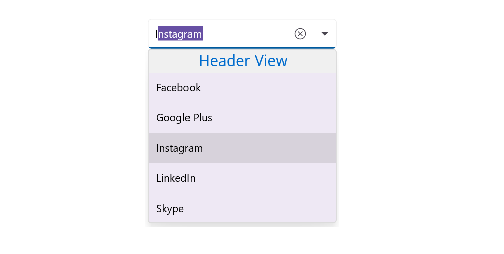

# Header and Footer in Maui ComboBox (SfComboBox)

You can provide header and footer views in the dropdown in [`SfComboBox`] by enabling the [`ShowDropDownHeaderView`] and the [`ShowDropDownFooterView`] properties. 

## Header content

You can provide content for header at the top of the ComboBox's dropdown. The [`DropDownHeaderView`] property is used to set the content of the header. The height of the header in the [`SfComboBox`] can be adjusted using the [`DropDownHeaderViewHeight`] property.





    <StackLayout VerticalOptions="Start" HorizontalOptions="Start" Padding="30">
        <combobox:SfComboBox HeightRequest="40" x:Name="comboBox" IsEditableMode="true" ItemsSource="{Binding SocialMedias}" AllowFiltering="true">
            <combobox:SfComboBox.DropDownHeaderView>
                <StackLayout BackgroundColor="#f0f0f0" >
                    <Label  x:Name="label2" FontSize="20" VerticalTextAlignment="Center" HorizontalOptions="Center" VerticalOptions="Center" TextColor="#006bcd" />
                </StackLayout>
            </combobox:SfComboBox.DropDownHeaderView>        
        </combobox:SfComboBox>
    </StackLayout>                  





    StackLayout layout = new StackLayout()
    {
        VerticalOptions = LayoutOptions.Start,
        HorizontalOptions = LayoutOptions.Start,
        Padding = new Thickness(30)
    };

     SfComboBox comboBox = new SfComboBox()
     {
        HeightRequest = 40,
        ShowDropDownHeaderView = true,
        ItemsSource = new List<string> { "Facebook", "Twitter", "Instagram", "LinkedIn" },
        DropDownHeaderViewHeight = 50
    };

    Label label2 = new Label()
    {
        FontSize = 20,
        VerticalTextAlignment = TextAlignment.Center,
        HorizontalTextAlignment = TextAlignment.Center,
        HorizontalOptions = LayoutOptions.Center,
        VerticalOptions = LayoutOptions.Center,
        TextColor = Color.FromHex("#006bcd")
    };

    comboBox.DropDownHeaderView = label2;
    layout.Children.Add(comboBox);
    this.Content = layout;





## Footer content

You can provide content for footer at the bottom of the ComboBox's dropdown. The [`DropDownFooterView`] property is used to set the content for footer. The height of the footer in the [`SfComboBox`] can be adjusted using the [`DropDownFooterViewHeight`] property.

The following code example shows how to set footer content in [`SfComboBox`].





    <StackLayout VerticalOptions="Start" HorizontalOptions="Start" Padding="30">
        <combobox:SfComboBox HeightRequest="40" ItemsSource="{Binding SocialMedias}" x:Name="comboBox" IsEditableMode="true" AllowFiltering="true">
            <combobox:SfComboBox.DropDownFooterView>
                <StackLayout BackgroundColor="#f0f0f0" >
                    <Label Text="Add New" BackgroundColor="#f0f0f0" TextColor="#006bcd" VerticalTextAlignment="Center" VerticalOptions="Center" HorizontalTextAlignment="Center" FontSize="20"/>
                </StackLayout>
            </combobox:SfComboBox.DropDownFooterView>
        </combobox:SfComboBox>
    </StackLayout>                  





    StackLayout layout = new StackLayout()
    {
        VerticalOptions = LayoutOptions.Start,
        HorizontalOptions = LayoutOptions.Start,
        Padding = new Thickness(30)
    };

    SfComboBox comboBox = new SfComboBox()
     {
        HeightRequest = 40,
        ShowDropDownFooterView = true,
        ItemsSource = new List<string> { "Facebook", "Twitter", "Instagram", "LinkedIn" },
        DropDownFooterViewHeight = 50
    };

    StackLayout customFooterView = new StackLayout();
    Label label = new Label() 
    { 
        Text = "Add New", 
        BackgroundColor = Color.FromHex("#f0f0f0"), 
        TextColor = Color.FromHex("#006bcd"), 
        VerticalOptions = LayoutOptions.Center, 
        VerticalTextAlignment = TextAlignment.Center, 
        HorizontalTextAlignment = TextAlignment.Center, 
        FontSize = 20 
    };
    customFooterView.Children.Add(label);
    comboBox.DropDownFooterView = customFooterView;
    layout.Children.Add(comboBox);
    Content = layout;





