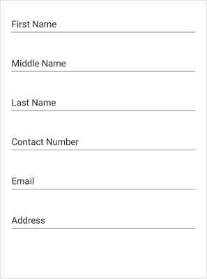
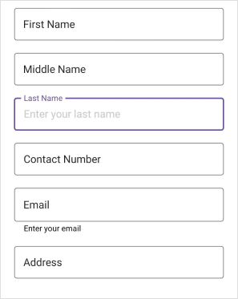
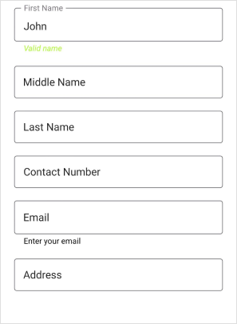
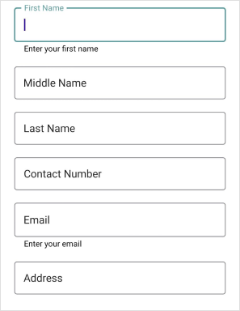

# Floating label layout in .NET MAUI DataForm (SfDataForm)

## Overview

The floating label layout is a powerful feature that enhances the user experience and makes it easier for users to interact with forms. The data form supports a floating label layout which includes assistive labels, leading and trailing icons, and a password toggle icon to show or hide a password. It offers three different containers, including filled, outlined, and none. Setting [LayoutType](https://help.syncfusion.com/cr/maui/Syncfusion.Maui.DataForm.DataFormLayoutType.html) to [TextInputLayout](https://help.syncfusion.com/cr/maui/Syncfusion.Maui.DataForm.DataFormLayoutType.html#Syncfusion_Maui_DataForm_DataFormLayoutType_TextInputLayout) enables a floating label layout.

## Changing the layout type for the data form
By default, the dataform arranges the editors and their labels corresponding to the fields in the layout. However, to enable the floating label layout for data form, set the [LayoutType](https://help.syncfusion.com/cr/maui/Syncfusion.Maui.DataForm.SfDataForm.html#Syncfusion_Maui_DataForm_SfDataForm_LayoutType) property of the [SfDataForm](https://help.syncfusion.com/cr/maui/Syncfusion.Maui.DataForm.SfDataForm.html) or [DataFormItem](https://help.syncfusion.com/cr/maui/Syncfusion.Maui.DataForm.DataFormItem.html) to `TextInputLayout`.



<ContentPage 
...
xmlns:dataForm="clr-namespace:Syncfusion.Maui.DataForm;assembly=Syncfusion.Maui.DataForm">
    <dataForm:SfDataForm
        x:Name="dataForm"
        LayoutType="TextInputLayout">
    </dataForm:SfDataForm>
</ContentPage>



SfDataForm dataForm = new SfDataForm();
dataForm.LayoutType = DataFormLayoutType.TextInputLayout;
this.Content = dataForm;




#### Changing the layout type for the editor
Change the layout type for the editor by using the [LayoutType](https://help.syncfusion.com/cr/maui/Syncfusion.Maui.DataForm.DataFormItem.html#Syncfusion_Maui_DataForm_DataFormItem_LayoutType) property of the [DataFormItem](https://help.syncfusion.com/cr/maui/Syncfusion.Maui.DataForm.DataFormItem.html), and it will be handled in the [GenerateDataFormItem](https://help.syncfusion.com/cr/maui/Syncfusion.Maui.DataForm.SfDataForm.html#Syncfusion_Maui_DataForm_SfDataForm_GenerateDataFormItem) event.



<ContentPage 
...
xmlns:dataForm="clr-namespace:Syncfusion.Maui.DataForm;assembly=Syncfusion.Maui.DataForm">
<dataForm:SfDataForm x:Name="dataForm" 
                        LayoutType="Default"
                        DataObject="{Binding ContactInfo}"
                        GenerateDataFormItem="OnGenerateDataFormItem">
</dataForm:SfDataForm>
</ContentPage>



SfDataForm dataForm = new SfDataForm();
dataForm.LayoutType = DataFormLayoutType.Default;
dataForm.GenerateDataFormItem += OnGenerateDataFormItem;
this.Content = dataForm;

private void OnGenerateDataFormItem(object sender, GenerateDataFormItemEventArgs e)
{
    if (e.DataFormItem != null && e.DataFormItem.FieldName == "FirstName")
    {
        e.DataFormItem.LayoutType = DataFormLayoutType.TextInputLayout;
    }
}




## Supported editors
Dataform supports the floating label layout for the following editors.
* Text editor
* Password editor
* MultilineText editor
* ComboBox editor
* AutoComplete editor
* Custom editor

## Container types
Containers enhance the perspective of the dataform editor views. By default, the container type is [Outlined](https://help.syncfusion.com/cr/maui/Syncfusion.Maui.DataForm.TextInputLayoutContainerType.html#Syncfusion_Maui_DataForm_TextInputLayoutContainerType_Outlined). By using the [ContainerType](https://help.syncfusion.com/cr/maui/Syncfusion.Maui.DataForm.TextInputLayoutSettings.html#Syncfusion_Maui_DataForm_TextInputLayoutSettings_ContainerType) property of the [TextInputLayoutSettings](https://help.syncfusion.com/cr/maui/Syncfusion.Maui.DataForm.TextInputLayoutSettings.html) in [DataForm](https://help.syncfusion.com/cr/maui/Syncfusion.Maui.DataForm.SfDataForm.html) or [DataFormItem](https://help.syncfusion.com/cr/maui/Syncfusion.Maui.DataForm.DataFormItem.html), modify the container type to [Filled](https://help.syncfusion.com/cr/maui/Syncfusion.Maui.DataForm.TextInputLayoutContainerType.html#Syncfusion_Maui_DataForm_TextInputLayoutContainerType_Filled) or [None](https://help.syncfusion.com/cr/maui/Syncfusion.Maui.DataForm.TextInputLayoutContainerType.html#Syncfusion_Maui_DataForm_TextInputLayoutContainerType_None).

#### Outlined
The `Outlined` container type draws a thin border around the text input field and adds a hint text that floats above the input field when the user starts typing. To enable the outlined container type, set the [ContainerType](https://help.syncfusion.com/cr/maui/Syncfusion.Maui.DataForm.TextInputLayoutSettings.html#Syncfusion_Maui_DataForm_TextInputLayoutSettings_ContainerType) property of the [TextInputLayoutSettings](https://help.syncfusion.com/cr/maui/Syncfusion.Maui.DataForm.TextInputLayoutSettings.html) to [Outlined](https://help.syncfusion.com/cr/maui/Syncfusion.Maui.DataForm.TextInputLayoutContainerType.html#Syncfusion_Maui_DataForm_TextInputLayoutContainerType_Outlined) in [SfDataForm](https://help.syncfusion.com/cr/maui/Syncfusion.Maui.DataForm.SfDataForm.html) or [DataFormItem](https://help.syncfusion.com/cr/maui/Syncfusion.Maui.DataForm.DataFormItem.html), which covers the editor view with rounded-corner.



<ContentPage 
...
xmlns:dataForm="clr-namespace:Syncfusion.Maui.DataForm;assembly=Syncfusion.Maui.DataForm">
<dataForm:SfDataForm x:Name="dataForm" 
                        LayoutType="TextInputLayout"
                        DataObject="{Binding ContactInfo}">
    <dataForm:SfDataForm.TextInputLayoutSettings>
        <dataForm:TextInputLayoutSettings ContainerType="Outlined"/>
    </dataForm:SfDataForm.TextInputLayoutSettings>
</dataForm:SfDataForm>
</ContentPage>



SfDataForm dataForm = new SfDataForm();
dataForm.LayoutType = DataFormLayoutType.TextInputLayout;
dataForm.GenerateDataFormItem += OnGenerateDataFormItem;
this.Content = dataForm;

private void OnGenerateDataFormItem(object sender, GenerateDataFormItemEventArgs e)
{
    if (e.DataFormItem != null && e.DataFormItem.FieldName == "Name")
    {
        e.DataFormItem.LayoutType = DataFormLayoutType.TextInputLayout;
        e.DataFormItem.TextInputLayoutSettings = new TextInputLayoutSettings
        {
            ContainerType = TextInputLayoutContainerType.Outlined
        };
    }
}




public class ContactInfo
{
    [Display(Name = "First Name", Prompt = "Enter your first name")]
    [DataFormDisplayOptions(ValidMessage = "Valid name")]
    [Required(ErrorMessage = "Please enter your first name")]
    [StringLength(10, ErrorMessage = "First name should not exceed 10 characters")]
    public string FirstName { get; set; }

    [Display(Name = "Middle Name")]
    [Required(ErrorMessage = "Please enter your middle name")]
    [StringLength(10, ErrorMessage = "First name should not exceed 10 characters")]
    public string MiddleName { get; set; }

    [Display(Name = "Last Name")]
    [Required(ErrorMessage = "Please enter your last name")]
    [StringLength(10, ErrorMessage = "First name should not exceed 10 characters")]
    public string LastName { get; set; }

    [Display(Name = "Contact Number")]
    public string ContactNumber { get; set; }

    [Display(Name = "Email", Prompt = "Enter your email")]
    [EmailAddress(ErrorMessage = "Invalid email address")]
    public string Email { get; set; }

    public string Address { get; set; }
}




#### Filled
The `Filled` container type fills the background of the text input field with a solid color and adds a hint of text that floats above the input field when the user starts typing. It can be enabled by setting the [ContainerType](https://help.syncfusion.com/cr/maui/Syncfusion.Maui.DataForm.TextInputLayoutSettings.html#Syncfusion_Maui_DataForm_TextInputLayoutSettings_ContainerType) property to [Filled](https://help.syncfusion.com/cr/maui/Syncfusion.Maui.DataForm.TextInputLayoutContainerType.html#Syncfusion_Maui_DataForm_TextInputLayoutContainerType_Filled) in the [SfDataForm](https://help.syncfusion.com/cr/maui/Syncfusion.Maui.DataForm.SfDataForm.html) or [DataFormItem](https://help.syncfusion.com/cr/maui/Syncfusion.Maui.DataForm.DataFormItem.html).



<ContentPage 
...
xmlns:dataForm="clr-namespace:Syncfusion.Maui.DataForm;assembly=Syncfusion.Maui.DataForm">
<dataForm:SfDataForm x:Name="dataForm" 
                        LayoutType="TextInputLayout"
                        DataObject="{Binding ContactInfo}">
    <dataForm:SfDataForm.TextInputLayoutSettings>
        <dataForm:TextInputLayoutSettings ContainerType="Filled"/>
    </dataForm:SfDataForm.TextInputLayoutSettings>
</dataForm:SfDataForm>
</ContentPage>



SfDataForm dataForm = new SfDataForm();
dataForm.LayoutType = DataFormLayoutType.TextInputLayout;
dataForm.GenerateDataFormItem += OnGenerateDataFormItem;
this.Content = dataForm;

private void OnGenerateDataFormItem(object sender, GenerateDataFormItemEventArgs e)
{
    if (e.DataFormItem != null && e.DataFormItem.FieldName == "Name")
    {
        e.DataFormItem.LayoutType = DataFormLayoutType.TextInputLayout;
        e.DataFormItem.TextInputLayoutSettings = new TextInputLayoutSettings
        {
            ContainerType = TextInputLayoutContainerType.Filled
        };
    }
}




#### None
The `None` container type adds no border or background to the text input field. It can be enabled by setting the [ContainerType](https://help.syncfusion.com/cr/maui/Syncfusion.Maui.DataForm.TextInputLayoutSettings.html#Syncfusion_Maui_DataForm_TextInputLayoutSettings_ContainerType) property to [None](https://help.syncfusion.com/cr/maui/Syncfusion.Maui.DataForm.TextInputLayoutContainerType.html#Syncfusion_Maui_DataForm_TextInputLayoutContainerType_None) in the [SfDataForm](https://help.syncfusion.com/cr/maui/Syncfusion.Maui.DataForm.SfDataForm.html) or [DataFormItem](https://help.syncfusion.com/cr/maui/Syncfusion.Maui.DataForm.DataFormItem.html). It will have an empty background and enough spacing.



<ContentPage 
...
xmlns:dataForm="clr-namespace:Syncfusion.Maui.DataForm;assembly=Syncfusion.Maui.DataForm">
<dataForm:SfDataForm x:Name="dataForm" 
                        LayoutType="TextInputLayout"
                        DataObject="{Binding ContactInfo}">
    <dataForm:SfDataForm.TextInputLayoutSettings>
        <dataForm:TextInputLayoutSettings ContainerType="None"/>
    </dataForm:SfDataForm.TextInputLayoutSettings>
</dataForm:SfDataForm>
</ContentPage>



SfDataForm dataForm = new SfDataForm();
dataForm.LayoutType = DataFormLayoutType.TextInputLayout;
dataForm.GenerateDataFormItem += OnGenerateDataFormItem;
this.Content = dataForm;

private void OnGenerateDataFormItem(object sender, GenerateDataFormItemEventArgs e)
{
    if (e.DataFormItem != null && e.DataFormItem.FieldName == "Name")
    {
        e.DataFormItem.LayoutType = DataFormLayoutType.TextInputLayout;
        e.DataFormItem.TextInputLayoutSettings = new TextInputLayoutSettings
        {
            ContainerType = TextInputLayoutContainerType.None
        };
    }
}




## Leading and Trailing view

#### Leading view
The leading view is a view that appears to the left of the text input field. It can add functionality or visual elements to the text input such as a label or an icon. It can be added to the floating label layout by setting the [LeadingView](https://help.syncfusion.com/cr/maui/Syncfusion.Maui.DataForm.DataFormItem.html#Syncfusion_Maui_DataForm_DataFormItem_LeadingView) property of the [DataFormItem](https://help.syncfusion.com/cr/maui/Syncfusion.Maui.DataForm.DataFormItem.html). Show the leading view only when the [ShowLeadingView](https://help.syncfusion.com/cr/maui/Syncfusion.Maui.DataForm.DataFormItem.html#Syncfusion_Maui_DataForm_DataFormItem_ShowLeadingView) property is `true`.



<ContentPage 
...
xmlns:dataForm="clr-namespace:Syncfusion.Maui.DataForm;assembly=Syncfusion.Maui.DataForm">
<dataForm:SfDataForm x:Name="dataForm" 
                        LayoutType="TextInputLayout"
                        DataObject="{Binding ContactInfo}">
<dataForm:SfDataForm.Items>
    <dataForm:DataFormTextItem FieldName="Name" 
                                ShowLeadingView="True">
        <dataForm:DataFormTextItem.LeadingView>
            <Label Text="F" FontSize="18" TextColor="Gray" FontFamily="InputLayoutIcons" HeightRequest="24" VerticalTextAlignment="End" />
        </dataForm:DataFormTextItem.LeadingView>
    </dataForm:DataFormTextItem>
</dataForm:SfDataForm.Items>
</dataForm:SfDataForm>
</ContentPage>



SfDataForm dataForm = new SfDataForm();
dataForm.LayoutType = DataFormLayoutType.TextInputLayout;
dataForm.GenerateDataFormItem += OnGenerateDataFormItem;
this.Content = dataForm;

private void OnGenerateDataFormItem(object sender, GenerateDataFormItemEventArgs e)
{
    if (e.DataFormItem != null && e.DataFormItem.FieldName == "Name")
    {
        e.DataFormItem.LayoutType = DataFormLayoutType.TextInputLayout;
        e.DataFormItem.ShowLeadingView = true;
        e.DataFormItem.LeadingView = new Label { Text = "F", FontSize = 18, TextColor = Colors.Gray, FontFamily = "InputLayoutIcons", HeightRequest = 24, VerticalTextAlignment = TextAlignment.End };
    }
}




N> The [LeadingView](https://help.syncfusion.com/cr/maui/Syncfusion.Maui.DataForm.DataFormItem.html#Syncfusion_Maui_DataForm_DataFormItem_LeadingView) is applicable for both [Default](https://help.syncfusion.com/cr/maui/Syncfusion.Maui.DataForm.DataFormLayoutType.html#Syncfusion_Maui_DataForm_DataFormLayoutType_Default) and [TextInputLayout](https://help.syncfusion.com/cr/maui/Syncfusion.Maui.DataForm.DataFormLayoutType.html#Syncfusion_Maui_DataForm_DataFormLayoutType_TextInputLayout) layout types

#### Trailing view
The trailing view is a view that appears to the right of the text input field. It can be used to add additional functionality or visual elements to the text input such as a clear button or an icon. It can be added to the floating label layout by setting the [TrailingView](https://help.syncfusion.com/cr/maui/Syncfusion.Maui.DataForm.DataFormItem.html#Syncfusion_Maui_DataForm_DataFormItem_TrailingView) property of the [DataFormItem](https://help.syncfusion.com/cr/maui/Syncfusion.Maui.DataForm.DataFormItem.html). Show a trailing view only when the [ShowTrailingView](https://help.syncfusion.com/cr/maui/Syncfusion.Maui.DataForm.DataFormItem.html#Syncfusion_Maui_DataForm_DataFormItem_ShowTrailingView) property is `true`.



<ContentPage 
...
xmlns:dataForm="clr-namespace:Syncfusion.Maui.DataForm;assembly=Syncfusion.Maui.DataForm">
<dataForm:SfDataForm x:Name="dataForm" 
                        LayoutType="TextInputLayout"
                        DataObject="{Binding ContactInfo}">
<dataForm:SfDataForm.Items>
    <dataForm:DataFormTextItem FieldName="Name" 
                                ShowTrailingView="True">
        <dataForm:DataFormTextItem.TrailingView>
            <Label Text="F" FontSize="18" TextColor="Gray" FontFamily="InputLayoutIcons" HeightRequest="24" VerticalTextAlignment="End" />
        </dataForm:DataFormTextItem.TrailingView>
    </dataForm:DataFormTextItem>
</dataForm:SfDataForm.Items>
</dataForm:SfDataForm>
</ContentPage>



SfDataForm dataForm = new SfDataForm();
dataForm.LayoutType = DataFormLayoutType.TextInputLayout;
dataForm.GenerateDataFormItem += OnGenerateDataFormItem;
this.Content = dataForm;

private void OnGenerateDataFormItem(object sender, GenerateDataFormItemEventArgs e)
{
    if (e.DataFormItem != null && e.DataFormItem.FieldName == "Name")
    {
        e.DataFormItem.LayoutType = DataFormLayoutType.TextInputLayout;
        e.DataFormItem.ShowTrailingView = true;
        e.DataFormItem.TrailingView = new Label { Text = "F", FontSize = 18, TextColor = Colors.Gray, FontFamily = "InputLayoutIcons", HeightRequest = 24, VerticalTextAlignment = TextAlignment.End };
    }
}




N> The [TrailingView](https://help.syncfusion.com/cr/maui/Syncfusion.Maui.DataForm.DataFormItem.html#Syncfusion_Maui_DataForm_DataFormItem_TrailingView) is applicable only when the [LayoutType](https://help.syncfusion.com/cr/maui/Syncfusion.Maui.DataForm.DataFormItem.html#Syncfusion_Maui_DataForm_DataFormItem_LayoutType) is [TextInputLayout](https://help.syncfusion.com/cr/maui/Syncfusion.Maui.DataForm.DataFormLayoutType.html#Syncfusion_Maui_DataForm_DataFormLayoutType_TextInputLayout).

#### Leading and Trailing View Position
The [LeadingViewPosition](https://help.syncfusion.com/cr/maui/Syncfusion.Maui.DataForm.DataFormItem.html#Syncfusion_Maui_DataForm_DataFormItem_LeadingViewPosition) and [TrailingViewPosition](https://help.syncfusion.com/cr/maui/Syncfusion.Maui.DataForm.DataFormItem.html#Syncfusion_Maui_DataForm_DataFormItem_TrailingViewPosition) properties of the [DataFormItem](https://help.syncfusion.com/cr/maui/Syncfusion.Maui.DataForm.DataFormItem.html) allow you to adjust the leading and trailing view's positions. The view is positioned `outside` the container if the leading and trailing view positions are set to [TextInputLayoutViewPosition.Outside](https://help.syncfusion.com/cr/maui/Syncfusion.Maui.DataForm.TextInputLayoutViewPosition.html#Syncfusion_Maui_DataForm_TextInputLayoutViewPosition_Outside). The view is positioned `inside` the container if the leading and trailing view positions are set to [TextInputLayoutViewPosition.Inside](https://help.syncfusion.com/cr/maui/Syncfusion.Maui.DataForm.TextInputLayoutViewPosition.html#Syncfusion_Maui_DataForm_TextInputLayoutViewPosition_Inside).



<ContentPage 
...
xmlns:dataForm="clr-namespace:Syncfusion.Maui.DataForm;assembly=Syncfusion.Maui.DataForm">
<dataForm:SfDataForm x:Name="dataForm" 
                        LayoutType="TextInputLayout"
                        DataObject="{Binding ContactInfo}">
<dataForm:SfDataForm.Items>
    <dataForm:DataFormTextItem FieldName="Name" 
                                ShowLeadingView="True" 
                                LeadingViewPosition="Outside">
        <dataForm:DataFormTextItem.LeadingView>
            <Label Text="F" FontSize="18" TextColor="Gray" FontFamily="InputLayoutIcons" HeightRequest="24" VerticalTextAlignment="End" />
        </dataForm:DataFormTextItem.LeadingView>
    </dataForm:DataFormTextItem>
</dataForm:SfDataForm.Items>
</dataForm:SfDataForm>
</ContentPage>



SfDataForm dataForm = new SfDataForm();
dataForm.LayoutType = DataFormLayoutType.TextInputLayout;
dataForm.GenerateDataFormItem += OnGenerateDataFormItem;
this.Content = dataForm;

private void OnGenerateDataFormItem(object sender, GenerateDataFormItemEventArgs e)
{
    if (e.DataFormItem != null && e.DataFormItem.FieldName == "Name")
    {
        e.DataFormItem.LayoutType = DataFormLayoutType.TextInputLayout;
        e.DataFormItem.ShowLeadingView = true;
        e.DataFormItem.LeadingViewPosition = TextInputLayoutViewPosition.Outside;
        e.DataFormItem.LeadingView = new Label { Text = "F", FontSize = 18, TextColor = Colors.Gray, FontFamily = "InputLayoutIcons", HeightRequest = 24, VerticalTextAlignment = TextAlignment.End };
    }
}



<ContentPage 
...
xmlns:dataForm="clr-namespace:Syncfusion.Maui.DataForm;assembly=Syncfusion.Maui.DataForm">
<dataForm:SfDataForm x:Name="dataForm" 
                        LayoutType="TextInputLayout"
                        DataObject="{Binding ContactInfo}">
<dataForm:SfDataForm.Items>
    <dataForm:DataFormTextItem FieldName="Contact Number" 
                                ShowTrailingView="True" 
                                TrailingViewPosition="Inside">
        <dataForm:DataFormTextItem.TrailingView>
            <Label Text="F" FontSize="18" TextColor="Gray" FontFamily="InputLayoutIcons" HeightRequest="24" VerticalTextAlignment="End" />
        </dataForm:DataFormTextItem.TrailingView>
    </dataForm:DataFormTextItem>
</dataForm:SfDataForm.Items>
</dataForm:SfDataForm>
</ContentPage>



SfDataForm dataForm = new SfDataForm();
dataForm.LayoutType = DataFormLayoutType.TextInputLayout;
dataForm.GenerateDataFormItem += OnGenerateDataFormItem;
this.Content = dataForm;

private void OnGenerateDataFormItem(object sender, GenerateDataFormItemEventArgs e)
{
    if (e.DataFormItem != null && e.DataFormItem.FieldName == "Contact Number")
    {
        e.DataFormItem.LayoutType = DataFormLayoutType.TextInputLayout;
        e.DataFormItem.ShowTrailingView = true;
        e.DataFormItem.TrailingViewPosition = TextInputLayoutViewPosition.Inside;
        e.DataFormItem.TrailingView = new Label { Text = "F", FontSize = 18, TextColor = Colors.Gray, FontFamily = "InputLayoutIcons", HeightRequest = 24, VerticalTextAlignment = TextAlignment.End };
    }
}




## Enable password visibility toggle for password editor
Password toggle visibility in a floating label layout is used to show or hide the visibility of characters in the dataform password editor. Enable this toggle by setting the [EnablePasswordVisibilityToggle](https://help.syncfusion.com/cr/maui/Syncfusion.Maui.DataForm.DataFormPasswordItem.html#Syncfusion_Maui_DataForm_DataFormPasswordItem_EnablePasswordVisibilityToggle) property to `true` in the [DataFormItem](https://help.syncfusion.com/cr/maui/Syncfusion.Maui.DataForm.DataFormItem.html). The default value of the `EnablePasswordVisibilityToggle` is `true`.



<ContentPage 
...
xmlns:dataForm="clr-namespace:Syncfusion.Maui.DataForm;assembly=Syncfusion.Maui.DataForm">
<dataForm:SfDataForm x:Name="dataForm" 
                        LayoutType="TextInputLayout"
                        DataObject="{Binding ContactInfo}">
<dataForm:SfDataForm.Items>
    <dataForm:DataFormPasswordItem FieldName="Name" 
                                EnablePasswordVisibilityToggle="True">
    </dataForm:DataFormPasswordItem>
</dataForm:SfDataForm.Items>
</dataForm:SfDataForm>
</ContentPage>



SfDataForm dataForm = new SfDataForm();
dataForm.LayoutType = DataFormLayoutType.TextInputLayout;
dataForm.GenerateDataFormItem += OnGenerateDataFormItem;
this.Content = dataForm;

private void OnGenerateDataFormItem(object sender, GenerateDataFormItemEventArgs e)
{
    if (e.DataFormItem != null && e.DataFormItem.FieldName == "Name" && e.DataFormItem is DataFormPasswordItem passwordItem)
    {
        passwordItem.LayoutType = DataFormLayoutType.TextInputLayout;
        passwordItem.EnablePasswordVisibilityToggle = true;
    }
}




## Assistive label

#### Hint label
The data field name will be displayed as a floating or hint label for the editor and enabled by using the `Name` or `LabelText` property.

#### Helper label
The helper label displays the watermark for the editor to provide hints for users, and it can be set using `Prompt` or `PlaceHolderText`.

The visibility of the helper text in the DataForm floating label layout for the [DataForm](https://help.syncfusion.com/cr/maui/Syncfusion.Maui.DataForm.SfDataForm.html) and [DataFormItem](https://help.syncfusion.com/cr/maui/Syncfusion.Maui.DataForm.DataFormItem.html) can be collapsed by setting the [ShowHelperText](https://help.syncfusion.com/cr/maui/Syncfusion.Maui.DataForm.TextInputLayoutSettings.html#Syncfusion_Maui_DataForm_TextInputLayoutSettings_ShowHelperText) property of the [TextInputLayoutSettings](https://help.syncfusion.com/cr/maui/Syncfusion.Maui.DataForm.TextInputLayoutSettings.html) to `false`.



<ContentPage 
...
xmlns:dataForm="clr-namespace:Syncfusion.Maui.DataForm;assembly=Syncfusion.Maui.DataForm">
<dataForm:SfDataForm x:Name="dataForm" 
                        LayoutType="TextInputLayout"
                        DataObject="{Binding ContactInfo}">
    <dataForm:SfDataForm.TextInputLayoutSettings>
        <dataForm:TextInputLayoutSettings ShowHelperText="False"/>
    </dataForm:SfDataForm.TextInputLayoutSettings>
</dataForm:SfDataForm>
</ContentPage>



SfDataForm dataForm = new SfDataForm();
dataForm.LayoutType = DataFormLayoutType.TextInputLayout;
dataForm.GenerateDataFormItem += OnGenerateDataFormItem;
this.Content = dataForm;

private void OnGenerateDataFormItem(object sender, GenerateDataFormItemEventArgs e)
{
    if (e.DataFormItem != null && e.DataFormItem.FieldName == "Name")
    {
        e.DataFormItem.LayoutType = DataFormLayoutType.TextInputLayout;
        e.DataFormItem.TextInputLayoutSettings = new TextInputLayoutSettings
        {
            ShowHelperText = false,
        };
    }
}




#### Validation label
The validation label displays the dataform validation messages such as valid or invalid data. Refer to the [validation](https://help.syncfusion.com/maui/dataform/validation) to learn more about the dataform validation.

## Customize Assistive label using text style
Customize the font of assistive labels by setting the `TextColor`, `FontFamily`, `FontSize`, and `FontAttributes` properties of the [DataFormTextStyle](https://help.syncfusion.com/cr/maui/Syncfusion.Maui.DataForm.DataFormTextStyle.html) property.

#### Hint label style
Customize the text of the hint label by setting the `TextColor`, `FontFamily`, `FontSize`, and `FontAttributes` properties of the [LabelTextStyle](https://help.syncfusion.com/cr/maui/Syncfusion.Maui.DataForm.DataFormItem.html#Syncfusion_Maui_DataForm_DataFormItem_LabelTextStyle) in the [DataFormItem](https://help.syncfusion.com/cr/maui/Syncfusion.Maui.DataForm.DataFormItem.html).



<ContentPage 
...
xmlns:dataForm="clr-namespace:Syncfusion.Maui.DataForm;assembly=Syncfusion.Maui.DataForm">
<dataForm:SfDataForm x:Name="dataForm" 
                        LayoutType="TextInputLayout"
                        DataObject="{Binding ContactInfo}"
                        AutoGenerateItems="False"
                        GenerateDataFormItem="OnGenerateDataFormItem">
    <dataForm:SfDataForm.Items>
        <dataForm:DataFormTextItem FieldName="Name">
            <dataForm:DataFormTextItem.LabelTextStyle>
                <dataForm:DataFormTextStyle TextColor="CadetBlue" FontAttributes="None"/>
            </dataForm:DataFormTextItem.LabelTextStyle>
        </dataForm:DataFormTextItem>
    </dataForm:SfDataForm.Items>
</dataForm:SfDataForm>
</ContentPage>



SfDataForm dataForm = new SfDataForm();
dataForm.LayoutType = DataFormLayoutType.TextInputLayout;
dataForm.GenerateDataFormItem += OnGenerateDataFormItem;
this.Content = dataForm;

private void OnGenerateDataFormItem(object sender, GenerateDataFormItemEventArgs e)
{
    if (e.DataFormItem != null && e.DataFormItem.FieldName == "Name")
    {
        e.DataFormItem.LayoutType = DataFormLayoutType.TextInputLayout;
        e.DataFormItem.LabelTextStyle = new DataFormTextStyle { FontAttributes = FontAttributes.Bold, TextColor = Colors.BlueViolet };
    }
}




#### Helper label style
Customize the text of the helper label by setting the `TextColor`, `FontFamily`, `FontSize`, and `FontAttributes` properties of the [TextInputLayoutSettings.HelperTextStyle](https://help.syncfusion.com/cr/maui/Syncfusion.Maui.DataForm.TextInputLayoutSettings.html#Syncfusion_Maui_DataForm_TextInputLayoutSettings_HelperTextStyle) in the [DataFormItem](https://help.syncfusion.com/cr/maui/Syncfusion.Maui.DataForm.DataFormItem.html).



<ContentPage 
...
xmlns:dataForm="clr-namespace:Syncfusion.Maui.DataForm;assembly=Syncfusion.Maui.DataForm">
<dataForm:SfDataForm x:Name="dataForm" 
                        LayoutType="TextInputLayout"
                        DataObject="{Binding ContactInfo}"
                        GenerateDataFormItem="OnGenerateDataFormItem">
    <dataForm:SfDataForm.TextInputLayoutSettings>
        <dataForm:TextInputLayoutSettings ShowHelperText="True">
            <dataForm:TextInputLayoutSettings.HelperTextStyle>
                <dataForm:DataFormTextStyle FontAttributes="Italic" TextColor="Violet" />
            </dataForm:TextInputLayoutSettings.HelperTextStyle>
        </dataForm:TextInputLayoutSettings>
    </dataForm:SfDataForm.TextInputLayoutSettings>
</dataForm:SfDataForm>
</ContentPage>



SfDataForm dataForm = new SfDataForm();
dataForm.LayoutType = DataFormLayoutType.TextInputLayout;
dataForm.GenerateDataFormItem += OnGenerateDataFormItem;
this.Content = dataForm;

private void OnGenerateDataFormItem(object sender, GenerateDataFormItemEventArgs e)
{
    if (e.DataFormItem != null && e.DataFormItem.FieldName == "Name")
    {
        e.DataFormItem.LayoutType = DataFormLayoutType.TextInputLayout;
        e.DataFormItem.TextInputLayoutSettings = new TextInputLayoutSettings
        {
            HelperTextStyle = new DataFormTextStyle { TextColor = Colors.Blue, FontAttributes = FontAttributes.Bold },
        };
    }
}




#### Error message label style
Customize the text of the error message label by setting the `TextColor`, `FontFamily`, `FontSize`, and `FontAttributes` properties of the [ErrorLabelTextStyle](https://help.syncfusion.com/cr/maui/Syncfusion.Maui.DataForm.DataFormItem.html#Syncfusion_Maui_DataForm_DataFormItem_ErrorLabelTextStyle) in the [DataFormItem](https://help.syncfusion.com/cr/maui/Syncfusion.Maui.DataForm.DataFormItem.html).



<ContentPage 
...
xmlns:dataForm="clr-namespace:Syncfusion.Maui.DataForm;assembly=Syncfusion.Maui.DataForm">
<dataForm:SfDataForm x:Name="dataForm" 
                        LayoutType="TextInputLayout"
                        DataObject="{Binding ContactInfo}"
                        AutoGenerateItems="False"
                        GenerateDataFormItem="OnGenerateDataFormItem">
    <dataForm:SfDataForm.Items>
        <dataForm:DataFormTextItem FieldName="Name">
            <dataForm:DataFormTextItem.ErrorLabelTextStyle>
                <dataForm:DataFormTextStyle TextColor="RosyBrown" FontAttributes="Italic"/>
            </dataForm:DataFormTextItem.ErrorLabelTextStyle>
        </dataForm:DataFormTextItem>
    </dataForm:SfDataForm.Items>
</dataForm:SfDataForm>
</ContentPage>



SfDataForm dataForm = new SfDataForm();
dataForm.LayoutType = DataFormLayoutType.TextInputLayout;
dataForm.GenerateDataFormItem += OnGenerateDataFormItem;
this.Content = dataForm;

private void OnGenerateDataFormItem(object sender, GenerateDataFormItemEventArgs e)
{
    if (e.DataFormItem != null && e.DataFormItem.FieldName == "Name")
    {
        e.DataFormItem.LayoutType = DataFormLayoutType.TextInputLayout;
        e.DataFormItem.ErrorLabelTextStyle = new DataFormTextStyle { FontAttributes = FontAttributes.Bold, TextColor = Colors.IndianRed };
    }
}




#### Valid message label style
Customize the text of a valid message label by setting the `TextColor`, `FontFamily`, `FontSize`, and `FontAttributes` properties of the [ValidMessageLabelTextStyle](https://help.syncfusion.com/cr/maui/Syncfusion.Maui.DataForm.DataFormItem.html#Syncfusion_Maui_DataForm_DataFormItem_ValidMessageLabelTextStyle) in the [DataFormItem](https://help.syncfusion.com/cr/maui/Syncfusion.Maui.DataForm.DataFormItem.html).



<ContentPage 
...
xmlns:dataForm="clr-namespace:Syncfusion.Maui.DataForm;assembly=Syncfusion.Maui.DataForm">
<dataForm:SfDataForm x:Name="dataForm" 
                        LayoutType="TextInputLayout"
                        DataObject="{Binding ContactInfo}"
                        AutoGenerateItems="False"
                        GenerateDataFormItem="OnGenerateDataFormItem">
    <dataForm:SfDataForm.Items>
        <dataForm:DataFormTextItem FieldName="Name">
            <dataForm:DataFormTextItem.ValidMessageLabelTextStyle>
                <dataForm:DataFormTextStyle TextColor="ForestGreen" FontAttributes="Italic"/>
            </dataForm:DataFormTextItem.ValidMessageLabelTextStyle>
        </dataForm:DataFormTextItem>
    </dataForm:SfDataForm.Items>
</dataForm:SfDataForm>
</ContentPage>



SfDataForm dataForm = new SfDataForm();
dataForm.LayoutType = DataFormLayoutType.TextInputLayout;
dataForm.GenerateDataFormItem += OnGenerateDataFormItem;
this.Content = dataForm;

private void OnGenerateDataFormItem(object sender, GenerateDataFormItemEventArgs e)
{
    if (e.DataFormItem != null && e.DataFormItem.FieldName == "Name")
    {
        e.DataFormItem.LayoutType = DataFormLayoutType.TextInputLayout;
        e.DataFormItem.ValidMessageLabelTextStyle = new DataFormTextStyle { FontAttributes = FontAttributes.Bold, TextColor = Colors.GreenYellow };
    }
}




## Appearance customization

#### Changing outline corner radius
The corner radius of the container will be changed by setting the [OutlineCornerRadius](https://help.syncfusion.com/cr/maui/Syncfusion.Maui.DataForm.TextInputLayoutSettings.html#Syncfusion_Maui_DataForm_TextInputLayoutSettings_OutlineCornerRadius) property of the [TextInputLayoutSettings](https://help.syncfusion.com/cr/maui/Syncfusion.Maui.DataForm.TextInputLayoutSettings.html) to double value.



<ContentPage 
...
xmlns:dataForm="clr-namespace:Syncfusion.Maui.DataForm;assembly=Syncfusion.Maui.DataForm">
<dataForm:SfDataForm x:Name="dataForm" 
                        LayoutType="TextInputLayout"
                        DataObject="{Binding ContactInfo}"
                        GenerateDataFormItem="OnGenerateDataFormItem">
    <dataForm:SfDataForm.TextInputLayoutSettings>
        <dataForm:TextInputLayoutSettings OutlineCornerRadius="10"/>
    </dataForm:SfDataForm.TextInputLayoutSettings>
</dataForm:SfDataForm>
</ContentPage>



SfDataForm dataForm = new SfDataForm();
this.dataForm.LayoutType = DataFormLayoutType.TextInputLayout;
this.dataForm.GenerateDataFormItem += OnGenerateDataFormItem;
this.Content = dataForm;

private void OnGenerateDataFormItem(object sender, GenerateDataFormItemEventArgs e)
{
    if (e.DataFormItem != null && e.DataFormItem.FieldName == "Name")
    {
        e.DataFormItem.LayoutType = DataFormLayoutType.TextInputLayout;
        e.DataFormItem.TextInputLayoutSettings = new TextInputLayoutSettings
        {
            OutlineCornerRadius = 10,
        };
    }
}




#### Stroke color
The [Stroke](https://help.syncfusion.com/cr/maui/Syncfusion.Maui.DataForm.TextInputLayoutSettings.html#Syncfusion_Maui_DataForm_TextInputLayoutSettings_Stroke) property of the [TextInputLayoutSettings](https://help.syncfusion.com/cr/maui/Syncfusion.Maui.DataForm.TextInputLayoutSettings.html) changes the label text and border color of the editors.



<ContentPage 
...
xmlns:dataForm="clr-namespace:Syncfusion.Maui.DataForm;assembly=Syncfusion.Maui.DataForm">
<dataForm:SfDataForm x:Name="dataForm" 
                        LayoutType="TextInputLayout"
                        DataObject="{Binding ContactInfo}"
                        GenerateDataFormItem="OnGenerateDataFormItem">
    <dataForm:SfDataForm.TextInputLayoutSettings>
        <dataForm:TextInputLayoutSettings Stroke="Blue"/>
    </dataForm:SfDataForm.TextInputLayoutSettings>
</dataForm:SfDataForm>
</ContentPage>



SfDataForm dataForm = new SfDataForm();
dataForm.LayoutType = DataFormLayoutType.TextInputLayout;
dataForm.GenerateDataFormItem += OnGenerateDataFormItem;
this.Content = dataForm;

private void OnGenerateDataFormItem(object sender, GenerateDataFormItemEventArgs e)
{
    if (e.DataFormItem != null && e.DataFormItem.FieldName == "Name")
    {
        e.DataFormItem.LayoutType = DataFormLayoutType.TextInputLayout;
        e.DataFormItem.TextInputLayoutSettings = new TextInputLayoutSettings
        {
            Stroke = Colors.Blue,
        };
    }
}




#### Focused stroke color
When the given editor view is focused, the [FocusedStroke](https://help.syncfusion.com/cr/maui/Syncfusion.Maui.DataForm.TextInputLayoutSettings.html#Syncfusion_Maui_DataForm_TextInputLayoutSettings_FocusedStroke) property value will be applied to the label text and border.



<ContentPage 
...
xmlns:dataForm="clr-namespace:Syncfusion.Maui.DataForm;assembly=Syncfusion.Maui.DataForm">
<dataForm:SfDataForm x:Name="dataForm" 
                        LayoutType="TextInputLayout"
                        DataObject="{Binding ContactInfo}"
                        GenerateDataFormItem="OnGenerateDataFormItem">
    <dataForm:SfDataForm.TextInputLayoutSettings>
        <dataForm:TextInputLayoutSettings FocusedStroke="Green"/>
    </dataForm:SfDataForm.TextInputLayoutSettings>
</dataForm:SfDataForm>
</ContentPage>



SfDataForm dataForm = new SfDataForm();
dataForm.LayoutType = DataFormLayoutType.TextInputLayout;
dataForm.GenerateDataFormItem += OnGenerateDataFormItem;
this.Content = dataForm;

private void OnGenerateDataFormItem(object sender, GenerateDataFormItemEventArgs e)
{
    if (e.DataFormItem != null && e.DataFormItem.FieldName == "Name")
    {
        e.DataFormItem.LayoutType = DataFormLayoutType.TextInputLayout;
        e.DataFormItem.TextInputLayoutSettings = new TextInputLayoutSettings
        {
            FocusedStroke = Colors.Green,
        };
    }
}




#### Focused and unfocused stroke thickness
When the editor's view is focused and unfocused, the border's thickness can be changed using the [FocusedStrokeThickness](https://help.syncfusion.com/cr/maui/Syncfusion.Maui.DataForm.TextInputLayoutSettings.html#Syncfusion_Maui_DataForm_TextInputLayoutSettings_FocusedStrokeThickness) and [UnfocusedStrokeThickness](https://help.syncfusion.com/cr/maui/Syncfusion.Maui.DataForm.TextInputLayoutSettings.html#Syncfusion_Maui_DataForm_TextInputLayoutSettings_UnfocusedStrokeThickness) properties of the [TextInputLayoutSettings](https://help.syncfusion.com/cr/maui/Syncfusion.Maui.DataForm.TextInputLayoutSettings.html).



<ContentPage 
...
xmlns:dataForm="clr-namespace:Syncfusion.Maui.DataForm;assembly=Syncfusion.Maui.DataForm">
<dataForm:SfDataForm x:Name="dataForm" 
                        LayoutType="TextInputLayout"
                        DataObject="{Binding ContactInfo}"
                        GenerateDataFormItem="OnGenerateDataFormItem">
    <dataForm:SfDataForm.TextInputLayoutSettings>
        <dataForm:TextInputLayoutSettings FocusedStrokeThickness="3.0"
                                    UnfocusedStrokeThickness="2.0"/>
    </dataForm:SfDataForm.TextInputLayoutSettings>
</dataForm:SfDataForm>
</ContentPage>



SfDataForm dataForm = new SfDataForm();
dataForm.LayoutType = DataFormLayoutType.TextInputLayout;
dataForm.GenerateDataFormItem += OnGenerateDataFormItem;
this.Content = dataForm;

private void OnGenerateDataFormItem(object sender, GenerateDataFormItemEventArgs e)
{
    if (e.DataFormItem != null && e.DataFormItem.FieldName == "Name")
    {
        e.DataFormItem.LayoutType = DataFormLayoutType.TextInputLayout;
        e.DataFormItem.TextInputLayoutSettings = new TextInputLayoutSettings
        {
            FocusedStrokeThickness = 3.0,
            UnfocusedStrokeThickness = 2.0,
        };
    }
}




N> [View sample in GitHub](https://github.com/SyncfusionExamples/maui-dataform/tree/master/FloatingLabelLayoutSample)

## Unsupported editors
The Floating label layout does not support non-editable editors such as [RadioGroup editor](https://help.syncfusion.com/maui/dataform/editors#radiogroup-editor), [CheckBox editor](https://help.syncfusion.com/maui/dataform/editors#checkbox-editor), and [Switch editor](https://help.syncfusion.com/maui/dataform/editors#switch-editor). Picker editors such as [Picker editor](https://help.syncfusion.com/maui/dataform/editors#picker-editor), [Date picker](https://help.syncfusion.com/maui/dataform/editors#date-editor), and [Time picker](https://help.syncfusion.com/maui/dataform/editors#time-editor) will be updated to support a floating label layout.

N> By default, the layout type of unsupported editors is `Default`. You can also set the layout type for the unsupported editor using this [Changing layout type of the DataFormItem](https://help.syncfusion.com/maui/dataform/floating-label-layout#changing-the-layout-type-for-the-editor).