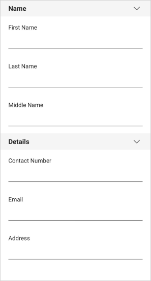
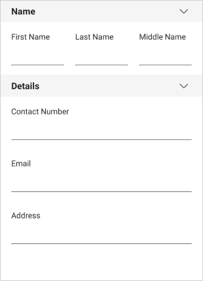
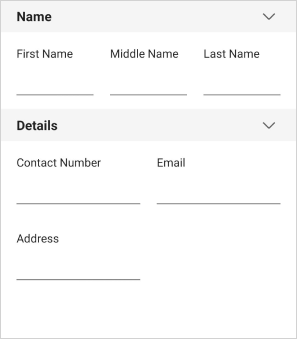
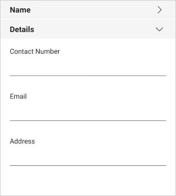
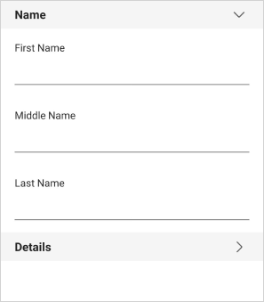
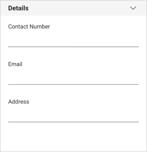
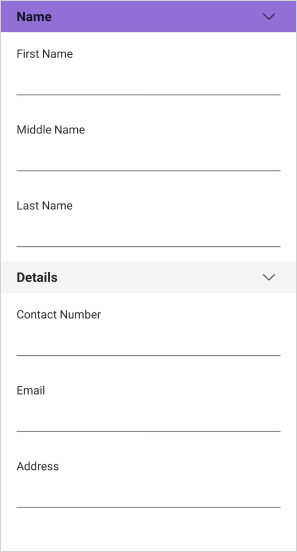
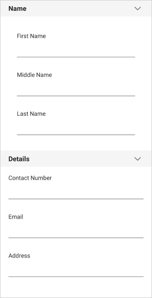

# Grouping the editors in .NET MAUI DataForm (SfDataForm)

The .NET MAUI DataForm supports the grouping of the editors, which are relevant to each other. Expand or collapse the group by tapping the group item.

Grouping is achieved by defining the [Display](https://learn.microsoft.com/en-us/dotnet/api/system.componentmodel.dataannotations.displayattribute?view=net-7.0) attribute or by handling the [GenerateDataFormItem](https://help.syncfusion.com/cr/maui/Syncfusion.Maui.DataForm.SfDataForm.html#Syncfusion_Maui_DataForm_SfDataForm_GenerateDataFormItem) event.

#### Using attributes




public class ContactInfo
{
    [Display(GroupName = "Name")]
    public string FirstName { get; set; }

    [Display(GroupName = "Name")]
    public string MiddleName { get; set; }

    [Display(GroupName = "Name")]
    public string LastName { get; set; }    
}




#### Using event




this.dataForm.GenerateDataFormItem += OnGenerateDataFormItem;

private void OnGenerateDataFormItem(object sender, GenerateDataFormItemEventArgs e)
{
    if (e.DataFormItem != null)
    {
        if (e.DataFormItem.FieldName == "FirstName" || e.DataFormItem.FieldName == "MiddleName" || e.DataFormItem.FieldName == "LastName")
        {
            e.DataFormItem.GroupName = "Name";
        }
    }
}




## Changing editors order in the group

#### Using attribute

#### Display attribute

The order of the editors in the group is changed by using attributes. Set the order of the data form items in the group by using the [Order](https://learn.microsoft.com/en-us/dotnet/api/system.componentmodel.dataannotations.displayattribute.order?view=net-7.0#system-componentmodel-dataannotations-displayattribute-order) property along with the [GroupName](https://learn.microsoft.com/en-us/dotnet/api/system.componentmodel.dataannotations.displayattribute.groupname?view=net-7.0#system-componentmodel-dataannotations-displayattribute-groupname) property in the [Display](https://learn.microsoft.com/en-us/dotnet/api/system.componentmodel.dataannotations.displayattribute?view=net-7.0) attribute.



public class ContactInfo
{
    [Display(GroupName = "Name", Order = 0)]
    public string FirstName { get; set; }

    [Display(GroupName = "Name", Order = 2)]
    public string LastName { get; set; }

    [Display(GroupName = "Name", Order = 1)]
    public string MiddleName { get; set; }
}



#### DataForm display options attribute

The order of the editors in the group is also changed by using the [RowOrder](https://help.syncfusion.com/cr/maui/Syncfusion.Maui.DataForm.DataFormDisplayOptionsAttribute.html#Syncfusion_Maui_DataForm_DataFormDisplayOptionsAttribute_RowOrder) property of the [DataFormDisplayOptions](https://help.syncfusion.com/cr/maui/Syncfusion.Maui.DataForm.DataFormDisplayOptionsAttribute.html) attribute.




public class ContactInfo
{
    [Display(GroupName = "Details")]
    [DataFormDisplayOptions(RowOrder = 0)]
    public string FirstName { get; set; }

    [Display(GroupName = "Details")]
    [DataFormDisplayOptions(RowOrder = 2)]
    public string LastName { get; set; }

    [Display(GroupName = "Details")]
    [DataFormDisplayOptions(RowOrder = 1)]
    public string MiddleName { get; set; }
}




#### Using event

The order of the editors in the group can also be changed by handling the [GenerateDataFormItem](https://help.syncfusion.com/cr/maui/Syncfusion.Maui.DataForm.SfDataForm.html#Syncfusion_Maui_DataForm_SfDataForm_GenerateDataFormItem) event using the [RowOrder](https://help.syncfusion.com/cr/maui/Syncfusion.Maui.DataForm.DataFormViewItem.html#Syncfusion_Maui_DataForm_DataFormViewItem_RowOrder) property of a [DataFormItem](https://help.syncfusion.com/cr/maui/Syncfusion.Maui.DataForm.DataFormItem.html).




this.dataForm.GenerateDataFormItem += OnGenerateDataFormItem;

private void OnGenerateDataFormItem(object sender, GenerateDataFormItemEventArgs e)
{
    if (e.DataFormItem != null)
    {
        if (e.DataFormItem.FieldName == "FirstName")
        {
            e.DataFormItem.RowOrder = 0;
        }
        else if (e.DataFormItem.FieldName == "LastName")
        {
            e.DataFormItem.RowOrder = 2;
        }
        else if (e.DataFormItem.FieldName == "MiddleName")
        {
            e.DataFormItem.RowOrder = 1;
        }
    }
}




## Changing the editors order of the group in grid rows

The order of the group's editors in a grid row can be changed within a row by using the [RowOrder](https://help.syncfusion.com/cr/maui/Syncfusion.Maui.DataForm.DataFormDisplayOptionsAttribute.html#Syncfusion_Maui_DataForm_DataFormDisplayOptionsAttribute_RowOrder) and [ItemsOrderInRow](https://help.syncfusion.com/cr/maui/Syncfusion.Maui.DataForm.DataFormDisplayOptionsAttribute.html#Syncfusion_Maui_DataForm_DataFormDisplayOptionsAttribute_ItemsOrderInRow) properties and [DataFormDisplayOptions](https://help.syncfusion.com/cr/maui/Syncfusion.Maui.DataForm.DataFormDisplayOptionsAttribute.html)  attribute and by handling the [GenerateDataFormItem](https://help.syncfusion.com/cr/maui/Syncfusion.Maui.DataForm.SfDataForm.html#Syncfusion_Maui_DataForm_SfDataForm_GenerateDataFormItem) event.




public class ContactInfo
{
    [Display(GroupName = "Name")]
    [DataFormDisplayOptions(RowOrder = 0, ItemsOrderInRow = 0)]
    public string FirstName { get; set; }

    [Display(GroupName = "Name")]
    [DataFormDisplayOptions(RowOrder = 0, ItemsOrderInRow = 2)]
    public string LastName { get; set; }

    [Display(GroupName = "Name")]
    [DataFormDisplayOptions(RowOrder = 0, ItemsOrderInRow = 1)]
    public string MiddleName { get; set; }
}




this.dataForm.DataObject = new ContactInfo();
this.dataForm.GenerateDataFormItem += OnGenerateDataFormItem;

private void OnGenerateDataFormItem(object sender, GenerateDataFormItemEventArgs e)
{
    if (e.DataFormGroupItem != null)
    {
        if (e.DataFormGroupItem.Name == "Name")
        {
            e.DataFormGroupItem.ColumnCount = 3;
        }
    }
}




## Changing the group name for the editors

The `GroupName` for the group can be changed in the [GenerateDataFormItem](https://help.syncfusion.com/cr/maui/Syncfusion.Maui.DataForm.SfDataForm.html#Syncfusion_Maui_DataForm_SfDataForm_GenerateDataFormItem) event.




this.dataForm.GenerateDataFormItem += OnGenerateDataFormItem;

private void OnGenerateDataFormItem(object sender, GenerateDataFormItemEventArgs e)
{
    if (e.DataFormItem != null)
    {
        if (e.DataFormItem.GroupName == "Name")
        {
            e.DataFormItem.GroupName = "Name Group";
        }
    }
}




## Changing the layout for the group

The linear or grid layout for the particular group can be loaded by handling the [GenerateDataFormItem](https://help.syncfusion.com/cr/maui/Syncfusion.Maui.DataForm.SfDataForm.html#Syncfusion_Maui_DataForm_SfDataForm_GenerateDataFormItem) event.
By setting the `ColumnCount` property in the data form, non-grouped items only will be arranged in the grid layout. To load the grid layout, set the [ColumnCount](https://help.syncfusion.com/cr/maui/Syncfusion.Maui.DataForm.DataFormGroupItem.html#Syncfusion_Maui_DataForm_DataFormGroupItem_ColumnCount) for the [DataFormGroupItem](https://help.syncfusion.com/cr/maui/Syncfusion.Maui.DataForm.DataFormGroupItem.html).




public class ContactInfo
{
    [Display(GroupName = "Name")]
    public string FirstName { get; set; }

    [Display(GroupName = "Name")]
    public string LastName { get; set; }

    [Display(GroupName = "Name")]
    public string MiddleName { get; set; }

    [Display(GroupName = "Details")]
    public string Address { get; set; }

    [Display(GroupName = "Details")]
    public double PhoneNumber { get; set; }
}




this.dataForm.DataObject = new ContactInfo();
this.dataForm.GenerateDataFormItem += OnGenerateDataFormItem;

private void OnGenerateDataFormItem(object sender, GenerateDataFormItemEventArgs e)
{
    if (e.DataFormGroupItem != null)
    {
        if (e.DataFormGroupItem.Name == "Name")
        {
            e.DataFormGroupItem.ColumnCount = 3;
        }
        else if (e.DataFormGroupItem.Name == "Details")
        {
            e.DataFormGroupItem.ColumnCount = 2;
        }
    }
}




## Loading the group in collapsed state

By default, the group will be loaded in the expanded state. Collapse the group by setting the [IsExpanded](https://help.syncfusion.com/cr/maui/Syncfusion.Maui.DataForm.DataFormGroupItem.html#Syncfusion_Maui_DataForm_DataFormGroupItem_IsExpanded) property of the [DataFormGroupItem](https://help.syncfusion.com/cr/maui/Syncfusion.Maui.DataForm.DataFormGroupItem.html) class to `false`.




this.dataForm.GenerateDataFormItem += OnGenerateDataFormItem;

private void OnGenerateDataFormItem(object sender, GenerateDataFormItemEventArgs e)
{
    if (e.DataFormGroupItem != null)
    {
        if (e.DataFormGroupItem.Name == "Name")
        {
            e.DataFormGroupItem.IsExpanded = false;
        }
    }
}




## Restricting the group expanding and collapsing

The group being expanded or collapsed can be restricted by setting the [AllowExpandCollapse](https://help.syncfusion.com/cr/maui/Syncfusion.Maui.DataForm.DataFormGroupItem.html#Syncfusion_Maui_DataForm_DataFormGroupItem_AllowExpandCollapse) to `false` in the [DataFormGroupItem](https://help.syncfusion.com/cr/maui/Syncfusion.Maui.DataForm.DataFormGroupItem.html).




this.dataForm.GenerateDataFormItem += OnGenerateDataFormItem;

private void OnGenerateDataFormItem(object sender, GenerateDataFormItemEventArgs e)
{
    if (e.DataFormGroupItem != null)
    {
        if (e.DataFormGroupItem.Name == "Name")
        {
            e.DataFormGroupItem.AllowExpandCollapse = false;
        }
    }
}




## Changing the group editors visibility

The data form group visibility can be changed by using the `IsVisible` property of the [DataFormGroupItem](https://help.syncfusion.com/cr/maui/Syncfusion.Maui.DataForm.DataFormGroupItem.html).




this.dataForm.GenerateDataFormItem += OnGenerateDataFormItem;

private void OnGenerateDataFormItem(object sender, GenerateDataFormItemEventArgs e)
{
    if (e.DataFormGroupItem != null)
    {
        if (e.DataFormGroupItem.Name == "Name")
        {
            e.DataFormGroupItem.IsVisible = false;
        }
    }
}




Here, the `Name` group will be hidden.

## Changing the group header background

The data form group header background can be changed by using the [HeaderBackground](https://help.syncfusion.com/cr/maui/Syncfusion.Maui.DataForm.DataFormGroupItem.html#Syncfusion_Maui_DataForm_DataFormGroupItem_HeaderBackground) property of the [DataFormGroupItem](https://help.syncfusion.com/cr/maui/Syncfusion.Maui.DataForm.DataFormGroupItem.html).




this.dataForm.GenerateDataFormItem += OnGenerateDataFormItem;

private void OnGenerateDataFormItem(object sender, GenerateDataFormItemEventArgs e)
{
    if (e.DataFormGroupItem != null)
    {
        if (e.DataFormGroupItem.Name == "Name")
        {
            e.DataFormGroupItem.HeaderBackground = Brush.Violet;
        }
    }
}




## Changing the group header text style

The data form group header text style can be changed by using the [HeaderTextStyle](https://help.syncfusion.com/cr/maui/Syncfusion.Maui.DataForm.DataFormGroupItem.html#Syncfusion_Maui_DataForm_DataFormGroupItem_HeaderTextStyle) property of the [DataFormGroupItem](https://help.syncfusion.com/cr/maui/Syncfusion.Maui.DataForm.DataFormGroupItem.html).




this.dataForm.GenerateDataFormItem += OnGenerateDataFormItem;

private void OnGenerateDataFormItem(object sender, GenerateDataFormItemEventArgs e)
{
    if (e.DataFormGroupItem != null)
    {
        if (e.DataFormGroupItem.Name == "Name")
        {
            e.DataFormGroupItem.HeaderTextStyle = new DataFormTextStyle
            {
                TextColor = Colors.Violet,
                FontSize = 12,
                FontAttributes = FontAttributes.Italic,
            };
        }
    }
}




## Changing the padding for group headers and editors

The distance between editors and the data form’s borders or group headers can be changed by using the [ItemsPadding](https://help.syncfusion.com/cr/maui/Syncfusion.Maui.DataForm.DataFormGroupItem.html#Syncfusion_Maui_DataForm_DataFormGroupItem_ItemsPadding) property of the [DataFormGroupItem](https://help.syncfusion.com/cr/maui/Syncfusion.Maui.DataForm.DataFormGroupItem.html).




this.dataForm.GenerateDataFormItem += OnGenerateDataFormItem;

private void OnGenerateDataFormItem(object sender, GenerateDataFormItemEventArgs e)
{
    if (e.DataFormGroupItem != null)
    {
        if (e.DataFormGroupItem.Name == "Name")
        {
            e.DataFormGroupItem.ItemsPadding = 20;
        }
    }
}




N> [View sample in GitHub](https://github.com/SyncfusionExamples/maui-dataform/tree/master/DataFormGrouping)
