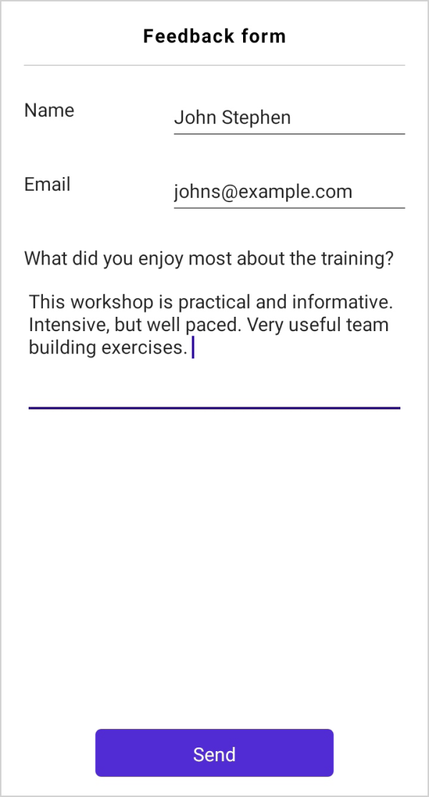
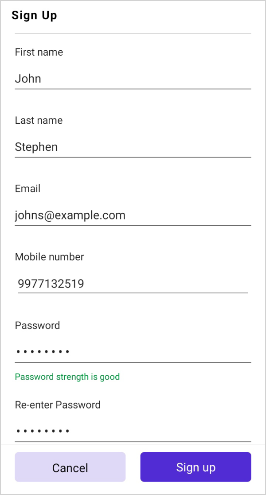
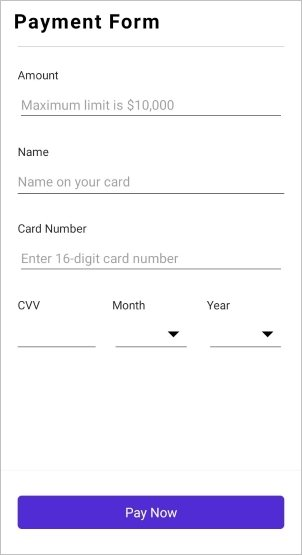
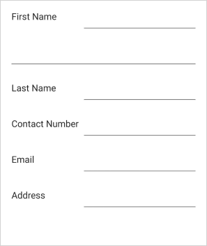
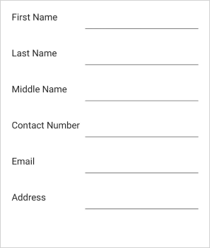
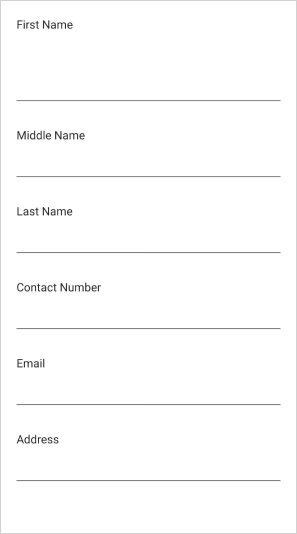
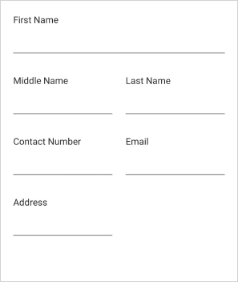

# Layout in .NET MAUI DataForm (SfDataForm)

## Overview

The data form supports linear and grid layouts and manages the layout of the label, editor, and validation label.

## Linear data form layout

By default, the data form arranges the fields one by one. It is applicable for both label positions: left and top.

When the label position is Left, the linear layout is shown as follows:

When the label position is Top, the linear layout is shown as follows:

## Grid data form layout

By default, the data form arranges one data field per row. It is possible to have more than one data field per row by setting the [ColumnCount](https://help.syncfusion.com/cr/maui/Syncfusion.Maui.DataForm.SfDataForm.html#Syncfusion_Maui_DataForm_SfDataForm_ColumnCount) property which provides a grid-like layout for the data form. The column order of the data form field in a row can be changed using the [ItemsOrderInRow](https://help.syncfusion.com/cr/maui/Syncfusion.Maui.DataForm.DataFormItem.html#Syncfusion_Maui_DataForm_DataFormItem_ItemsOrderInRow).



<ContentPage 
...
xmlns:dataForm="clr-namespace:Syncfusion.Maui.DataForm;assembly=Syncfusion.Maui.DataForm">
    <dataForm:SfDataForm
        x:Name="dataForm"
        ColumnCount="2">
    </dataForm:SfDataForm>
</ContentPage>



SfDataForm dataForm = new SfDataForm();
dataForm.ColumnCount = 2;
this.Content = dataForm;




N> Setting the [ColumnCount](https://help.syncfusion.com/cr/maui/Syncfusion.Maui.DataForm.SfDataForm.html#Syncfusion_Maui_DataForm_SfDataForm_ColumnCount) property to SfDataForm does not arrange the data fields in a group according to the column count. To set the column count for data fields in the data form group, refer to the [loading different layout for data form group](https://help.syncfusion.com/maui/dataform/grouping#changing-the-layout-for-the-group).

When the label position is Top, the grid layout is shown as follows:

## Label visibility

The label can be hidden by defining the [DataFormDisplayOptions](https://help.syncfusion.com/cr/maui/Syncfusion.Maui.DataForm.DataFormDisplayOptionsAttribute.html?tabs=tabid-1%2Ctabid-22%2Ctabid-18%2Ctabid-5%2Ctabid-9%2Ctabid-13) attribute or by handling the [GenerateDataFormItem](https://help.syncfusion.com/cr/maui/Syncfusion.Maui.DataForm.SfDataForm.html#Syncfusion_Maui_DataForm_SfDataForm_GenerateDataFormItem) event. In this case, only the editor will be loaded.

#### Using attributes




[DataFormDisplayOptions(ShowLabel = false)]
public string Name { get; set; }




#### Using event




this.dataForm.GenerateDataFormItem += OnGenerateDataFormItem;

private void OnGenerateDataFormItem(object sender, GenerateDataFormItemEventArgs e)
{
    if (e.DataFormItem != null)
    {
        if (e.DataFormItem.FieldName == "Name")
        {
            e.DataFormItem.ShowLabel = false;
        }
    }
}




## Label position

The label can be positioned either top or left side of the editor. By using the [DataFormDefaultLayoutSettings.LabelPosition](https://help.syncfusion.com/cr/maui/Syncfusion.Maui.DataForm.DataFormDefaultLayoutSettings.html#Syncfusion_Maui_DataForm_DataFormDefaultLayoutSettings_LabelPosition) property, lay out the label associated with the editor for the data form.

By default, the label will be positioned at left side of the editor.



<ContentPage 
...
xmlns:dataForm="clr-namespace:Syncfusion.Maui.DataForm;assembly=Syncfusion.Maui.DataForm">
    <dataForm:SfDataForm
        x:Name="dataForm">
        <dataForm:SfDataForm.DefaultLayoutSettings>
            <dataForm:DataFormDefaultLayoutSettings
                LabelPosition="Top"/>
        </dataForm:SfDataForm.DefaultLayoutSettings>
    </dataForm:SfDataForm>
</ContentPage>




SfDataForm dataForm = new SfDataForm();
dataForm.DefaultLayoutSettings.LabelPosition = DataFormLabelPosition.Top;
this.Content = dataForm;




#### Changing particular editors label position

The label position of a particular editor can be changed by using the [DataFormDefaultLayoutSettings.LabelPosition](https://help.syncfusion.com/cr/maui/Syncfusion.Maui.DataForm.DataFormDefaultLayoutSettings.html#Syncfusion_Maui_DataForm_DataFormDefaultLayoutSettings_LabelPosition) property in the [DataFormItem](https://help.syncfusion.com/cr/maui/Syncfusion.Maui.DataForm.DataFormItem.html), and it will be handled in the [GenerateDataFormItem](https://help.syncfusion.com/cr/maui/Syncfusion.Maui.DataForm.SfDataForm.html#Syncfusion_Maui_DataForm_SfDataForm_GenerateDataFormItem) event.



<ContentPage 
...
xmlns:dataForm="clr-namespace:Syncfusion.Maui.DataForm;assembly=Syncfusion.Maui.DataForm">
    <dataForm:SfDataForm
        x:Name="dataForm"
        DataObject="{Binding DataObjects}"
        GenerateDataFormItem="OnGenerateDataFormItem">
    </dataForm:SfDataForm>
</ContentPage>




SfDataForm dataForm = new SfDataForm();
dataForm.GenerateDataFormItem += OnGenerateDataFormItem;
this.Content = dataForm;

private void OnGenerateDataFormItem(object sender, GenerateDataFormItemEventArgs e)
{
    if (e.DataFormItem != null)
    {
        if (e.DataFormItem.FieldName == "Name")
        {
            e.DataFormItem.DefaultLayoutSettings = new DataFormDefaultLayoutSettings
            {
                LabelPosition = DataFormLabelPosition.Top,
            };
        }
    }
}




## Loading images for label

The image can be loaded instead of the label by using the [LeadingView](https://help.syncfusion.com/cr/maui/Syncfusion.Maui.DataForm.DataFormItem.html#Syncfusion_Maui_DataForm_DataFormItem_LeadingView) property of the [DataFormItem](https://help.syncfusion.com/cr/maui/Syncfusion.Maui.DataForm.DataFormItem.html).

#### Using event




this.dataForm.GenerateDataFormItem += OnGenerateDataFormItem;

private void OnGenerateDataFormItem(object sender, GenerateDataFormItemEventArgs e)
{
    if (e.DataFormItem != null)
    {
        if (e.DataFormItem.FieldName == "Name")
        {
            e.DataFormItem.LeadingView = new Label { Text = "F", FontSize = 18, TextColor = Colors.Gray, FontFamily = "InputLayoutIcons", HeightRequest = 24, VerticalTextAlignment = TextAlignment.End };
        }
    }
}




N> [View sample in GitHub](https://github.com/SyncfusionExamples/maui-dataform/tree/master/LabelIconSample)

## Changing order of the editors

The order of the data form editors can be changed by using attributes or by handling the [GenerateDataFormItem](https://help.syncfusion.com/cr/maui/Syncfusion.Maui.DataForm.SfDataForm.html#Syncfusion_Maui_DataForm_SfDataForm_GenerateDataFormItem) event.

#### Using attributes

The data form editors' order can be changed by using the [RowOrder](https://help.syncfusion.com/cr/maui/Syncfusion.Maui.DataForm.DataFormDisplayOptionsAttribute.html#Syncfusion_Maui_DataForm_DataFormDisplayOptionsAttribute_RowOrder) property in the [DataFormDisplayOptionsAttribute](https://help.syncfusion.com/cr/maui/Syncfusion.Maui.DataForm.DataFormDisplayOptionsAttribute.html) attribute.




[DataFormDisplayOptions(RowOrder = 1)]
public string Adress { get; set; }

[DataFormDisplayOptions(RowOrder = 0)]
public string Name { get; set; }




#### Using event

The data form editors' order can be changed by using the [RowOrder](https://help.syncfusion.com/cr/maui/Syncfusion.Maui.DataForm.DataFormViewItem.html#Syncfusion_Maui_DataForm_DataFormViewItem_RowOrder) property in the [DataFormItem](https://help.syncfusion.com/cr/maui/Syncfusion.Maui.DataForm.DataFormItem.html).




this.dataForm.GenerateDataFormItem += OnGenerateDataFormItem;

private void OnGenerateDataFormItem(object sender, GenerateDataFormItemEventArgs e)
{
    if (e.DataFormItem != null)
    {
        if (e.DataFormItem.FieldName == "Name")
        {
            e.DataFormItem.RowOrder = 0;
        }
    }
}




## Change the label and editor width

The label and editor width are set proportionally by using the [LabelWidth](https://help.syncfusion.com/cr/maui/Syncfusion.Maui.DataForm.DataFormDefaultLayoutSettings.html#Syncfusion_Maui_DataForm_DataFormDefaultLayoutSettings_LabelWidth) and [EditorWidth](https://help.syncfusion.com/cr/maui/Syncfusion.Maui.DataForm.DataFormDefaultLayoutSettings.html#Syncfusion_Maui_DataForm_DataFormDefaultLayoutSettings_EditorWidth) properties of the [DefaultLayoutSettings](https://help.syncfusion.com/cr/maui/Syncfusion.Maui.DataForm.DataFormDefaultLayoutSettings.html) class.
The [Value](https://help.syncfusion.com/cr/maui/Syncfusion.Maui.DataForm.DataFormItemLength.html#Syncfusion_Maui_DataForm_DataFormItemLength_Value) and [UnitType](https://help.syncfusion.com/cr/maui/Syncfusion.Maui.DataForm.DataFormItemLength.html#Syncfusion_Maui_DataForm_DataFormItemLength_UnitType) properties of the [DataFormItemLength](https://help.syncfusion.com/cr/maui/Syncfusion.Maui.DataForm.DataFormItemLength.html) each return the value and unit type of the corresponding DataFormItemLength respectively.
The label and Editor are specified with proportionate values such as `0.4*` and `0.6*` when the [DataFormItemLength.UnitType](https://help.syncfusion.com/cr/maui/Syncfusion.Maui.DataForm.DataFormItemLength.html#Syncfusion_Maui_DataForm_DataFormItemLength_UnitType) is `Star`.
Additionally, Specify a defined width for the editor and label such as `300, 400,` and the [DataFormItemLength.UnitType](https://help.syncfusion.com/cr/maui/Syncfusion.Maui.DataForm.DataFormItemLength.html#Syncfusion_Maui_DataForm_DataFormItemLength_UnitType) is `Absolute`.



<ContentPage 
...
xmlns:dataForm="clr-namespace:Syncfusion.Maui.DataForm;assembly=Syncfusion.Maui.DataForm">
    <dataForm:SfDataForm
        x:Name="dataForm">
        <dataForm:SfDataForm.DefaultLayoutSettings>
            <dataForm:DataFormDefaultLayoutSettings
                LabelWidth="0.4*"
                EditorWidth="0.6*"/>
        </dataForm:SfDataForm.DefaultLayoutSettings>
    </dataForm:SfDataForm>
</ContentPage>



SfDataForm dataForm = new SfDataForm();
dataForm.DefaultLayoutSettings.LabelWidth = new DataFormItemLength(300, DataFormItemLengthUnitType.Absolute);
dataForm.DefaultLayoutSettings.EditorWidth = new DataFormItemLength(400, DataFormItemLengthUnitType.Absolute);
this.Content = dataForm;




SfDataForm dataForm = new SfDataForm();
this.dataForm.DefaultLayoutSettings.LabelWidth = new DataFormItemLength(0.3, DataFormItemLengthUnitType.Star);
this.dataForm.DefaultLayoutSettings.EditorWidth = new DataFormItemLength(0.7, DataFormItemLengthUnitType.Star);
this.Content = dataForm;




N> The label width customization is applicable only when the [LabelPosition](https://help.syncfusion.com/cr/maui/Syncfusion.Maui.DataForm.DataFormDefaultLayoutSettings.html#Syncfusion_Maui_DataForm_DataFormDefaultLayoutSettings_LabelPosition) is Left.

By default, the available width is divided into 40% for the label and 60% for the editor.

## Spanning editors rows and columns

The row height and column width are increased by defining the [DataFormDisplayOptions](https://help.syncfusion.com/cr/maui/Syncfusion.Maui.DataForm.DataFormDisplayOptionsAttribute.html) attribute or by handling the [GenerateDataFormItem](https://help.syncfusion.com/cr/maui/Syncfusion.Maui.DataForm.SfDataForm.html#Syncfusion_Maui_DataForm_SfDataForm_GenerateDataFormItem) event.

### Row span

#### Using attributes

The row height is increased by using the [RowSpan](https://help.syncfusion.com/cr/maui/Syncfusion.Maui.DataForm.DataFormDisplayOptionsAttribute.html#Syncfusion_Maui_DataForm_DataFormDisplayOptionsAttribute_RowSpan) property in the [DataFormDisplayOptions](https://help.syncfusion.com/cr/maui/Syncfusion.Maui.DataForm.DataFormDisplayOptionsAttribute.html)  attribute.




[DataFormDisplayOptions(RowSpan = 2)]
public string FirstName { get; set; }




#### Using event

The row height of each [DataFormItem](https://help.syncfusion.com/cr/maui/Syncfusion.Maui.DataForm.DataFormItem.html) can also be increased by using the [RowSpan](https://help.syncfusion.com/cr/maui/Syncfusion.Maui.DataForm.DataFormDisplayOptionsAttribute.html#Syncfusion_Maui_DataForm_DataFormDisplayOptionsAttribute_RowSpan) property, and it will be handled in the [GenerateDataFormItem](https://help.syncfusion.com/cr/maui/Syncfusion.Maui.DataForm.SfDataForm.html#Syncfusion_Maui_DataForm_SfDataForm_GenerateDataFormItem) event.




this.dataForm.GenerateDataFormItem += OnGenerateDataFormItem;

private void OnGenerateDataFormItem(object sender, GenerateDataFormItemEventArgs e)
{
    if (e.DataFormItem != null)
    {
        if (e.DataFormItem.FieldName == "FirstName")
        {
            e.DataFormItem.RowSpan = 2;
        }
    }
}




Here, `FirstName` field’s row height is increased.

### Column span

#### Using attributes

When the grid layout is used, the column width is increased by using the [ColumnSpan](https://help.syncfusion.com/cr/maui/Syncfusion.Maui.DataForm.DataFormDisplayOptionsAttribute.html#Syncfusion_Maui_DataForm_DataFormDisplayOptionsAttribute_ColumnSpan) property in the [DataFormDisplayOptions](https://help.syncfusion.com/cr/maui/Syncfusion.Maui.DataForm.DataFormDisplayOptionsAttribute.html) attribute.




this.dataForm.ColumnCount = 2;




[DataFormDisplayOptions(ColumnSpan = 2)]
public string FirstName { get; set; }




#### Using event

When the grid layout is used, increase the column width of each [DataFormItem](https://help.syncfusion.com/cr/maui/Syncfusion.Maui.DataForm.DataFormItem.html) using the [ColumnSpan](https://help.syncfusion.com/cr/maui/Syncfusion.Maui.DataForm.DataFormDisplayOptionsAttribute.html#Syncfusion_Maui_DataForm_DataFormDisplayOptionsAttribute_ColumnSpan) property, and it will be handled in the [GenerateDataFormItem](https://help.syncfusion.com/cr/maui/Syncfusion.Maui.DataForm.SfDataForm.html#Syncfusion_Maui_DataForm_SfDataForm_GenerateDataFormItem) event.




this.dataForm.GenerateDataFormItem += OnGenerateDataFormItem;

private void OnGenerateDataFormItem(object sender, GenerateDataFormItemEventArgs e)
{
    if (e.DataFormItem != null)
    {
        if (e.DataFormItem.FieldName == "FirstName")
        {
            e.DataFormItem.ColumnSpan = 2;
        }
    }
}




## Change the editor visibility

The data form editor visibility is changed by using the [IsVisible](https://help.syncfusion.com/cr/maui/Syncfusion.Maui.DataForm.DataFormViewItem.html#Syncfusion_Maui_DataForm_DataFormViewItem_IsVisible) property of the [DataFormItem](https://help.syncfusion.com/cr/maui/Syncfusion.Maui.DataForm.DataFormItem.html).




this.dataForm.GenerateDataFormItem += OnGenerateDataFormItem;

private void OnGenerateDataFormItem(object sender, GenerateDataFormItemEventArgs e)
{
    if (e.DataFormItem != null)
    {
        if (e.DataFormItem.FieldName == "Name")
        {
            e.DataFormItem.IsVisible = false;
        }
    }
}




Here, the `Name` field will be hidden.