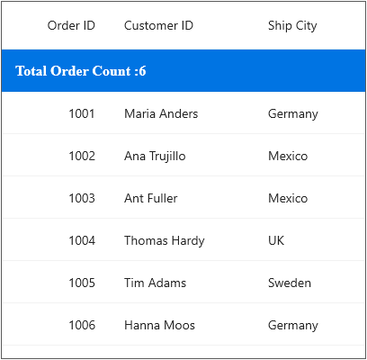
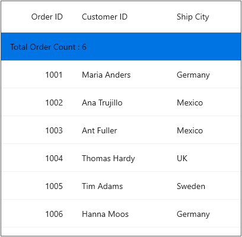
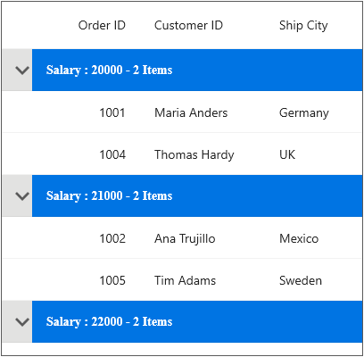
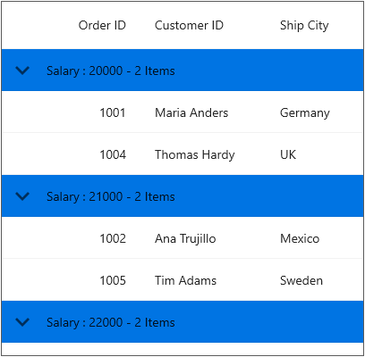
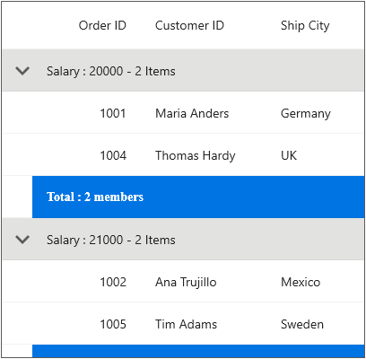

# Styling in .NET MAUI DataGrid (SfDataGrid)

The [DataGrid](https://help.syncfusion.com/cr/maui/Syncfusion.Maui.DataGrid.html) applies style for all of its elements by setting desired values to the style properties in [SfDataGrid.DefaultStyle](https://help.syncfusion.com/cr/maui/Syncfusion.Maui.DataGrid.SfDataGrid.html#Syncfusion_Maui_DataGrid_SfDataGrid_DefaultStyleProperty). This property has all the required styling properties for each and every elements in the DataGrid.

To get start quickly with apply styling .NET MAUI DataGrid, you can check on this video:

 <iframe id='MAUIDataGridVideoTutorial' src="https://www.youtube.com/embed/1HHHz5isIM4?start=66"></iframe>



<ContentPage xmlns:syncfusion="http://schemas.syncfusion.com/maui">
    <ContentPage.Content>
        <syncfusion:SfDataGrid ItemsSource="{Binding OrderInfoCollection}" >
            <syncfusion:SfDataGrid.DefaultStyle>
                <syncfusion:DataGridStyle HeaderRowBackground="#0074E3" HeaderRowTextColor="White" RowBackground="#AFD5FB" RowTextColor="#212121"/>
            </syncfusion:SfDataGrid.DefaultStyle>
        </syncfusion:SfDataGrid>
    </ContentPage.Content>
</ContentPage>


public partial class MainPage : ContentPage
{
    public MainPage()
    {
        InitializeComponent();
        this.dataGrid.DefaultStyle.HeaderRowBackground = Color.FromArgb("#0074E3");
        this.dataGrid.DefaultStyle.HeaderRowTextColor = Colors.White;
        this.dataGrid.DefaultStyle.RowBackground = Color.FromArgb("#AFD5FB");
        this.dataGrid.DefaultStyle.RowTextColor = Color.FromArgb("#212121");
    }
}



## Set datagrid style from application resources
You can write custom style for the properties in the `SfDataGrid.DefaultStyle` class using the application resource and consume the custom style as a static resource to the DefaultSyle property for the required DataGrid used on that page.



<Application.Resources>
    <ResourceDictionary>
        <syncfusion:DataGridStyle x:Key="customStyle" 
                                  RowBackground="LightBlue"
                                  HeaderRowBackground="Blue"
                                  RowTextColor="Black"
                                  HeaderRowTextColor="White"/>
    </ResourceDictionary>
</Application.Resources>


<ContentPage xmlns:syncfusion="http://schemas.syncfusion.com/maui">
    <ContentPage.Content>
        <syncfusion:SfDataGrid DefaultStyle="{StaticResource customStyle}" ItemsSource="{Binding OrderInfoCollection}" />
    </ContentPage.Content>
</ContentPage>



## Set datagrid style from page resources
You can write custom style for the properties in the `SfDataGrid.DefaultStyle` class using page resource and consume the custom style as a static resource to the DefaultSyle property for the required DataGrid used on that page.



<ContentPage xmlns:syncfusion="http://schemas.syncfusion.com/maui">
    <ContentPage.Resources>
        <ResourceDictionary>
            <syncfusion:DataGridStyle x:Key="customStyle" 
                                  RowBackground="LightBlue"
                                  HeaderRowBackground="Blue"
                                  RowTextColor="Black"
                                  HeaderRowTextColor="White"/>
        </ResourceDictionary>
    </ContentPage.Resources>
    <ContentPage.Content>
        <syncfusion:SfDataGrid DefaultStyle="{StaticResource customStyle}" ItemsSource="{Binding OrderInfoCollection}" />
    </ContentPage.Content>
</ContentPage>



## Implicit styling
The appearance of DataGrid (SfDataGrid) and its inner elements can be customized by the writing style of TargetType to those control. If the key is not specified, then the style will be applied to all the SfDataGrid in its scope. You can apply specific to [DataGridRow](https://help.syncfusion.com/cr/maui/Syncfusion.Maui.DataGrid.DataGridRow.html) or [DataGridCell](https://help.syncfusion.com/cr/maui/Syncfusion.Maui.DataGrid.DataGridCell.html) using various properties exposed.

### Styling Record cell
The record cells can be customized by the writing style for [DataGridCell](https://help.syncfusion.com/cr/maui/Syncfusion.Maui.DataGrid.DataGridCell.html) TargetType. Underlying record will be the DataContext for `DataGridCell`.



<ContentPage xmlns:syncfusion="http://schemas.syncfusion.com/maui">
    <ContentPage.Resources>
        
    </ContentPage.Resources>
</ContentPage>



### Styling Record row
The record row can be customized by the writing style for [DataGridRow](https://help.syncfusion.com/cr/maui/Syncfusion.Maui.DataGrid.DataGridRow.html) TargetType. 



<ContentPage xmlns:syncfusion="http://schemas.syncfusion.com/maui">
    <ContentPage.Resources>
        
    </ContentPage.Resources>
</ContentPage>



### Styling Header cell
The header cells can be customized by the writing style for [DataGridHeaderCell](https://help.syncfusion.com/cr/maui/Syncfusion.Maui.DataGrid.DataGridHeaderCell.html) TargetType.



<ContentPage xmlns:syncfusion="http://schemas.syncfusion.com/maui">
    <ContentPage.Resources>
        
    </ContentPage.Resources>
</ContentPage>



### Styling Header row
The header row can be customized by the writing style for [DataGridHeaderRow](https://help.syncfusion.com/cr/maui/Syncfusion.Maui.DataGrid.DataGridHeaderRow.html) TargetType.



<ContentPage xmlns:syncfusion="http://schemas.syncfusion.com/maui">
    <ContentPage.Resources>
        
    </ContentPage.Resources>
</ContentPage>



### Styling Table Summary cell
The table summary cell can be customized by the writing style for [DataGridTableSummaryCell](https://help.syncfusion.com/cr/maui/Syncfusion.Maui.DataGrid.DataGridTableSummaryCell.html) TargetType.



<ContentPage xmlns:syncfusion="http://schemas.syncfusion.com/maui">
    <ContentPage.Resources>
        
    </ContentPage.Resources>
</ContentPage>



### Styling Table Summary row
The table summary row can be customized by the writing style for [DataGridTableSummaryRowView](https://help.syncfusion.com/cr/maui/Syncfusion.Maui.DataGrid.DataGridTableSummaryRowView.html) TargetType.



<ContentPage xmlns:syncfusion="http://schemas.syncfusion.com/maui">
    <ContentPage.Resources>
        
    </ContentPage.Resources>
</ContentPage>



### Styling Caption Summary cell
The caption summary cell can be customized by the writing style for [DataGridCaptionSummaryCell](https://help.syncfusion.com/cr/maui/Syncfusion.Maui.DataGrid.DataGridCaptionSummaryCell.html) TargetType.



<ContentPage xmlns:syncfusion="http://schemas.syncfusion.com/maui">
    <ContentPage.Resources>
        
    </ContentPage.Resources>
</ContentPage>



### Styling Caption Summary row
The caption summary row can be customized by the writing style for [DataGridCaptionSummaryRowView](https://help.syncfusion.com/cr/maui/Syncfusion.Maui.DataGrid.DataGridCaptionSummaryRowView.html) TargetType.



<ContentPage xmlns:syncfusion="http://schemas.syncfusion.com/maui">
    <ContentPage.Resources>
        
    </ContentPage.Resources>
</ContentPage>



### Styling Group Summary cell
The group summary cell can be customized by the writing style for [DataGridGroupSummaryCell](https://help.syncfusion.com/cr/maui/Syncfusion.Maui.DataGrid.DataGridGroupSummaryCell.html) TargetType.



<ContentPage xmlns:syncfusion="http://schemas.syncfusion.com/maui">
    <ContentPage.Resources>
        
    </ContentPage.Resources>
</ContentPage>



### Styling Group Summary row
The group summary row can be customized by the writing style for [DataGridGroupSummaryRowView](https://help.syncfusion.com/cr/maui/Syncfusion.Maui.DataGrid.DataGridGroupSummaryRowView.html) TargetType.



<ContentPage xmlns:syncfusion="http://schemas.syncfusion.com/maui">
    <ContentPage.Resources>
        
    </ContentPage.Resources>
</ContentPage>



### Styling Unbound row cell
The unbound row cell can be customized by the writing style for [DataGridUnboundRowCell]() TargetType.



<ContentPage xmlns:syncfusion="http://schemas.syncfusion.com/maui">
    <ContentPage.Resources>
        
    </ContentPage.Resources>
</ContentPage>



### Styling Unbound row
The unbound row can be customized by the writing style for [DataGridUnboundRowView]() TargetType.



<ContentPage xmlns:syncfusion="http://schemas.syncfusion.com/maui">
    <ContentPage.Resources>
        
    </ContentPage.Resources>
</ContentPage>



### Column Styling 
You can apply the style for a particular column by using [DataGridColumn.CellStyle](https://help.syncfusion.com/cr/maui/Syncfusion.Maui.DataGrid.DataGridColumn.html#Syncfusion_Maui_DataGrid_DataGridColumn_CellStyleProperty) and [DataGridColumn.HeaderStyle](https://help.syncfusion.com/cr/maui/Syncfusion.Maui.DataGrid.DataGridColumn.html#Syncfusion_Maui_DataGrid_DataGridColumn_HeaderStyleProperty) property.



<ContentPage xmlns:syncfusion="http://schemas.syncfusion.com/maui">
    <ContentPage.Resources>
        
        
    </ContentPage.Resources>

    <syncfusion:SfDataGrid ItemsSource="{Binding OrderInfoCollection}">
        <syncfusion:SfDataGrid.Columns>
            <syncfusion:DataGridTextColumn MappingName="OrderID" HeaderText="Order ID"
                                        CellStyle="{StaticResource customCellStyle}"
                                        HeaderStyle="{StaticResource customHeaderStyle}"/>
        </syncfusion:SfDataGrid.Columns>
    </syncfusion:SfDataGrid>]
</ContentPage>



## Applying alternate row style
You can apply the alternative row color by using [AlternateRowBackground](https://help.syncfusion.com/cr/maui/Syncfusion.Maui.DataGrid.DataGridStyle.html#Syncfusion_Maui_DataGrid_DataGridStyle_AlternateRowBackground) in `SfDataGrid.DefaultStyle`.



<ContentPage xmlns:syncfusion="http://schemas.syncfusion.com/maui">
    <ContentPage.Content>
        <syncfusion:SfDataGrid ItemsSource="{Binding OrderInfoCollection}">
            <syncfusion:SfDataGrid.DefaultStyle>
                <syncfusion:DataGridStyle AlternateRowBackground="#AFD5FB"/>
            </syncfusion:SfDataGrid.DefaultStyle>
        </syncfusion:SfDataGrid>
    </ContentPage.Content>
</ContentPage>


public partial class MainPage : ContentPage
{
    public MainPage()
    {
        InitializeComponent();
        this.dataGrid.DefaultStyle.AlternateRowBackground = Color.FromArgb("#AFD5FB");
    }
}



## Changing the alternation row count
You can change the row count which should be considered to apply the background for alternate rows using the [SfDataGrid.AlternationRowCount](https://help.syncfusion.com/cr/maui/Syncfusion.Maui.DataGrid.SfDataGrid.html#Syncfusion_Maui_DataGrid_SfDataGrid_AlternationRowCountProperty) property.



<ContentPage xmlns:syncfusion="http://schemas.syncfusion.com/maui">
    <ContentPage.Content>
        <syncfusion:SfDataGrid AlternationRowCount="3" 
                            ItemsSource="{Binding OrderInfoCollection}">
            <syncfusion:SfDataGrid.DefaultStyle>
                <syncfusion:DataGridStyle AlternateRowBackground="#AFD5FB"/>
            </syncfusion:SfDataGrid.DefaultStyle>
        </syncfusion:SfDataGrid>
    </ContentPage.Content>
</ContentPage>


public partial class MainPage : ContentPage
{
    public MainPage()
    {
        InitializeComponent();
        this.dataGrid.DefaultStyle.AlternateRowBackground = Color.FromArgb("#AFD5FB");
        this.dataGrid.AlternationRowCount = 3;
    }
}



## Changing the font style
You can apply the style for header and row font attributes by using SfDataGrid.DefaultStyle.



<ContentPage xmlns:syncfusion="http://schemas.syncfusion.com/maui">
    <ContentPage.Content>
        <syncfusion:SfDataGrid ItemsSource="{Binding OrderInfoCollection}">
            <syncfusion:SfDataGrid.DefaultStyle>
                <syncfusion:DataGridStyle HeaderRowFontAttributes="Bold"
                                        HeaderRowFontFamily="TimesNewRoman"
                                        HeaderRowFontSize="16"
                                        RowFontAttributes="Italic"
                                        RowFontFamily="Adabi"
                                        RowFontSize="14"/>
            </syncfusion:SfDataGrid.DefaultStyle>
        </syncfusion:SfDataGrid>
    </ContentPage.Content>
</ContentPage>



## Border customization
The DataGrid provides support to change the visibility of the vertical and horizontal borders. Set desired value to [SfDataGrid.GridLinesVisibility](https://help.syncfusion.com/cr/maui/Syncfusion.Maui.DataGrid.SfDataGrid.html#Syncfusion_Maui_DataGrid_SfDataGrid_GridLinesVisibilityProperty) for data rows or [SfDataGrid.HeaderGridLinesVisibility](https://help.syncfusion.com/cr/maui/Syncfusion.Maui.DataGrid.SfDataGrid.html#Syncfusion_Maui_DataGrid_SfDataGrid_HeaderGridLinesVisibilityProperty) for header row.

Following are the list of options available to customize the grid borders:
.	Both
.	Horizontal
.	Vertical
.	None

The following example shows how to apply both vertical and horizontal borders for header and data rows,



<ContentPage xmlns:syncfusion="http://schemas.syncfusion.com/maui">
    <ContentPage.Content>
        <syncfusion:SfDataGrid ItemsSource="{Binding OrderInfoCollection}"
                            GridLinesVisibility="Both"
                            HeaderGridLinesVisibility="Both"/>
    </ContentPage.Content>
</ContentPage>


public partial class MainPage : ContentPage
{
    public MainPage()
    {
        InitializeComponent();
        this.dataGrid.GridLinesVisibility = Syncfusion.Maui.DataGrid.GridLinesVisibility.Both;
        this.dataGrid.HeaderGridLinesVisibility = Syncfusion.Maui.DataGrid.GridLinesVisibility.Both;
    }
}



## Changing the border width
You can change the border width by using [GridLineStrokeThickness](https://help.syncfusion.com/cr/maui/Syncfusion.Maui.DataGrid.DataGridStyle.html#Syncfusion_Maui_DataGrid_DataGridStyle_GridLineStrokeThicknessProperty) property in `SfDataGrid.DefaultStyle`.



<ContentPage xmlns:syncfusion="http://schemas.syncfusion.com/maui">
    <ContentPage.Content>
        <syncfusion:SfDataGrid ItemsSource="{Binding OrderInfoCollection}">
            <syncfusion:SfDataGrid.DefaultStyle>
                <syncfusion:DataGridStyle GridLineStrokeThickness="3"/>
            </syncfusion:SfDataGrid.DefaultStyle>
        </syncfusion:SfDataGrid>
    </ContentPage.Content>
</ContentPage>


public partial class MainPage : ContentPage
{
    public MainPage()
    {
        InitializeComponent();
        this.dataGrid.DefaultStyle.GridLineStrokeThickness = 3;
    }
}



