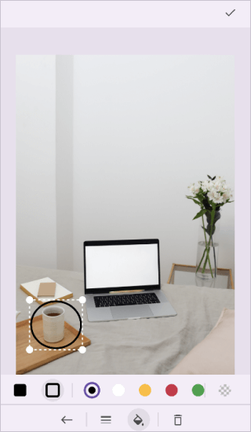

# Shape Annotations in .NET MAUI Image Editor (SfImageEditor)

The image editor control allows you to add various shapes with customizable settings.

## Add shape annotation

Annotate any shapes over an image using the [`AddShape`](https://help.syncfusion.com/cr/maui/Syncfusion.Maui.ImageEditor.SfImageEditor.html#Syncfusion_Maui_ImageEditor_SfImageEditor_AddShape_Syncfusion_Maui_ImageEditor_AnnotationShape_Syncfusion_Maui_ImageEditor_ImageEditorShapeSettings_) method.




   <Grid RowDefinitions="0.9*, 0.1*">
        <imageEditor:SfImageEditor x:Name="imageEditor"
                                   Source="image.jpeg" />
        <Button Grid.Row="1"
                Text="AddShape"
                Clicked="OnAddShapeClicked" />
    </Grid>  




    private void OnAddShapeClicked(object sender, EventArgs e)
    {
        this.imageEditor.AddShape(AnnotationShape.Arrow)
    }




## Shape types

The [`AnnotationShape`](https://help.syncfusion.com/cr/maui/Syncfusion.Maui.ImageEditor.AnnotationShape.html) enum contains the following shape types.

* Circle
* Rectangle
* Arrow
* Line
* Dotted
* DoubleArrow
* DottedArrow
* DottedDoubleArrow

## Customize shape settings

Customize the appearance of each shape using the [`ImageEditorShapeSettings`](https://help.syncfusion.com/cr/maui/Syncfusion.Maui.ImageEditor.ImageEditorShapeSettings.html).

* [`AllowDrag`](https://help.syncfusion.com/cr/maui/Syncfusion.Maui.ImageEditor.ImageEditorAnnotationSettings.html#Syncfusion_Maui_ImageEditor_ImageEditorAnnotationSettings_AllowDrag): Enables or disables the dragging for shape annotation. The default value is `true`.
* [`AllowResize`](https://help.syncfusion.com/cr/maui/Syncfusion.Maui.ImageEditor.ImageEditorAnnotationSettings.html#Syncfusion_Maui_ImageEditor_ImageEditorAnnotationSettings_AllowResize): Enables or disables the resizing for shape annotation. The default value is `true`.
* [`Bounds`](https://help.syncfusion.com/cr/maui/Syncfusion.Maui.ImageEditor.ImageEditorAnnotationSettings.html#Syncfusion_Maui_ImageEditor_ImageEditorAnnotationSettings_Bounds): Specifies the bounds of the shapes. Position the shapes wherever you want on the image. The value of the shape bounds should fall between 0 and 1.
* [`Color`](https://help.syncfusion.com/cr/maui/Syncfusion.Maui.ImageEditor.ImageEditorShapeSettings.html#Syncfusion_Maui_ImageEditor_ImageEditorShapeSettings_Color) - Specifies the color of the shape annotation.
* [`IsFilled`](https://help.syncfusion.com/cr/maui/Syncfusion.Maui.ImageEditor.ImageEditorShapeSettings.html#Syncfusion_Maui_ImageEditor_ImageEditorShapeSettings_IsFilled) - Enables or disables the fill color of the shapes. This is applicable only for [`AnnotationShape.Rectangle`](https://help.syncfusion.com/cr/maui/Syncfusion.Maui.ImageEditor.AnnotationShape.html#Syncfusion_Maui_ImageEditor_AnnotationShape_Rectangle) and [`AnnotationShape.Circle`](https://help.syncfusion.com/cr/maui/Syncfusion.Maui.ImageEditor.AnnotationShape.html#Syncfusion_Maui_ImageEditor_AnnotationShape_Circle) shape types.
* [`StrokeThickness`](https://help.syncfusion.com/cr/maui/Syncfusion.Maui.ImageEditor.ImageEditorShapeSettings.html#Syncfusion_Maui_ImageEditor_ImageEditorShapeSettings_StrokeThickness) - Specifies the stroke width of the shapes. It is not applicable for [`AnnotationShape.Rectangle`](https://help.syncfusion.com/cr/maui/Syncfusion.Maui.ImageEditor.AnnotationShape.html#Syncfusion_Maui_ImageEditor_AnnotationShape_Rectangle) and [`AnnotationShape.Circle`](https://help.syncfusion.com/cr/maui/Syncfusion.Maui.ImageEditor.AnnotationShape.html#Syncfusion_Maui_ImageEditor_AnnotationShape_Circle) in the filled state.
* [`Opacity`](https://help.syncfusion.com/cr/maui/Syncfusion.Maui.ImageEditor.ImageEditorAnnotationSettings.html#Syncfusion_Maui_ImageEditor_ImageEditorAnnotationSettings_Opacity): Specifies the opacity of shape annotation. This value ranges from 0 to 1.




   <Grid RowDefinitions="0.9*, 0.1*">
        <imageEditor:SfImageEditor x:Name="imageEditor"
                                   Source="image.jpeg" />
        <Button Grid.Row="1"
                Text="AddShape"
                Clicked="OnAddShapeClicked" />
    </Grid>  




    private void OnAddShapeClicked(object sender, EventArgs e)
    {
        this.imageEditor.AddShape(AnnotationShape.Rectangle,
             new ImageEditorShapeSettings()
             {
                 Color = Colors.Blue,
                 StrokeThickness = 5,
                 IsFilled = false
             });
    }




## Delete the selected shape

Delete the selected shape using either the toolbar or the [`DeleteAnnotation`](https://help.syncfusion.com/cr/maui/Syncfusion.Maui.ImageEditor.SfImageEditor.html#Syncfusion_Maui_ImageEditor_SfImageEditor_DeleteAnnotation) method.




   <Grid RowDefinitions="0.9*, 0.1*">
        <imageEditor:SfImageEditor x:Name="imageEditor"
                                   Source="image.jpeg" />
        <Button Grid.Row="1"
                Text="DeleteAnnotation"
                Clicked="OnDeleteAnnotationClicked" />
    </Grid>  




    private void OnDeleteAnnotationClicked(object sender, EventArgs e)
    {
        this.imageEditor.DeleteAnnotation();
    }




## Clear all annotations

Remove all the annotations using the [`ClearAnnotations`](https://help.syncfusion.com/cr/maui/Syncfusion.Maui.ImageEditor.SfImageEditor.html#Syncfusion_Maui_ImageEditor_SfImageEditor_ClearAnnotations) method.

N> It will remove text and pen annotations as well.




   <Grid RowDefinitions="0.9*, 0.1*">
        <imageEditor:SfImageEditor x:Name="imageEditor"
                                   Source="image.jpeg" />
        <Button Grid.Row="1"
                Text="ClearAnnotations"
                Clicked="OnClearAnnotationsClicked" />
    </Grid>  




    private void OnClearAnnotationsClicked(object sender, EventArgs e)
    {
        this.imageEditor.ClearAnnotations();
    }




## Annotation selected event

The [`AnnotationSelected`](https://help.syncfusion.com/cr/maui/Syncfusion.Maui.ImageEditor.SfImageEditor.html#Syncfusion_Maui_ImageEditor_SfImageEditor_AnnotationSelected) event occurs when an annotation is selected.

N> The event is common for text and shape annotations.





    <imageEditor:SfImageEditor Source="image.png" AnnotationSelected = "OnAnnotationSelected" />





    private void OnAnnotationSelected(object sender, AnnotationSelectedEventArgs e)
    {
        if (e.AnnotationSettings is ImageEditorShapeSettings shapeSettings)
        {
            shapeSettings.Color = Colors.Black;
        }
    }





## Add shape on initial loading

Annotate a shape on image loading using the [`Imageloaded`](https://help.syncfusion.com/cr/maui/Syncfusion.Maui.ImageEditor.SfImageEditor.html#Syncfusion_Maui_ImageEditor_SfImageEditor_ImageLoaded) event.





    <imageEditor:SfImageEditor x:Name="imageEditor" Source="image.png" ImageLoaded = "OnImageLoaded" />





    private void OnImageLoaded(object sender, EventArgs e)
    {
        this.imageEditor.AddShape(AnnotationShape.Circle);
    }





N> [View sample in GitHub](https://github.com/SyncfusionExamples/maui-image-editor-examples/tree/master/ImageLoadedSample)

### Add shape with manual bounds

Shapes can be added by user-defined view bounds. The [`Bounds`](https://help.syncfusion.com/cr/maui/Syncfusion.Maui.ImageEditor.ImageEditorAnnotationSettings.html#Syncfusion_Maui_ImageEditor_ImageEditorAnnotationSettings_Bounds) are treated as ratio values of image width and height, so you have to specify bounds rectangle values in the range of 0 to 1.




    <imageEditor:SfImageEditor x:Name="imageEditor" Source="image.png" ImageLoaded = "OnImageLoaded" />





    private void OnImageLoaded(object sender, EventArgs e)
    {
        imageEditor.AddShape(AnnotationShape.Arrow, new ImageEditorShapeSettings()
        {
            Bounds = new Rect(0.1, 0.1, 0.5, 0.5)
        });
    }





## Restrict shape drag and resize

To restrict the drag action on a shape, set the [`AllowDrag`](https://help.syncfusion.com/cr/maui/Syncfusion.Maui.ImageEditor.ImageEditorAnnotationSettings.html#Syncfusion_Maui_ImageEditor_ImageEditorAnnotationSettings_AllowDrag) property to `false`.




    imageEditor.AddShape(AnnotationShape.Circle, new ImageEditorShapeSettings() { AllowDrag = false });




To restrict the resize action on a shape, set the [`AllowResize`](https://help.syncfusion.com/cr/maui/Syncfusion.Maui.ImageEditor.ImageEditorAnnotationSettings.html#Syncfusion_Maui_ImageEditor_ImageEditorAnnotationSettings_AllowResize) property to `false`.




    imageEditor.AddShape(AnnotationShape.Circle, new ImageEditorShapeSettings() { AllowResize = false });




## Freehand Draw

The image editor control allows you to create freehand drawings such as signature, pen drawing with customizable settings. The [`AddShape`](https://help.syncfusion.com/cr/maui/Syncfusion.Maui.ImageEditor.SfImageEditor.html#Syncfusion_Maui_ImageEditor_SfImageEditor_AddShape_Syncfusion_Maui_ImageEditor_AnnotationShape_Syncfusion_Maui_ImageEditor_ImageEditorShapeSettings_) method enables the canvas view, in which you can draw objects.




   <Grid RowDefinitions="0.9*, 0.1*">
        <imageEditor:SfImageEditor x:Name="imageEditor"
                                   Source="image.jpeg" />
        <Button Grid.Row="1"
                Text="FreeHandDraw"
                Clicked="OnFreeHandDrawClicked" />
    </Grid>  




    private void OnFreeHandDrawClicked(object sender, EventArgs e)
    {
        this.imageEditor.AddShape(AnnotationShape.Pen);
    }




## Customize the pen drawing settings

*  [`StrokeThickness`](https://help.syncfusion.com/cr/maui/Syncfusion.Maui.ImageEditor.ImageEditorShapeSettings.html#Syncfusion_Maui_ImageEditor_ImageEditorShapeSettings_StrokeThickness) - Specifies the stroke width of the drawing pen.
*  [`Color`](https://help.syncfusion.com/cr/maui/Syncfusion.Maui.ImageEditor.ImageEditorShapeSettings.html#Syncfusion_Maui_ImageEditor_ImageEditorShapeSettings_Color) - Specifies the stroke color of the drawing pen.

N> The other shape settings are not applicable for freehand draw.

In the following example, the [`AddShape`](https://help.syncfusion.com/cr/maui/Syncfusion.Maui.ImageEditor.SfImageEditor.html#Syncfusion_Maui_ImageEditor_SfImageEditor_AddShape_Syncfusion_Maui_ImageEditor_AnnotationShape_Syncfusion_Maui_ImageEditor_ImageEditorShapeSettings_) method is used to toggle the freehand drawings.




   <Grid RowDefinitions="0.9*, 0.1*">
        <imageEditor:SfImageEditor x:Name="imageEditor"
                                   Source="image.jpeg" />
        <Button Grid.Row="1"
                Text="FreeHandDraw"
                Clicked="OnFreeHandDrawClicked" />
    </Grid>  




    private void OnFreeHandDrawClicked(object sender, EventArgs e)
    {
        imageEditor.AddShape(AnnotationShape.Pen, new ImageEditorShapeSettings() {Color=Colors.Blue, StrokeThickness=5});
    }


