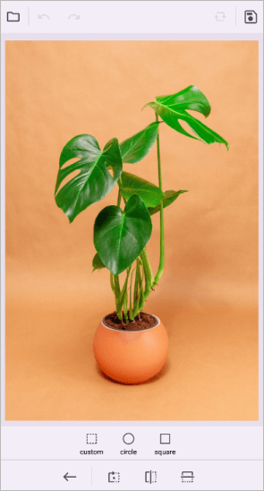
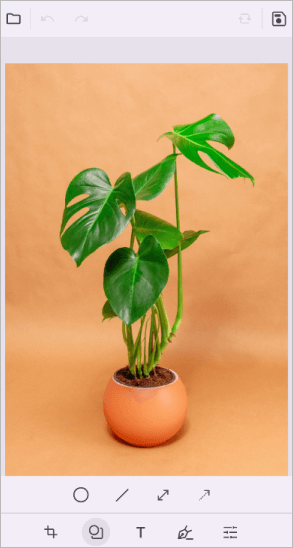
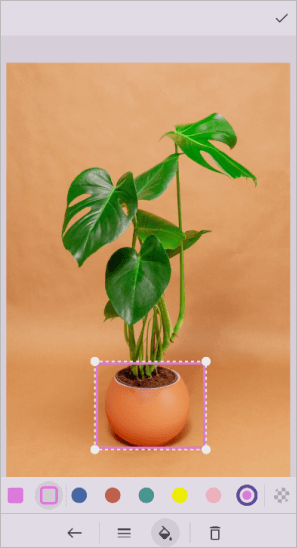
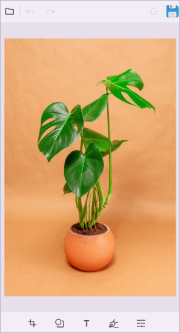
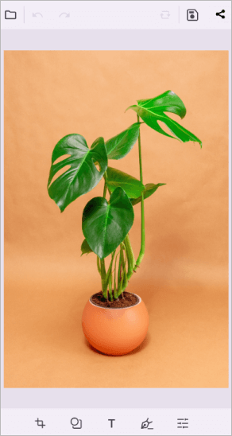
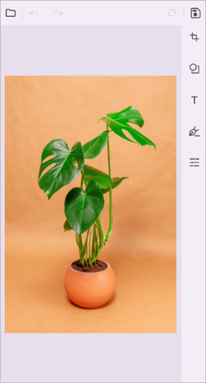
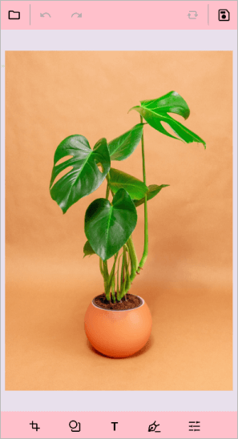

# Toolbar in .NET MAUI Image Editor (SfImageEditor)

Customize the built-in toolbar appearance, visibility, position, and orientation of each toolbar and add new toolbars.

## Show or hide toolbar

To show or hide the toolbar, set the [`ShowToolbar`](https://help.syncfusion.com/cr/maui/Syncfusion.Maui.ImageEditor.SfImageEditor.html#Syncfusion_Maui_ImageEditor_SfImageEditor_ShowToolbar) property to either true or false. By default, the [`ShowToolbar`](https://help.syncfusion.com/cr/maui/Syncfusion.Maui.ImageEditor.SfImageEditor.html#Syncfusion_Maui_ImageEditor_SfImageEditor_ShowToolbar) property is set to `true`.




<ContentPage 
            . . .
            <imageEditor:SfImageEditor Source="image.jpeg" ShowToolbar="True" />

</ContentPage>




using Syncfusion.Maui.ImageEditor;
namespace SyncfusionImageEditor;

public partial class MainPage : ContentPage
{
	public MainPage()
	{
        InitializeComponent();
        SfImageEditor imageEditor = new SfImageEditor();
        imageEditor.Source = "image.jpeg";
        imageEditor.ShowToolbar = true;
        this.content = imageEditor;
    }
}




## Built-in Toolbar

Customize each toolbar item using the [`Name`](https://help.syncfusion.com/cr/maui/Syncfusion.Maui.ImageEditor.ImageEditorToolbarItem.html#Syncfusion_Maui_ImageEditor_ImageEditorToolbarItem_Name). Get or set the names of the built-in toolbar and dynamically add toolbar items using the [`Name`](https://help.syncfusion.com/cr/maui/Syncfusion.Maui.ImageEditor.ImageEditorToolbarItem.html#Syncfusion_Maui_ImageEditor_ImageEditorToolbarItem_Name) property.



public MainPage()
{			
    InitializeComponent();
    SfImageEditor imageEditor = new SfImageEditor();
    imageEditor.Source = ImageSource.FromFile("image.png");
    string itemName = imageEditor.Toolbars[1].ToolbarItems[0].Name;
}



N> The following built-in toolbar item names are available in image editor: `Browse`, `Undo`, `Redo`, `ZoomOut`, `ZoomIn`, `Reset`, `Save`, `SaveEdit`, `Crop`, `Shape`, `Text`, `Pen`, `Effects`, `Rotate`, `FlipHorizontal`, `FlipVertical`, `custom`, `original`, `ellipse`, `circle`, `square`, `3:1`, `3:2`, `4:3`, `5:4`, `7:5`, `16:9`, `Rectangle`, `Circle`, `Arrow`, `Line`, `Dotted`, `DoubleArrow`, `DottedArrow`, `DottedDoubleArrow`, `ShapeStrokeThickness`, `ShapeStrokeColor`, `ShapeFill`, `ShapeStroke`, `AddText`, `StrokeThickness`, `Delete`, `FontFamily`, `TextAlignment`, `FontAttributes`, `TextColor`, `Start`, `Center`, `End`, `DefaultText`, `Handlee`, `Pinyon Script`, `Kaushan Script`, `Boogaloo`, `Bold`, `Italic`, `Color`, `ShapeStrokeOpacity`, `PenStrokeOpacity`, `TextColorOpacity`, `PenStrokeThickness`, `PenStrokeColor`, `Back`, `Blur`, `Contrast`, `Sharpen`, `Brightness`, `Saturation`, `Hue`, `Opacity`,  and `Exposure`.

N> You cannot modify the names of existing built-in toolbar items or create toolbar items with this list.

#### Get an item from the default top toolbar

The default top toolbar contains three groups, each containing its items. Get the [`ImageEditorToolbarItem`](https://help.syncfusion.com/cr/maui/Syncfusion.Maui.ImageEditor.ImageEditorToolbarItem.html) and customize the properties.


SfImageEditor imageEditor = new SfImageEditor();
imageEditor.Source = ImageSource.FromFile("image.png");

ImageEditorToolbar headerToolbar = imageEditor.Toolbars[0];
ImageEditorToolbarGroupItem browseGroup = (ImageEditorToolbarGroupItem) headerToolbar.ToolbarItems[0];
ImageEditorToolbarItem browseItem = browseGroup.Items.FirstOrDefault();
ImageEditorToolbarGroupItem saveGroup = (ImageEditorToolbarGroupItem) headerToolbar.ToolbarItems[2];
ImageEditorToolbarItem saveItem = saveGroup.Items.FirstOrDefault(i => i.Name == "Save");



#### Get an item from the default bottom toolbar

The default bottom toolbar contains [`ToolbarItems`](https://help.syncfusion.com/cr/maui/Syncfusion.Maui.ImageEditor.ImageEditorToolbar.html#Syncfusion_Maui_ImageEditor_ImageEditorToolbar_ToolbarItems), and each item has [`SubToolbars`](https://help.syncfusion.com/cr/maui/Syncfusion.Maui.ImageEditor.ImageEditorToolbarItem.html#Syncfusion_Maui_ImageEditor_ImageEditorToolbarItem_SubToolbars). Get the required [`ImageEditorToolbarItem`](https://help.syncfusion.com/cr/maui/Syncfusion.Maui.ImageEditor.ImageEditorToolbarItem.html) using the [`Name`](https://help.syncfusion.com/cr/maui/Syncfusion.Maui.ImageEditor.ImageEditorToolbarItem.html#Syncfusion_Maui_ImageEditor_ImageEditorToolbarItem_Name) and customize the default settings.

Refer to the following code sample to customize the footer toolbar item.



SfImageEditor imageEditor = new SfImageEditor();
imageEditor.Source = ImageSource.FromFile("image.png");
ImageEditorToolbar footerToolbar = imageEditor.Toolbars[1];
ImageEditorToolbarItem textItem = (ImageEditorToolbarItem)footerToolbar.ToolbarItems.FirstOrDefault(i => i.Name == "Text");



#### Get an item from the sub-toolbar

The sub-toolbars contain their own items, and they can be retried as follows.

Refer to the following code snippet to customize sub items of bottom toolbar item.



SfImageEditor imageEditor = new SfImageEditor();
imageEditor.Source = ImageSource.FromFile("image.png");
ImageEditorToolbar footerToolbar = imageEditor.Toolbars[1];
ImageEditorToolbarItem shapeItem = (ImageEditorToolbarItem)footerToolbar.ToolbarItems.FirstOrDefault(i => i.Name == "Shape");
ImageEditorToolbar subtoolbar = shapeItem.SubToolbars[0];
ImageEditorToolbarItem arrowItem = (ImageEditorToolbarItem)subtoolbar.ToolbarItems.FirstOrDefault(i => i.Name == "Arrow");



N> Remove the existing toolbar items [`Name`](https://help.syncfusion.com/cr/maui/Syncfusion.Maui.ImageEditor.ImageEditorToolbarItem.html#Syncfusion_Maui_ImageEditor_ImageEditorToolbarItem_Name) from the image editor toolbarItems collection based on the index value. Change the icon and text values dynamically for any already added toolbar items based on the index.

### Change the crop toolbar options

Show the required crop types alone in the crop types toolbar by using the [`CropTypes`](https://help.syncfusion.com/cr/maui/Syncfusion.Maui.ImageEditor.ImageEditorToolbarSettings.html#Syncfusion_Maui_ImageEditor_ImageEditorToolbarSettings_CropTypes) property in the [`ImageEditorToolbarSettings`](https://help.syncfusion.com/cr/maui/Syncfusion.Maui.ImageEditor.ImageEditorToolbarSettings.html) class.




  
<imageEditor:SfImageEditor Source="image.png">
    <imageEditor:SfImageEditor.ToolbarSettings>
        <imageEditor:ImageEditorToolbarSettings CropTypes="Circle, Square, Free" />
    </imageEditor:SfImageEditor.ToolbarSettings>
</imageEditor:SfImageEditor>
      




SfImageEditor imageEditor = new SfImageEditor();
imageEditor.Source = ImageSource.FromFile("image.png");
imageEditor.ToolbarSettings.CropTypes = ImageCropType.Circle | ImageCropType.Square | ImageCropType.Free;





### Change the effect toolbar options

Show the required effect types alone in the effects toolbar by using the [`EffectTypes`](https://help.syncfusion.com/cr/maui/Syncfusion.Maui.ImageEditor.ImageEditorToolbarSettings.html#Syncfusion_Maui_ImageEditor_ImageEditorToolbarSettings_EffectTypes) property in the [`ImageEditorToolbarSettings`](https://help.syncfusion.com/cr/maui/Syncfusion.Maui.ImageEditor.ImageEditorToolbarSettings.html) class.




  
<imageEditor:SfImageEditor Source="image.png">
    <imageEditor:SfImageEditor.ToolbarSettings>
        <imageEditor:ImageEditorToolbarSettings EffectTypes="Hue, Blur, Brightness" />
    </imageEditor:SfImageEditor.ToolbarSettings>
</imageEditor:SfImageEditor>
      




SfImageEditor imageEditor = new SfImageEditor();
imageEditor.Source = ImageSource.FromFile("image.png");
imageEditor.ToolbarSettings.EffectTypes = ImageEffect.Hue | ImageEffect.Blur | ImageEffect.Brightness;





### Change the shapes toolbar options

Show the required shape types alone in the shapes toolbar by using the [`Shapes`](https://help.syncfusion.com/cr/maui/Syncfusion.Maui.ImageEditor.ImageEditorToolbarSettings.html#Syncfusion_Maui_ImageEditor_ImageEditorToolbarSettings_Shapes) property in the [`ImageEditorToolbarSettings`](https://help.syncfusion.com/cr/maui/Syncfusion.Maui.ImageEditor.ImageEditorToolbarSettings.html) class.




  
<imageEditor:SfImageEditor Source="image.png">
    <imageEditor:SfImageEditor.ToolbarSettings>
        <imageEditor:ImageEditorToolbarSettings Shapes="Circle, Line, DottedArrow, DoubleArrow" />
    </imageEditor:SfImageEditor.ToolbarSettings>
</imageEditor:SfImageEditor>





SfImageEditor imageEditor = new SfImageEditor();
imageEditor.Source = ImageSource.FromFile("image.png");
imageEditor.ToolbarSettings.Shapes = AnnotationShape.Circle | AnnotationShape.Line | AnnotationShape.DottedArrow | AnnotationShape.DoubleArrow;





### Change the color palette toolbar options

Change the default colors of the [`ColorPalette`](https://help.syncfusion.com/cr/maui/Syncfusion.Maui.ImageEditor.ImageEditorToolbarSettings.html#Syncfusion_Maui_ImageEditor_ImageEditorToolbarSettings_ColorPalette) in the toolbar.




  
<imageEditor:SfImageEditor Source="image.png">
    <imageEditor:SfImageEditor.ToolbarSettings>
        <imageEditor:ImageEditorToolbarSettings>
            <imageEditor:ImageEditorToolbarSettings.ColorPalette>
                <Color>Yellow</Color>
                <Color>Pink</Color>
                <Color>Violet</Color>
            </imageEditor:ImageEditorToolbarSettings.ColorPalette>
        </imageEditor:ImageEditorToolbarSettings>
    </imageEditor:SfImageEditor.ToolbarSettings>
</imageEditor:SfImageEditor>
      




    SfImageEditor imageEditor = new SfImageEditor();
    imageEditor.Source = ImageSource.FromFile("image.png");
    imageEditor.ToolbarSettings.ColorPalette.Add(Colors.Yellow);
    imageEditor.ToolbarSettings.ColorPalette.Add(Colors.Pink);
    imageEditor.ToolbarSettings.ColorPalette.Add(Colors.Violet);





N> Color palette colors are common for Text, Shape and Pen.

### Change the Toolbar Item to Enable or Disable State

Enable or disable the toolbar items by using the [`IsEnabled`](https://help.syncfusion.com/cr/maui/Syncfusion.Maui.ImageEditor.ImageEditorToolbarItem.html#Syncfusion_Maui_ImageEditor_ImageEditorToolbarItem_IsEnabled) property in the [`ImageEditorToolbarItem`](https://help.syncfusion.com/cr/maui/Syncfusion.Maui.ImageEditor.ImageEditorToolbarItem.html) class.





SfImageEditor imageEditor = new SfImageEditor();
imageEditor.Source = ImageSource.FromFile("image.png");

ImageEditorToolbar headerToolbar = imageEditor.Toolbars[0];
ImageEditorToolbarGroupItem browseGroup = (ImageEditorToolbarGroupItem) headerToolbar.ToolbarItems[0];
ImageEditorToolbarItem browseItem = browseGroup.Items.FirstOrDefault();
browseItem.IsEnabled = false;

ImageEditorToolbarGroupItem saveGroup = (ImageEditorToolbarGroupItem) headerToolbar.ToolbarItems[2];
ImageEditorToolbarItem saveItem = saveGroup.Items.FirstOrDefault(i => i.Name == "Save");
saveItem.IsEnabled = false;





### Customize the Toolbar Item View

To customize the view of toolbar items, specify their icon names and set the view using the [`View`](https://help.syncfusion.com/cr/maui/Syncfusion.Maui.ImageEditor.ImageEditorToolbarItem.html#Syncfusion_Maui_ImageEditor_ImageEditorToolbarItem_View) property in the [`ImageEditorToolbarItem`](https://help.syncfusion.com/cr/maui/Syncfusion.Maui.ImageEditor.ImageEditorToolbarItem.html).





SfImageEditor imageEditor = new SfImageEditor();
imageEditor.Source = ImageSource.FromFile("image.png");

ImageEditorToolbar headerToolbar = imageEditor.Toolbars[0];
ImageEditorToolbarGroupItem saveGroup = (ImageEditorToolbarGroupItem)headerToolbar.ToolbarItems[2];
ImageEditorToolbarItem saveItem = saveGroup.Items.FirstOrDefault(i => i.Name == "Save");

Image image = new Image();
image.Source = ImageSource.FromFile("save.jpg");
saveItem.View = image;





### Add the SubToolbar

Create [`SubToolbars`](https://help.syncfusion.com/cr/maui/Syncfusion.Maui.ImageEditor.ImageEditorToolbarItem.html#Syncfusion_Maui_ImageEditor_ImageEditorToolbarItem_SubToolbars) within your toolbar items to organize related actions.





SfImageEditor imageEditor = new SfImageEditor();
imageEditor.Source = ImageSource.FromFile("image.png");
ImageEditorToolbar footerToolbar = imageEditor.Toolbars[1];
ImageEditorToolbarItem cropItem = (ImageEditorToolbarItem)footerToolbar.ToolbarItems.FirstOrDefault(i => i.Name == "Crop");
cropItem.SubToolbarOverlay = false;
cropItem.SubToolbars = new List<ImageEditorToolbar>()
{
    new ImageEditorToolbar()
    {
        ToolbarItems = new List<IImageEditorToolbarItem>()
        {
           new ImageEditorToolbarItem(){ Name = "original"},
           new ImageEditorToolbarItem(){ Name = "circle"},
           new ImageEditorToolbarItem(){ Name = "square"}
        },
    }
};





### Add a Toolbar Item with the Existing Toolbar

Explicitly add the [`ImageEditorToolbarItem`](https://help.syncfusion.com/cr/maui/Syncfusion.Maui.ImageEditor.ImageEditorToolbarItem.html) to the [`ImageEditorToolbar`](https://help.syncfusion.com/cr/maui/Syncfusion.Maui.ImageEditor.ImageEditorToolbar.html) manually.





SfImageEditor imageEditor = new SfImageEditor();
imageEditor.Source = ImageSource.FromFile("image.png");
Image image = new Image();
image.Source = ImageSource.FromResource("MyProject.Resources.Images.share.png");
image.WidthRequest = 48;
image.HeightRequest = 48;
ImageEditorToolbar headerToolbar = imageEditor.Toolbars[0];
ImageEditorToolbarGroupItem saveGroup = (ImageEditorToolbarGroupItem)headerToolbar.ToolbarItems[2];
saveGroup.Items.Add(new ImageEditorToolbarItem() { Name = "Share", View = image });





## Explicitly Create Toolbars

The ImageEditor automatically generates the toolbars. To add the toolbars manually, you need to explicitly add them and change the [`AutoGenerateToolbarItems`](https://help.syncfusion.com/cr/maui/Syncfusion.Maui.ImageEditor.SfImageEditor.html#Syncfusion_Maui_ImageEditor_SfImageEditor_AutoGenerateToolbarItems) property to `false`.

N> When you create a new toolbar item, you can use the pre-existing built-in names for the item, which will automatically generate the icon view. If you want to introduce a new item view or modify the current one, you can use the [`View`](https://help.syncfusion.com/cr/maui/Syncfusion.Maui.ImageEditor.ImageEditorToolbarItem.html#Syncfusion_Maui_ImageEditor_ImageEditorToolbarItem_View) property of the [`ImageEditorToolbarItem`](https://help.syncfusion.com/cr/maui/Syncfusion.Maui.ImageEditor.ImageEditorToolbarItem.html) class to define the item view.





<imageEditor:SfImageEditor Source="image.png"
                           AutoGenerateToolbarItems="False">
    <imageEditor:SfImageEditor.Toolbars>
        <imageEditor:ImageEditorToolbar Position="End">
            <imageEditor:ImageEditorToolbar.ToolbarItems>
                <imageEditor:ImageEditorToolbarGroupItem Alignment="Start">
                    <imageEditor:ImageEditorToolbarGroupItem.Items>
                        <imageEditor:ImageEditorToolbarItem Name="Browse" />
                        <imageEditor:ImageEditorToolbarItem Name="Reset" />
                    </imageEditor:ImageEditorToolbarGroupItem.Items>
                </imageEditor:ImageEditorToolbarGroupItem>
                <imageEditor:ImageEditorToolbarGroupItem Alignment="End">
                    <imageEditor:ImageEditorToolbarGroupItem.Items>
                        <imageEditor:ImageEditorToolbarItem Name="Save" />
                        <imageEditor:ImageEditorToolbarItem Name="SaveEdit" />
                    </imageEditor:ImageEditorToolbarGroupItem.Items>
                </imageEditor:ImageEditorToolbarGroupItem>
            </imageEditor:ImageEditorToolbar.ToolbarItems>
        </imageEditor:ImageEditorToolbar>
    </imageEditor:SfImageEditor.Toolbars>
</imageEditor:SfImageEditor>





SfImageEditor imageEditor = new SfImageEditor();
imageEditor.Source = ImageSource.FromFile("image.png");
imageEditor.AutoGenerateToolbarItems = false;
ImageEditorToolbar editorToolbar = new ();
editorToolbar.Position = ToolbarPosition.End;

ImageEditorToolbarGroupItem browseGroup = new ()
{
    Alignment = ToolbarGroupItemAlignment.Start,
    Items = new List<ImageEditorToolbarItem>()
        {
            new ImageEditorToolbarItem(){ Name ="Browse"},
            new ImageEditorToolbarItem(){ Name ="Reset"  }
        }
};

ImageEditorToolbarGroupItem saveGroup = new ()
{
    Alignment = ToolbarGroupItemAlignment.End,
    Items = new List<ImageEditorToolbarItem>()
        {
            new ImageEditorToolbarItem(){ Name ="Save"},
            new ImageEditorToolbarItem(){ Name ="SaveEdit"}
        }
};

editorToolbar.ToolbarItems.Add(browseGroup);
editorToolbar.ToolbarItems.Add(saveGroup);
imageEditor.Toolbars.Add(editorToolbar);
    




### Create the sub-toolbar explicitly

Create [`SubToolbars`](https://help.syncfusion.com/cr/maui/Syncfusion.Maui.ImageEditor.ImageEditorToolbarItem.html#Syncfusion_Maui_ImageEditor_ImageEditorToolbarItem_SubToolbars) within our default toolbar items to organize related actions.





<imageEditor:SfImageEditor Source="image.png"
                           AutoGenerateToolbarItems="False">
    <imageEditor:SfImageEditor.Toolbars>
        <imageEditor:ImageEditorToolbar Orientaion="Vertical"
                                        Position="End">
            <imageEditor:ImageEditorToolbar.ToolbarItems>
                <imageEditor:ImageEditorToolbarItem Name="Text">
                    <imageEditor:ImageEditorToolbarItem.SubToolbars>
                        <imageEditor:ImageEditorToolbar>
                            <imageEditor:ImageEditorToolbar.ToolbarItems>
                                <imageEditor:ImageEditorToolbarItem Name="AddText" />
                                <imageEditor:ImageEditorToolbarItem Name="TextColor" />
                                <imageEditor:ImageEditorToolbarItem Name="Delete" />
                            </imageEditor:ImageEditorToolbar.ToolbarItems>
                        </imageEditor:ImageEditorToolbar>
                    </imageEditor:ImageEditorToolbarItem.SubToolbars>
                </imageEditor:ImageEditorToolbarItem>
                <imageEditor:ImageEditorToolbarItem Name="Shape" />
                <imageEditor:ImageEditorToolbarItem Name="Pen" />
            </imageEditor:ImageEditorToolbar.ToolbarItems>
        </imageEditor:ImageEditorToolbar>
    </imageEditor:SfImageEditor.Toolbars>
</imageEditor:SfImageEditor>





SfImageEditor imageEditor = new SfImageEditor();
imageEditor.Source = ImageSource.FromFile("image.png");
imageEditor.AutoGenerateToolbarItems = false;
ImageEditorToolbar editorToolbar = new ();
editorToolbar.Orientaion = ToolbarOrientation.Vertical;
editorToolbar.Position = ToolbarPosition.End;
editorToolbar.ToolbarItems = new List<IImageEditorToolbarItem>()
{
    new ImageEditorToolbarItem(){ Name = "Text",
        SubToolbars = new List<ImageEditorToolbar>()
        {
            new ImageEditorToolbar()
            {
                ToolbarItems = new List<IImageEditorToolbarItem>()
                {
                   new ImageEditorToolbarItem(){ Name = "AddText"},
                   new ImageEditorToolbarItem(){ Name = "TextColor"},
                   new ImageEditorToolbarItem(){ Name = "Delete"}
                },
            }
        }
    },
    new ImageEditorToolbarItem(){ Name = "Shape"},
    new ImageEditorToolbarItem(){ Name = "Pen"}
};

imageEditor.Toolbars.Add(editorToolbar);





N> [View sample in GitHub](https://github.com/SyncfusionExamples/maui-image-editor-examples/tree/master/ExplicitToolbar)

## Change the Toolbar Item Visibility

Hide or show the toolbar items by specifying their icon names and setting the boolean values to true or false.

N> Customize an icon by specifying its [`Name`](https://help.syncfusion.com/cr/maui/Syncfusion.Maui.ImageEditor.ImageEditorToolbarItem.html#Syncfusion_Maui_ImageEditor_ImageEditorToolbarItem_Name).





        SfImageEditor imageEditor = new SfImageEditor();
        imageEditor.Source = ImageSource.FromFile("image.png");
        imageEditor.SetToolbarItemVisibility("Shape", false);





## Toolbar Orientation

The toolbar orientation can be changed to achieve the desired design by using the [`Orientation`](https://help.syncfusion.com/cr/maui/Syncfusion.Maui.ImageEditor.ImageEditorToolbar.html#Syncfusion_Maui_ImageEditor_ImageEditorToolbar_Orientaion) property in the [`ImageEditorToolbar`](https://help.syncfusion.com/cr/maui/Syncfusion.Maui.ImageEditor.ImageEditorToolbar.html) class. The default value is [`ToolbarOrientation.Horizontal`](https://help.syncfusion.com/cr/maui/Syncfusion.Maui.ImageEditor.ToolbarOrientation.html#Syncfusion_Maui_ImageEditor_ToolbarOrientation_Horizontal).

For example, set the toolbar to a vertical orientation:





SfImageEditor imageEditor = new SfImageEditor();
imageEditor.Source = ImageSource.FromFile("image.png");
ImageEditorToolbar footerToolbar = imageEditor.Toolbars[1];
footerToolbar.Orientaion = ToolbarOrientation.Vertical;
    




## Toolbar Position

The toolbar can be positioned before or after the image of the ImageEditor by using the [`Position`](https://help.syncfusion.com/cr/maui/Syncfusion.Maui.ImageEditor.ImageEditorToolbar.html#Syncfusion_Maui_ImageEditor_ImageEditorToolbar_Position) property in the [`ImageEditorToolbar`](https://help.syncfusion.com/cr/maui/Syncfusion.Maui.ImageEditor.ImageEditorToolbar.html) class. The default value is [`ToolbarPosition.Start`](https://help.syncfusion.com/cr/maui/Syncfusion.Maui.ImageEditor.ToolbarPosition.html#Syncfusion_Maui_ImageEditor_ToolbarPosition_Start).





SfImageEditor imageEditor = new SfImageEditor();
imageEditor.Source = ImageSource.FromFile("image.png");
ImageEditorToolbar footerToolbar = imageEditor.Toolbars[1];
footerToolbar.Position = ToolbarPosition.Start;
    




## Change the Toolbar Size 

The size of the toolbar can be adjusted by using the [`Size`](https://help.syncfusion.com/cr/maui/Syncfusion.Maui.ImageEditor.ImageEditorToolbar.html#Syncfusion_Maui_ImageEditor_ImageEditorToolbar_Size) property in the [`ImageEditorToolbar`](https://help.syncfusion.com/cr/maui/Syncfusion.Maui.ImageEditor.ImageEditorToolbar.html) class.

For horizontal orientation, the size will be considered as width, and for vertical orientation, it will be considered as height.



    SfImageEditor imageEditor = new SfImageEditor();
    imageEditor.Source = ImageSource.FromFile("image.png");
    imageEditor.ToolbarSettings.Background = Brush.LightGreen;
    imageEditor.Toolbars[0].Size = 80;
    imageEditor.Toolbars[1].Size = 50;



## Appearance Customization

Customize the appearance of the toolbar by using the [`ToolbarSettings`](https://help.syncfusion.com/cr/maui/Syncfusion.Maui.ImageEditor.SfImageEditor.html#Syncfusion_Maui_ImageEditor_SfImageEditor_ToolbarSettings) property. The following are some of the properties you can customize:

* [`Background`](https://help.syncfusion.com/cr/maui/Syncfusion.Maui.ImageEditor.ImageEditorToolbarSettings.html#Syncfusion_Maui_ImageEditor_ImageEditorToolbarSettings_Background): Specifies the background color of the toolbar.
* [`IconColor`](https://help.syncfusion.com/cr/maui/Syncfusion.Maui.ImageEditor.ImageEditorToolbarSettings.html#Syncfusion_Maui_ImageEditor_ImageEditorToolbarSettings_IconColor): Specifies the color of the icons in the toolbar.
* [`IconSize`](https://help.syncfusion.com/cr/maui/Syncfusion.Maui.ImageEditor.ImageEditorToolbarSettings.html#Syncfusion_Maui_ImageEditor_ImageEditorToolbarSettings_IconSize): Specifies the size of the icons in the toolbar. The default value is 48.
* [`DisabledColor`](https://help.syncfusion.com/cr/maui/Syncfusion.Maui.ImageEditor.ImageEditorToolbarSettings.html#Syncfusion_Maui_ImageEditor_ImageEditorToolbarSettings_DisabledColor): Specifies the color of the disabled icons in the toolbar.




  
<imageEditor:SfImageEditor Source="image.png">
    <imageEditor:SfImageEditor.ToolbarSettings>
        <imageEditor:ImageEditorToolbarSettings Background="Pink"
                                                IconColor="Black"
                                                DisabledColor="Grey"
                                                IconSize="50, 50" />
    </imageEditor:SfImageEditor.ToolbarSettings>
</imageEditor:SfImageEditor>
      




SfImageEditor imageEditor = new SfImageEditor();
imageEditor.Source = ImageSource.FromFile("image.png");
imageEditor.ToolbarSettings.Background = Brush.pink;
imageEditor.ToolbarSettings.IconColor = Colors.Black;
imageEditor.ToolbarSettings.DisabledColor = Colors.Grey;
imageEditor.ToolbarSettings.IconSize = new Size(50, 50);





N> [View sample in GitHub](https://github.com/SyncfusionExamples/maui-image-editor-examples/tree/master/ToolbarCustomization)

## Notifying the Toolbar Item Selected

Whenever you tap the toolbar menu item, the [`ToolbarItemSelected`](https://help.syncfusion.com/cr/maui/Syncfusion.Maui.ImageEditor.SfImageEditor.html#Syncfusion_Maui_ImageEditor_SfImageEditor_ToolbarItemSelected) event will be triggered, and you'll get the respective tapped toolbar item as an argument as shown in the following code sample.

The default toolbar item action can be restricted by setting the `e.cancel` to `true`.





    <imageEditor:SfImageEditor Source="image.png" ToolbarItemSelected = "OnImageEditorToolbarItemSelected" />




            
    private void OnImageEditorToolbarItemSelected(object sender, ToolbarItemSelectedEventArgs e)
    {
        DisplayAlert("Selected ToolbarItem is  " + e.ToolbarItem.Name, "Ok", "Cancel");
    }



