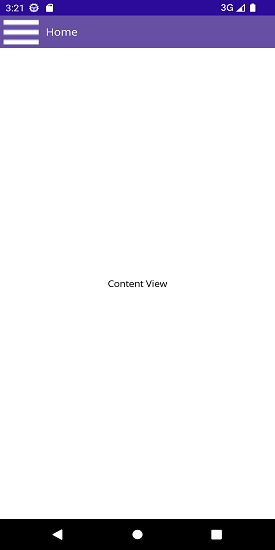
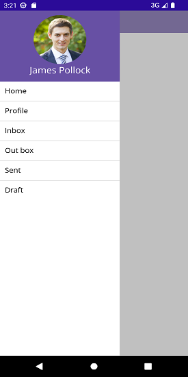

# Getting Started with .NET MAUI Navigation Drawer (SfNavigationDrawer)

This section explains how to add the `.NET MAUI NavigationDrawer control.` This section covers only the basic features needed to get started with Syncfusion .NET MAUI NavigationDrawer.

## Adding a .NET MAUI SfNavigationDrawer reference

Syncfusion .NET MAUI controls are available in [Nuget.org](https://www.nuget.org/). To add `.NET MAUI NavigationDrawer` to your project, open the NuGet package manager in Visual Studio, search for `Syncfusion.Maui.NavigationDrawer` and then install it.

## Handler registration 

 In the MauiProgram.cs file, register the handler for Syncfusion core.


using Microsoft.Maui;
using Microsoft.Maui.Hosting;
using Microsoft.Maui.Controls.Compatibility;
using Microsoft.Maui.Controls.Hosting;
using Microsoft.Maui.Controls.Xaml;
using `Syncfusion.Maui.Core.Hosting;`

namespace NavigationDrawerSample
{
    public static class MauiProgram
    {
    public static MauiApp CreateMauiApp()
    {
        var builder = MauiApp.CreateBuilder();
        builder
        .UseMauiApp<App>()
        `.ConfigureSyncfusionCore()`
        .ConfigureFonts(fonts =>
        {
            fonts.AddFont("OpenSans-Regular.ttf", "OpenSansRegular");
        });

        return builder.Build();
        }      
    }
}     

 

## Create a Simple .NET MAUI NavigationDrawer

The .NET MAUI NavigationDrawer control is configured entirely in C# code or by using XAML markup. The following steps explain how to create a .NET MAUI NavigationDrawer (SfNavigationDrawer) and configure its elements:

### Adding the .NET MAUI NavigationDrawer control

Step 1: Add the NuGet to the project as discussed in the above reference section. 

Step 2: Add the namespace as shown in the following code sample:





    xmlns:navigationdrawer="clr-namespace:Syncfusion.Maui.NavigationDrawer;assembly=Syncfusion.Maui.NavigationDrawer"
	




    using Syncfusion.Maui.NavigationDrawer;





Step 3: Set the control to content in `ContentPage.`





<navigationdrawer:SfNavigationDrawer x:Name="navigationDrawer">
    <navigationdrawer:SfNavigationDrawer.ContentView>
        <Grid/>
    </navigationdrawer:SfNavigationDrawer.ContentView>
</navigationdrawer:SfNavigationDrawer>




          
SfNavigationDrawer navigationDrawer = new SfNavigationDrawer();
Grid grid = new Grid();
navigationDrawer.ContentView = grid;
this.Content = navigationDrawer; 





N> It is mandatory to set `ContentView` for `SfNavigationDrawer` on initializing.

## Adjust Drawer Size

The default position of the navigation pane is on the left, so change the drawer width to 250 by using the `DrawerWidth` property.

	


<navigationdrawer:SfNavigationDrawer x:Name="navigationDrawer">
    <navigationdrawer:SfNavigationDrawer.DrawerSettings>
        <navigationdrawer:DrawerSettings DrawerWidth="250"/>
    </navigationdrawer:SfNavigationDrawer.DrawerSettings>
    <navigationdrawer:SfNavigationDrawer.ContentView>
        <Grid/>
    </navigationdrawer:SfNavigationDrawer.ContentView>
</navigationdrawer:SfNavigationDrawer>
	

 

using Syncfusion.Maui.NavigationDrawer;

namespace NavigationSample;

public partial class NavigationDrawerPage : ContentPage
{
	public NavigationDrawerPage()
	{
		InitializeComponent();
        SfNavigationDrawer navigationDrawer = new SfNavigationDrawer();
        Grid grid = new Grid();
        navigationDrawer.ContentView = grid;
        navigationDrawer.DrawerSettings = new DrawerSettings()
        {
            DrawerWidth = 250,
        };
        this.Content = navigationDrawer;
    }
}





N> To change the side of the navigation pane, utilize the `Position` property. Adjust the drawer height in the Top and Bottom positions using the `DrawerHeight` property.

## Add Hamburger Menu for Toggling Drawer

Create an ImageButton and set the required image to the `Source` property. Subscribe Clicked event of the button and invoke the `ToggleDrawer()` method to toggle the drawer. Properly align the layout of `ContentView` to position the hamburger icon at the top left, as demonstrated in the following code.

	



<navigationdrawer:SfNavigationDrawer x:Name="navigationDrawer">
    <navigationdrawer:SfNavigationDrawer.DrawerSettings>
        <navigationdrawer:DrawerSettings DrawerWidth="250"/>
    </navigationdrawer:SfNavigationDrawer.DrawerSettings>
    <navigationdrawer:SfNavigationDrawer.ContentView>
        <Grid x:Name="mainContentView" 
          BackgroundColor="White" RowDefinitions="Auto,*">
            <HorizontalStackLayout BackgroundColor="#6750A4" Spacing="10" Padding="5,0,0,0">
                <ImageButton x:Name="hamburgerButton"
                             HeightRequest="50"
                             WidthRequest="50"
                             HorizontalOptions="Start"
                             Source="hamburgericon.png"
                             BackgroundColor="#6750A4"
                             Clicked="hamburgerButton_Clicked"/>
                <Label x:Name="headerLabel" 
                   HeightRequest="50" 
                   HorizontalTextAlignment="Center" 
                   VerticalTextAlignment="Center" 
                   Text="Home" FontSize="16" 
                   TextColor="White" 
                   BackgroundColor="#6750A4"/>
            </HorizontalStackLayout>
            <Label Grid.Row="1" 
              x:Name="contentLabel" 
              VerticalOptions="Center" 
              HorizontalOptions="Center" 
              Text="Content View" 
              FontSize="14" 
              TextColor="Black"/>
        </Grid>
    </navigationdrawer:SfNavigationDrawer.ContentView>
</navigationdrawer:SfNavigationDrawer>
	

	
 

namespace NavigationSample;

public partial class NavigationDrawerPage : ContentPage
{
    SfNavigationDrawer navigationDrawer;
    Label contentLabel;
	public NavigationDrawerPage()
	{
		InitializeComponent();
        navigationDrawer = new SfNavigationDrawer();
        Grid grid = new Grid()
        {
            RowDefinitions =
            {
                new RowDefinition {Height=new GridLength(1,GridUnitType.Auto)},
                new RowDefinition(),
            },
            BackgroundColor = Colors.White,
        };

        HorizontalStackLayout layout = new HorizontalStackLayout()
        { 
            BackgroundColor = Color.FromArgb("#6750A4"),
            Spacing = 10,
            Padding = new Thickness(5,0,0,0),
        };

        var hamburgerButton = new ImageButton
        {
            HeightRequest = 50,
            WidthRequest = 50,
            HorizontalOptions = LayoutOptions.Start,
            BackgroundColor = Color.FromArgb("#6750A4"),
            Source = "hamburgericon.png",
        };
        hamburgerButton.Clicked += hamburgerButton_Clicked;

        var label = new Label
        {
            HeightRequest = 50,
            HorizontalTextAlignment = TextAlignment.Center,
            VerticalTextAlignment = TextAlignment.Center,
            Text = "Home",
            FontSize = 16,
            TextColor = Colors.White,
            BackgroundColor = Color.FromArgb("#6750A4")
        };
        layout.Children.Add(hamburgerButton);
        layout.Children.Add(label);

        contentLabel = new Label
        {
            HorizontalOptions = LayoutOptions.Center,
            VerticalOptions = LayoutOptions.Center,
            Text = "Content View",
            FontSize = 14,
            TextColor = Colors.Black
        };
        grid.SetRow(layout, 0);
        grid.SetRow(contentLabel, 1);
        grid.Children.Add(layout);
        grid.Children.Add(contentLabel);
        navigationDrawer.ContentView = grid;

        navigationDrawer.DrawerSettings = new DrawerSettings()
        {
            DrawerWidth = 250,
        };
        this.Content = navigationDrawer;
    }
}







    
    private void hamburgerButton_Clicked(object sender, EventArgs e)
    {
        navigationDrawer.ToggleDrawer();
    }




## Set ListView as Drawer Content

Create a ListView with items and set it as `DrawerContentView.` 

	



<navigationdrawer:SfNavigationDrawer x:Name="navigationDrawer">
    <navigationdrawer:SfNavigationDrawer.DrawerSettings>
        <navigationdrawer:DrawerSettings DrawerWidth="250"
                                     DrawerHeaderHeight="160">
            <navigationdrawer:DrawerSettings.DrawerHeaderView>
                <Grid BackgroundColor="#6750A4" RowDefinitions="120,40">
                    <Image Source="user.png"
                       HeightRequest="110"
                       Margin="0,10,0,0"
                       BackgroundColor="#6750A4"
                       VerticalOptions="Center"
                       HorizontalOptions="Center"/>
                    <Label Text="James Pollock"
                       Grid.Row="1"
                       HorizontalTextAlignment="Center"
                       HorizontalOptions="Center"
                       FontSize="20"
                       TextColor="White"/>
                </Grid>
            </navigationdrawer:DrawerSettings.DrawerHeaderView>
            <navigationdrawer:DrawerSettings.DrawerContentView>
                <ListView x:Name="listView"
                      ItemSelected="listView_ItemSelected">
                    <ListView.ItemTemplate>
                        <DataTemplate>
                            <ViewCell>
                                <VerticalStackLayout HeightRequest="40">
                                    <Label Margin="10,7,0,0"
                                       Text="{Binding}"
                                       FontSize="16"
                                       TextColor="Black"/>
                                </VerticalStackLayout>
                            </ViewCell>
                        </DataTemplate>
                    </ListView.ItemTemplate>
                </ListView>
            </navigationdrawer:DrawerSettings.DrawerContentView>
        </navigationdrawer:DrawerSettings>
    </navigationdrawer:SfNavigationDrawer.DrawerSettings>
    <navigationdrawer:SfNavigationDrawer.ContentView>
        <Grid x:Name="mainContentView" 
      BackgroundColor="White" RowDefinitions="Auto,*">
            <HorizontalStackLayout BackgroundColor="#6750A4" Spacing="10" Padding="5,0,0,0">
                <ImageButton x:Name="hamburgerButton"
                         HeightRequest="50"
                         WidthRequest="50"
                         HorizontalOptions="Start"
                         Source="hamburgericon.png"
                         BackgroundColor="#6750A4"
                         Clicked="hamburgerButton_Clicked"/>
                <Label x:Name="headerLabel" 
               HeightRequest="50" 
               HorizontalTextAlignment="Center" 
               VerticalTextAlignment="Center" 
               Text="Home" FontSize="16" 
               TextColor="White" 
               BackgroundColor="#6750A4"/>
            </HorizontalStackLayout>
            <Label Grid.Row="1" 
          x:Name="contentLabel" 
          VerticalOptions="Center" 
          HorizontalOptions="Center" 
          Text="Content View" 
          FontSize="14" 
          TextColor="Black"/>
        </Grid>
    </navigationdrawer:SfNavigationDrawer.ContentView>
</navigationdrawer:SfNavigationDrawer>

  	

	


namespace NavigationSample;

public partial class NavigationDrawerPage : ContentPage
{
    SfNavigationDrawer navigationDrawer;
	public NavigationDrawerPage()
	{
		InitializeComponent();
        Grid headerGrid = new Grid()
        {
            RowDefinitions =
            {
                new RowDefinition { Height = 120 },
                new RowDefinition { Height = 40 },
            },
            BackgroundColor = Color.FromArgb("#6750A4"),
        };

        var image = new Image
        {
            Source = "user.png",
            HeightRequest = 110,
            Margin = new Thickness(0, 10, 0, 0),
            BackgroundColor = Color.FromArgb("#6750A4"),
            HorizontalOptions = LayoutOptions.Center,
            VerticalOptions = LayoutOptions.Center
        };

        var headerlabel = new Label
        {
            Text = "James Pollock",
            HorizontalTextAlignment = TextAlignment.Center,
            HorizontalOptions = LayoutOptions.Center,
            FontSize = 20,
            TextColor = Colors.White
        };
        headerGrid.SetRow(image, 0);
        headerGrid.SetRow(headerlabel, 1);
        headerGrid.Children.Add(image);
        headerGrid.Children.Add(headerlabel);

        ListView listView = new ListView();
        listView.ItemSelected += listView_ItemSelected;
        List<string> list = new List<string>();
        list.Add("Home");
        list.Add("Profile");
        list.Add("Inbox");
        list.Add("Out box");
        list.Add("Sent");
        list.Add("Draft");
        listView.ItemsSource = list;

        navigationDrawer.DrawerSettings = new DrawerSettings()
        {
            DrawerHeaderView = headerGrid,
            DrawerContentView = listView,
            DrawerHeaderHeight = 160,
            DrawerWidth = 250,
        };
        this.Content = navigationDrawer;
    }
}







    
    private void hamburgerButton_Clicked(object sender, EventArgs e)
    {
        navigationDrawer.ToggleDrawer();
    }

    private void listView_ItemSelected(object sender, SelectedItemChangedEventArgs e)
    {
        if (e.SelectedItem.ToString() == "Home")
            contentLabel.Text = "Home";
        else if (e.SelectedItem.ToString() == "Profile")
            contentLabel.Text = "Profile";
        else if (e.SelectedItem.ToString() == "Inbox")
            contentLabel.Text = "Inbox";
        else if (e.SelectedItem.ToString() == "Out box")
            contentLabel.Text = "Out box";
        else if (e.SelectedItem.ToString() == "Sent")
            contentLabel.Text = "Sent";
        else if (e.SelectedItem.ToString() == "Draft")
            contentLabel.Text = "The folder is empty";
        navigationDrawer.ToggleDrawer();
    }




You can find the getting started sample from the [`GitHub`](https://github.com/SyncfusionExamples/Getting-started-sample-for-.NET-MAUI-NavigationDrawer) link.