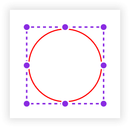
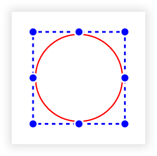
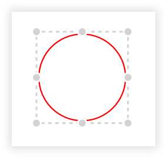

# Select and Deselct Annotations

This section will go through the various functions available in the [SfPdfViewer](https://help.syncfusion.com/cr/maui/Syncfusion.Maui.PdfViewer.SfPdfViewer.html) for selecting and deselecting annotations in a PDF document.

## Select an Annotation

You can select an annotation by simply tapping on the annotation using touch or mouse. When the annotation is selected, the selection border (selector) appears, indicating that the annotation is selected. It also lets you move or resize the annotation if the actions are supported by the annotation type. The following image represents the circle annotation is selected.

### Select an Annotation Programmatically

You can select an annotation programmatically by providing the annotation instance as the parameter to the `SelectAnnotation` method. The annotation instance can be found in the Annotations property of the `SfPdfViewer`. The following example explains how to select the first annotation in the annotation collection.




        void SelectAnnotation()
        {
            //Obtain the annotation collection.
            ReadOnlyObservableCollection<Annotation> annotations = PdfViewer.Annotations;
            
            //Select the first annotation in the collection.
            PdfViewer.SelectAnnotation(annotations[0]);
        }
		



### Customizing Selector Appearance

The `AnnotationSettings` property of SfPdfViewer allows you to customize the default selector color. The following example explains how to customize the selector color for locked and unlocked annotations.




        void CustomizeSelectorAppearance()
        {
            //Customize the selector color for unlocked annotations.
            PdfViewer.AnnotationSettings.Selector.Color = Colors.Blue;

            //Customize the selector color for locked annotations.
            PdfViewer.AnnotationSettings.Selector.LockedColor = Colors.LightGray;
        }
		



The following images represent the customized selector color of an unlocked and locked circle annotations respectively. 

### Annotation Selected Event

The `AnnotationSelected` event occurs when an annotation is selected interactively or programmatically. The selected annotation instance will be provided through the `Annotation` property of the event arguments. The following example explains how to wire the event to obtain and modify the selected annotation properties.




        void WireAnnotationSelectedEvent()
        {
            // Wire the annotation selected event of the PDF Viewer.
            PdfViewer.AnnotationSelected += OnAnnotationSelected;
        }

        private void OnAnnotationSelected(object sender, AnnotationEventArgs e)
        {
            // Obtain the selected annotation.
            Annotation selectedAnnotation = e.Annotation;
            // Modify the selected annotation properties.
            selectedAnnotation.Color = Colors.Blue;
            selectedAnnotation.Opacity = 0.5f; // 50% Opacity
        }
		



## Deselect an Annotation

You can deselect the selected annotation by simply tapping outside of it using touch or mouse. When the annotation is deselected, the selection border (selector) disappears, indicating that the annotation is deselected.

### Deselect an Annotation Programmatically 

You can deselect the annotation programmatically by providing the selected annotation instance as the parameter to `DeselectAnnotation` method. The selected annotation instance may be obtained from the `AnnotationSelected` event. The following example shows how to deselect the selected annotation. 




        /// 

        /// Deselect the selected annotation.
        /// 

        /// <param name="selectedAnnotation">The selected annotation instance that may be obtained from the annotation selected event</param>
        void DeselectAnnotation(Annotation selectedAnnotation)
        {
            PdfViewer.DeselectAnnotation(selectedAnnotation);
        }
		



### Annotation Deselected Event

The `AnnotationDeselected` event occurs when an annotation is selected interactively or programmatically. The following example explains how to wire the event to obtain the deselected annotation.




        void WireAnnotationDeselectedEvent()
        {
            // Wire the annotation deselected event of the PDF Viewer.
            PdfViewer.AnnotationDeselected += OnAnnotationDeselected;
        }

        private void OnAnnotationDeselected(object sender, AnnotationEventArgs e)
        {
            // Obtain the deselected annotation.
            Annotation deselectedAnnotation = e.Annotation;            
            //You can handle your logics here…
        }
		

