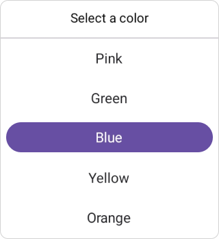
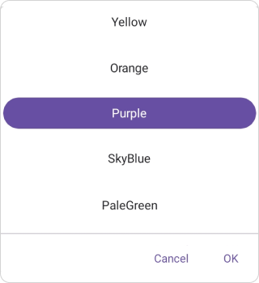

# Getting started with .NET MAUI Picker (SfPicker)
This section explains how to add the Picker control. It covers only the basic features needed to get started with the Syncfusion Picker.

## Creating an application using the .NET MAUI Picker

1. Create a new .NET MAUI application in Visual Studio.

2. Syncfusion .NET MAUI components are available on [nuget.org](https://www.nuget.org/). To add `SfPicker` to your project, open the NuGet package manager in Visual Studio, search for [Syncfusion.Maui.Picker](https://www.nuget.org/packages/Syncfusion.Maui.Picker), then install it.

3. To initialize the control, import the control namespace `Syncfusion.Maui.Picker` in XAML or C# code.

4. Initialize `SfPicker.`




<ContentPage   
    . . .
    xmlns:picker="clr-namespace:Syncfusion.Maui.Picker;assembly=Syncfusion.Maui.Picker">

    <picker:SfPicker />
</ContentPage>




using Syncfusion.Maui.Picker;
. . .

public partial class MainPage : ContentPage
{
    public MainPage()
    {
        InitializeComponent();
        SfPicker picker = new SfPicker();
        this.Content = picker;
    }
}




## Register the handler

The `Syncfusion.Maui.Core` NuGet is a dependent package for all Syncfusion controls of .NET MAUI. In the `MauiProgram.cs` file, register the handler for Syncfusion core.




using Syncfusion.Maui.Core.Hosting;
namespace GettingStarted
{
    public static class MauiProgram
    {
        public static MauiApp CreateMauiApp()
        {
            var builder = MauiApp.CreateBuilder();

            builder.ConfigureSyncfusionCore();
            builder
            .UseMauiApp<App>()
            .ConfigureFonts(fonts =>
            {
                fonts.AddFont("OpenSans-Regular.ttf", "OpenSansRegular");
                fonts.AddFont("Segoe-mdl2.ttf", "SegoeMDL2");
            });

            return builder.Build();
        }
    }
}




## Set header to the Picker

The SfPicker control allows you to add the header text by setting the [Text](https://help.syncfusion.com/cr/maui/Syncfusion.Maui.Picker.PickerHeaderView.html#Syncfusion_Maui_Picker_PickerHeaderView_Text) property in the [PickerHeaderView](https://help.syncfusion.com/cr/maui/Syncfusion.Maui.Picker.PickerHeaderView.html). To enable the header view by setting the [Height](https://help.syncfusion.com/cr/maui/Syncfusion.Maui.Picker.PickerHeaderView.html#Syncfusion_Maui_Picker_PickerHeaderView_HeightProperty) property in the [PickerHeaderView](https://help.syncfusion.com/cr/maui/Syncfusion.Maui.Picker.PickerHeaderView.html).




<picker:SfPicker x:Name="picker">
    <picker:SfPicker.HeaderView>
        <picker:PickerHeaderView Text="Select a color" Height="40" />
    </picker:SfPicker.HeaderView>
</picker:SfPicker>




SfPicker picker = new SfPicker();
picker.HeaderView = new PickerHeaderView()
{
    Text = "Select a color",
    Height = 40,
};

this.Content = picker;




## Add picker items to the picker

The .NET MAUI Picker control is a data-bound control. Hence, you must create a data collection and bind it to the picker control.

* Create a simple Observable Collection of data for the picker,




public class ItemInfo
{
    private ObservableCollection<object> dataSource = new ObservableCollection<object>()
    {
        "Pink", "Green", "Blue", "Yellow", "Orange", "Purple", "SkyBlue", "PaleGreen"
    };

    public ObservableCollection<object> DataSource
    {
        get
        {
            return dataSource;
        }
        set
        {
            dataSource = value;
        }
    }

    public ItemInfo()
    {

    }
}




* Bind the Collection to picker

The Picker control allows you to bind data collection by setting the [ItemsSource](https://help.syncfusion.com/cr/maui/Syncfusion.Maui.Picker.PickerColumn.html#Syncfusion_Maui_Picker_PickerColumn_ItemsSourceProperty) property from the [PickerColumn](https://help.syncfusion.com/cr/maui/Syncfusion.Maui.Picker.PickerColumn.html). Bind data collection in both XAML and C#.




<picker:SfPicker x:Name="picker">
    <picker:SfPicker.HeaderView>
        <picker:PickerHeaderView Text="Select a color" Height="40" />
    </picker:SfPicker.HeaderView>
    <picker:SfPicker.Columns>
        <picker:PickerColumn ItemsSource="{Binding DataSource}" />
    </picker:SfPicker.Columns>
</picker:SfPicker>

<ContentPage.BindingContext>
    <local:ItemInfo />
</ContentPage.BindingContext>




ItemInfo itemInfo = new ItemInfo();
SfPicker picker = new SfPicker()
{
    Columns = new ObservableCollection<PickerColumn>()
    {
        new PickerColumn()
        {
            ItemsSource = itemInfo.DataSource,
        }
    }
};

this.Content = picker;




## Set footer to the Picker

In SfPicker control, validation buttons (OK and Cancel) can be customized by setting the [OkButtonText](https://help.syncfusion.com/cr/maui/Syncfusion.Maui.Picker.PickerFooterView.html#Syncfusion_Maui_Picker_PickerFooterView_OkButtonText) and [CancelButtonText](https://help.syncfusion.com/cr/maui/Syncfusion.Maui.Picker.PickerFooterView.html#Syncfusion_Maui_Picker_PickerFooterView_CancelButtonText) properties in the [PickerFooterView](https://help.syncfusion.com/cr/maui/Syncfusion.Maui.Picker.PickerFooterView.html). It allows you to confirm or cancel the selected item. The `OkButtonText` can be enabled using the [ShowOkButton](https://help.syncfusion.com/cr/maui/Syncfusion.Maui.Picker.PickerFooterView.html#Syncfusion_Maui_Picker_PickerFooterView_ShowOkButton) property in the [PickerFooterView](https://help.syncfusion.com/cr/maui/Syncfusion.Maui.Picker.PickerFooterView.html).




<picker:SfPicker x:Name="Picker">
    <picker:SfPicker.FooterView>
        <picker:PickerFooterView ShowOkButton="True" Height="40" />
    </picker:SfPicker.FooterView>
</picker:SfPicker>




SfPicker picker = new SfPicker();
picker.FooterView= new PickerFooterView()
{  
    ShowOkButton = true,
    Height = 40,
};

this.Content = picker;

  


## Set column header to the Picker items

The SfPicker control allows you to add the column header text by setting the [HeaderText](https://help.syncfusion.com/cr/maui/Syncfusion.Maui.Picker.PickerColumn.html#Syncfusion_Maui_Picker_PickerColumn_HeaderText) property in the [PickerColumn](https://help.syncfusion.com/cr/maui/Syncfusion.Maui.Picker.PickerColumn.html), and you need to add the column header height by setting the [Height](https://help.syncfusion.com/cr/maui/Syncfusion.Maui.Picker.PickerColumnHeaderView.html#Syncfusion_Maui_Picker_PickerColumnHeaderView_Height) property in the [PickerColumnHeaderView](https://help.syncfusion.com/cr/maui/Syncfusion.Maui.Picker.PickerColumnHeaderView.html). Its text style and background color are customizable.




<picker:SfPicker x:Name="picker">
<picker:SfPicker.HeaderView>
    <picker:PickerHeaderView Text="Select a color" Height="40" />
</picker:SfPicker.HeaderView>

<picker:SfPicker.Columns>
    <picker:PickerColumn HeaderText="Colors" 
                         ItemsSource="{Binding DataSource}" />
</picker:SfPicker.Columns>

<picker:SfPicker.ColumnHeaderView>
    <picker:PickerColumnHeaderView Height="40" />
</picker:SfPicker.ColumnHeaderView>
</picker:SfPicker>




ItemInfo itemInfo = new ItemInfo();
SfPicker picker = new SfPicker()
{
    HeaderView = new PickerHeaderView()
    {
        Text = "Select a color",
        Height = 40,
    },

    Columns = new ObservableCollection<PickerColumn>()
    {
        new PickerColumn()
        {
            HeaderText = "Colors",
            ItemsSource = itemInfo.DataSource,
        }
    },

    ColumnHeaderView = new PickerColumnHeaderView()
    {
        Height = 40,
    },
};

this.Content = picker;

  


## Set height and width to the Picker

The SfPicker control allows you to change the height and width by using the [HeightRequest] and [WidthRequest] properties in the [SfPicker](https://help.syncfusion.com/cr/maui/Syncfusion.Maui.Picker.SfPicker.html).




<picker:SfPicker x:Name="Picker" 
                    HeightRequest="280" 
                    WidthRequest="300">
</picker:SfPicker>




SfPicker picker = new SfPicker()
{
    HeightRequest = 280,
    WidthRequest = 300,
};

this.Content = picker;

  


