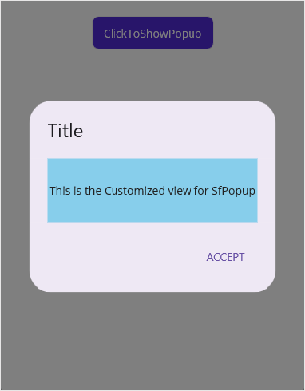

# Getting Started with .NET Maui Popup (SfPopup)

This section provides a quick overview of how to get started with the .NET Maui Popup (SfPopup) for Maui. Walk-through the entire process of creating the real world SfPopup.

## Creating an application using the .NET MAUI Popup

 1. Create a new .NET MAUI application in Visual Studio.
 2. Syncfusion .NET MAUI components are available on [nuget.org](https://www.nuget.org/). To add SfPopup to your project, open the NuGet package manager in Visual Studio, search for Syncfusion.Maui.Popup and then install it.
 3. Import the control namespace `Syncfusion.Maui.Popup` in XAML or C# code.
 4. Initialize the `SfPopup` control.
 



<ContentPage   
    . . .
    xmlns:syncfusion="clr-namespace:Syncfusion.Maui.Popup;assembly=Syncfusion.Maui.Popup">

    <syncfusion:SfPopup />
</ContentPage>




using Syncfusion.Maui.Popup;
. . .

public partial class MainPage : ContentPage
{
    public MainPage()
    {
        InitializeComponent();
        SfPopup popup = new SfPopup();
    }
}




## Register the handler

The `Syncfusion.Maui.Core` NuGet is a dependent package for all Syncfusion controls of .NET MAUI. In the `MauiProgram.cs` file, register the handler for Syncfusion core.



using Microsoft.Maui.Controls.Hosting;
using Microsoft.Maui.Controls.Xaml;
using Microsoft.Maui.Hosting;
using Syncfusion.Maui.Core.Hosting;

namespace GettingStarted
{
    public class MauiProgram 
    {
        public static MauiApp CreateMauiApp()
        {
            var builder = MauiApp.CreateBuilder();
            builder
                .UseMauiApp<App>()
                .ConfigureFonts(fonts =>
                {
                    fonts.AddFont("OpenSans-Regular.ttf", "OpenSansRegular");
                });

            builder.ConfigureSyncfusionCore();
            return builder.Build();
        }
    }
}
 


## Displaying popup

You can display popup over your view by calling the `SfPopup.Show` method.

Refer to the following code example for displaying popup.





<?xml version="1.0" encoding="utf-8" ?>
<ContentPage xmlns="http://schemas.microsoft.com/dotnet/2021/maui"
             xmlns:x="http://schemas.microsoft.com/winfx/2009/xaml"
             xmlns:local="clr-namespace:GettingStarted"
             x:Class="GettingStarted.MainPage" 
             Padding="0,40,0,0">
     <StackLayout x:Name="mainLayout">
       <Button x:Name="clickToShowPopup" Text="ClickToShowPopup" 
               VerticalOptions="Start" HorizontalOptions="FillAndExpand"
               Clicked="ClickToShowPopup_Clicked" />
     </StackLayout>
</ContentPage>





using Syncfusion.Maui.Popup;

namespace GettingStarted
{
    public partial class MainPage : ContentPage
    {
        SfPopup popup;

        public MainPage()
        {
            InitializeComponent();
            popup = new SfPopup();
        }

        private void ClickToShowPopup_Clicked(object sender, EventArgs e)
        {
            popup.Show();
        }
    }
}





You can download the source code of this sample [here](https://github.com/SyncfusionExamples/getting-started-.net-maui-popup).

N> Two Popups cannot be displayed at the same time in a page.

## Customize positioning

The .NET MAUI Popup (SfPopup) allows showing the popup content at various positions.

The following list of options are available to position the SfPopup in the desired position:

* `Center Positioning`: Use the `SfPopup.IsOpen` property or `SfPopup.Show` method to display the SfPopup at the center.
* `Absolute Positioning`: Use the `SfPopup.Show(x-position, y-position)` to display the SfPopup at the specified X and y position.
* `Relative Positioning`: Use the `SfPopup.ShowRelativeToView(View, RelativePosition)` to display the SfPopup at any of the 8 positions relative to the specified view.
* `Absolute relative positioning`: Use the `SfPopup.ShowRelativeToView(View, RelativePosition,x position,y position)` to display the SfPopup at an absolute x,y coordinate from the relative position of the specified view.

## Customizing layouts

By default, you can choose a layout from the following available layouts in the SfPopup by using the property `SfPopup.AppearanceMode`.

* `OneButton`: Shows the SfPopup with one button in the footer view. This is the default value.
* `TwoButton`: Shows the SfPopup with two buttons in the footer view.

You can also customize the entire view of the popup by loading the templates or custom views for the header, body, and footer.

###  Load your template view in the popup body

Any view can be added as popup content by using the `SfPopup.ContentTemplate` property to refresh it. Refer to the following code example in which a label is added as a popup content. 





<?xml version="1.0" encoding="utf-8" ?>
<ContentPage xmlns="http://xamarin.com/schemas/2014/forms"
             xmlns:x="http://schemas.microsoft.com/winfx/2009/xaml"
             xmlns:local="clr-namespace:GettingStarted"
             x:Class="GettingStarted.MainPage" 
             Padding="0,40,0,0"
             xmlns:sfPopup="clr-namespace:Syncfusion.Maui.Popup;assembly=Syncfusion.Maui.Popup">
    <StackLayout>
        <Button x:Name="clickToShowPopup"
                Text="ClickToShowPopup"
                VerticalOptions="Start"
                HorizontalOptions="FillAndExpand"
                Clicked="ClickToShowPopup_Clicked" />
        <sfPopup:SfPopup x:Name="popup">
            <sfPopup:SfPopup.ContentTemplate>
                <DataTemplate>
                    <Label Text="This is the Customized view for SfPopup"
                           BackgroundColor="SkyBlue"
                           HorizontalTextAlignment="Center" />
                </DataTemplate>
            </sfPopup:SfPopup.ContentTemplate>
        </sfPopup:SfPopup>
    </StackLayout>
</ContentPage>





using Syncfusion.Maui.Popup;

namespace GettingStarted
{
    public partial class MainPage : ContentPage
    {
        DataTemplate templateView;
        Label popupContent;

        public MainPage()
        {
            InitializeComponent();            
            templateView = new DataTemplate(() =>
            {
                popupContent = new Label();
                popupContent.Text = "This is the Customized view for SfPopup";
                popupContent.BackgroundColor = Color.LightSkyBlue;
                popupContent.HorizontalTextAlignment = TextAlignment.Center;
                return popupContent;
            });

            // Adding ContentTemplate of the SfPopup
            popup.ContentTemplate = templateView;
        }

        private void ClickToShowPopup_Clicked(object sender, EventArgs e)
        {
            popup.Show();
        }
    } 
}





