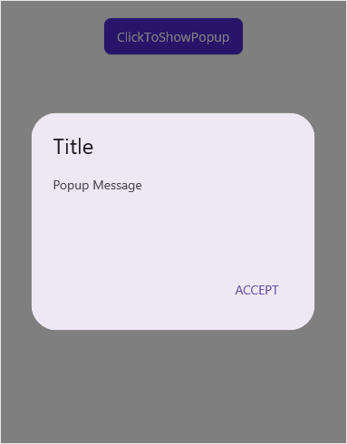
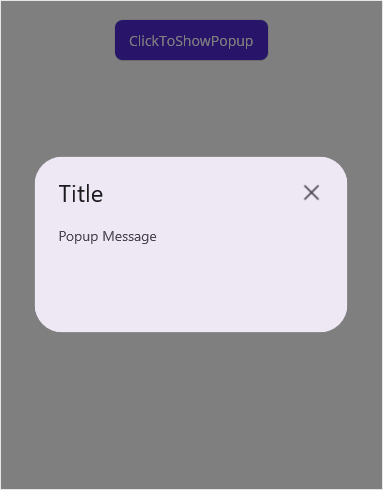
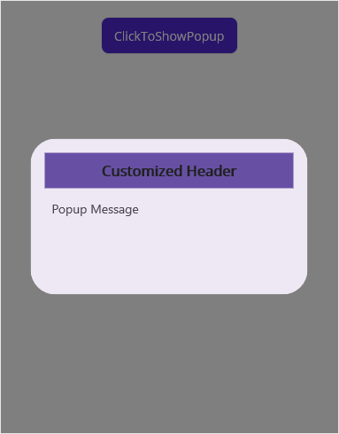
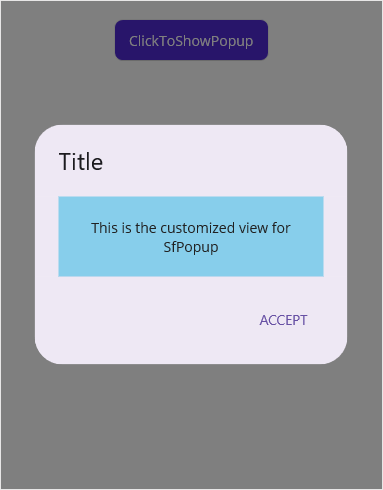

# Layout Customizations in MAUI Popup (SfPopup)

## Popup appearance mode for footer

The `SfPopup` supports two types of `SfPopup.AppearanceMode`. By default, the `PopupButtonAppearanceMode.OneButton` is set. You can change the appearance by using the `SfPopup.AppearanceMode` property.

The two different appearance modes in the SfPopup are as follows:
<table>
<tr>
<th>Modes</th>
<th>Description</th></tr>
<tr>
<td>`OneButton`</td>
<td>Shows the `SfPopup` with one button in the footer view. This is the default value.</td></tr>
<tr>
<td>`TwoButton`</td>
<td>Shows the `SfPopup` with two buttons in the footer view.</td></tr>
</table>

In the following code example, set the `SfPopup.AppearanceMode` property as `OneButton` which displays only the Accept button in the footer view.



<ContentPage xmlns="http://schemas.microsoft.com/dotnet/2021/maui"
             xmlns:x="http://schemas.microsoft.com/winfx/2009/xaml"
             xmlns:sfPopup="clr-namespace:Syncfusion.Maui.Popup;assembly=Syncfusion.Maui.Popup"
             x:Class="PopupMauiPositioning.MainPage">
     <ContentPage.Content>
        <StackLayout Padding="20">
            <Button x:Name="clickToShowPopup" Text="ClickToShowPopup" 
                    VerticalOptions="Start" HorizontalOptions="Center" 
                    Clicked="ClickToShowPopup_Clicked" />
            <sfPopup:SfPopup x:Name="sfPopup" AppearanceMode="OneButton" ShowFooter="True">
            </sfPopup:SfPopup>
        </StackLayout>
    </ContentPage.Content>
</ContentPage>


using Syncfusion.Maui.Popup;

public partial class MainPage : ContentPage
{
    public MainPage()
    {
        InitializeComponent();
        sfPopup.ShowFooter = true;
        // Setting the AppearanceMode as OneButton
        sfPopup.AppearanceMode = PopupButtonAppearanceMode.OneButton;
    }

    private void ClickToShowPopup_Clicked(object sender, EventArgs e)
    {
        sfPopup.Show();
    }
}



In the following code example, set the `SfPopup.AppearanceMode` property as `TwoButton` which displays both Accept button and Decline button in the footer view.



<ContentPage xmlns="http://schemas.microsoft.com/dotnet/2021/maui"
             xmlns:x="http://schemas.microsoft.com/winfx/2009/xaml"
             xmlns:sfPopup="clr-namespace:Syncfusion.Maui.Popup;assembly=Syncfusion.Maui.Popup"
             x:Class="PopupMauiPositioning.MainPage">
     <ContentPage.Content>
        <StackLayout Padding="20">
            <Button x:Name="clickToShowPopup" Text="ClickToShowPopup" 
                    VerticalOptions="Start" HorizontalOptions="Center" 
                    Clicked="ClickToShowPopup_Clicked" />
            <sfPopup:SfPopup x:Name="sfPopup" AppearanceMode="TwoButton" ShowFooter="True">
            </sfPopup:SfPopup>
        </StackLayout>
    </ContentPage.Content>
</ContentPage>


using Syncfusion.Maui.Popup;

public partial class MainPage : ContentPage
{
    public MainPage()
    {
        InitializeComponent();
        sfPopup.ShowFooter = true;
        // Setting the AppearanceMode as TwoButton
        sfPopup.AppearanceMode = PopupButtonAppearanceMode.TwoButton;
    }

    private void ClickToShowPopup_Clicked(object sender, EventArgs e)
    {
        sfPopup.Show();
    }
}



## Popup region customization

### Disable header

You can display the Popup without header by using the property `SfPopup.ShowHeader`. Default value is true. Find the code example of the same below.



<ContentPage xmlns="http://schemas.microsoft.com/dotnet/2021/maui"
             xmlns:x="http://schemas.microsoft.com/winfx/2009/xaml"
             xmlns:sfPopup="clr-namespace:Syncfusion.Maui.Popup;assembly=Syncfusion.Maui.Popup"
             x:Class="PopupMauiPositioning.MainPage">
     <ContentPage.Content>
        <StackLayout Padding="20">
            <Button x:Name="clickToShowPopup" Text="ClickToShowPopup" 
                    VerticalOptions="Start" HorizontalOptions="Center" 
                    Clicked="ClickToShowPopup_Clicked" />
            <sfPopup:SfPopup x:Name="sfPopup" ShowHeader="False" ShowFooter="True">
            </sfPopup:SfPopup>
        </StackLayout>
    </ContentPage.Content>
</ContentPage>


using Syncfusion.Maui.Popup;

public partial class MainPage : ContentPage
{
    public MainPage()
    {
        InitializeComponent();
        sfPopup.ShowHeader = false;
        sfPopup.ShowFooter = true;
    }

    private void ClickToShowPopup_Clicked(object sender, EventArgs e)
    {
        sfPopup.Show();
    }
}



### Enable footer

You can display the Popup with footer by using the property, `SfPopup.ShowFooter`. Default value is false. Find the code example of the same below.



<ContentPage xmlns="http://schemas.microsoft.com/dotnet/2021/maui"
             xmlns:x="http://schemas.microsoft.com/winfx/2009/xaml"
             xmlns:sfPopup="clr-namespace:Syncfusion.Maui.Popup;assembly=Syncfusion.Maui.Popup"
             x:Class="PopupMauiPositioning.MainPage">
     <ContentPage.Content>
        <StackLayout Padding="20">
            <Button x:Name="clickToShowPopup" Text="ClickToShowPopup" 
                    VerticalOptions="Start" HorizontalOptions="Center" 
                    Clicked="ClickToShowPopup_Clicked" />
            <sfPopup:SfPopup x:Name="sfPopup" ShowFooter="True">
            </sfPopup:SfPopup>
        </StackLayout>
    </ContentPage.Content>
</ContentPage>


using Syncfusion.Maui.Popup;

public partial class MainPage : ContentPage
{
    public MainPage()
    {
        InitializeComponent();
        sfPopup.ShowFooter = true;
    }

    private void ClickToShowPopup_Clicked(object sender, EventArgs e)
    {
        sfPopup.Show();
    }
}



## Enable close icon

You can show the Popup with close icon by using the property, `SfPopup.ShowCloseButton`. Default value is false. Find the code example of the same below. 

<ContentPage xmlns="http://schemas.microsoft.com/dotnet/2021/maui"
             xmlns:x="http://schemas.microsoft.com/winfx/2009/xaml"
             xmlns:sfPopup="clr-namespace:Syncfusion.Maui.Popup;assembly=Syncfusion.Maui.Popup"
             x:Class="PopupMauiPositioning.MainPage">
     <ContentPage.Content>
        <StackLayout Padding="20">
            <Button x:Name="clickToShowPopup" Text="ClickToShowPopup" 
                    VerticalOptions="Start" HorizontalOptions="Center" 
                    Clicked="ClickToShowPopup_Clicked" />
            <sfPopup:SfPopup x:Name="sfPopup" ShowCloseButton="True">
            </sfPopup:SfPopup>
        </StackLayout>
    </ContentPage.Content>
</ContentPage>


using Syncfusion.Maui.Popup;

public partial class MainPage : ContentPage
{
    public MainPage()
    {
        InitializeComponent();
        sfPopup.ShowCloseButton = true;
    }

    private void ClickToShowPopup_Clicked(object sender, EventArgs e)
    {
        sfPopup.Show();
    }
}



## Customizing popup header

Any view can be added as the header content using the `SfPopup.HeaderTemplate` property. Refer to the following code example in which a label is added as a header content.



<ContentPage xmlns="http://schemas.microsoft.com/dotnet/2021/maui"
             xmlns:x="http://schemas.microsoft.com/winfx/2009/xaml"
             xmlns:sfPopup="clr-namespace:Syncfusion.Maui.Popup;assembly=Syncfusion.Maui.Popup"
             x:Class="PopupMauiPositioning.MainPage">
    <ContentPage.Content>
        <StackLayout Padding="20">
            <Button x:Name="clickToShowPopup" Text="ClickToShowPopup" 
                    VerticalOptions="Start" HorizontalOptions="Center" 
                    Clicked="ClickToShowPopup_Clicked" />
            <sfPopup:SfPopup x:Name="sfPopup">
                <sfPopup:SfPopup.HeaderTemplate>
                    <DataTemplate>
                        <Label Text="Customized Header" 
                               FontAttributes="Bold"
                               BackgroundColor="#6750A4"
                               FontSize="16"
                               HorizontalTextAlignment="Center"
                               VerticalTextAlignment="Center"/>                               
                    </DataTemplate>
                </sfPopup:SfPopup.HeaderTemplate>                
            </sfPopup:SfPopup>
        </StackLayout>
    </ContentPage.Content>
</ContentPage>


using Syncfusion.Maui.Popup;

public partial class MainPage : ContentPage
{
    DataTemplate headerTemplateView;
    Label headerContent;
    public MainPage()
    {
        InitializeComponent(); 
        clickToShowPopup.Clicked += ClickToShowPopup_Clicked;
        headerTemplateView = new DataTemplate(() =>
        {
            headerContent = new Label();
            headerContent.Text = "Customized Header";
            headerContent.FontAttributes = FontAttributes.Bold;
            headerContent.BackgroundColor = Color.FromArgb("#6750A4");
            headerContent.FontSize = 16;
            headerContent.HorizontalTextAlignment = TextAlignment.Center;
            headerContent.VerticalTextAlignment = TextAlignment.Center;
            return headerContent;
        });
        
        // Adding HeaderTemplate of the SfPopup
        sfPopup.HeaderTemplate = headerTemplateView;
    }

    private void ClickToShowPopup_Clicked(object sender, EventArgs e)
    {
        sfPopup.Show();
    }
}



## Customizing popup footer

Any view can be added as the footer content using the `SfPopup.FooterTemplate` property. Refer to the following code example in which a label is added as a footer content.



<ContentPage xmlns="http://schemas.microsoft.com/dotnet/2021/maui"
             xmlns:x="http://schemas.microsoft.com/winfx/2009/xaml"
             xmlns:sfPopup="clr-namespace:Syncfusion.Maui.Popup;assembly=Syncfusion.Maui.Popup"
             x:Class="PopupMauiPositioning.MainPage">
    <ContentPage.Content>
        <StackLayout Padding="20">
            <Button x:Name="clickToShowPopup" Text="ClickToShowPopup" 
                    VerticalOptions="Start" HorizontalOptions="Center" 
                    Clicked="ClickToShowPopup_Clicked" />
            <sfPopup:SfPopup x:Name="sfPopup" ShowFooter="True">
                <sfPopup:SfPopup.FooterTemplate>
                    <DataTemplate>
                        <Label Text="Customized Footer" 
                               FontAttributes="Bold"
                               BackgroundColor="#6750A4"
                               FontSize="16"
                               HorizontalTextAlignment="Center"
                               VerticalTextAlignment="Center"/>
                    </DataTemplate>
                </sfPopup:SfPopup.FooterTemplate>
            </sfPopup:SfPopup>
        </StackLayout>
    </ContentPage.Content>
</ContentPage>


using Syncfusion.Maui.Popup;

public partial class MainPage : ContentPage
{
    DataTemplate footerTemplateView;
    Label footerContent;
    public MainPage()
    {
        InitializeComponent(); 
        clickToShowPopup.Clicked += ClickToShowPopup_Clicked;
        sfPopup.ShowFooter = true;
        footerTemplateView = new DataTemplate(() =>
        {
            footerContent = new Label();
            footerContent.Text = "Customized Footer";
            footerContent.FontAttributes = FontAttributes.Bold;
            footerContent.BackgroundColor = Color.FromArgb("#6750A4");
            footerContent.FontSize = 16;
            footerContent.HorizontalTextAlignment = TextAlignment.Center;
            footerContent.VerticalTextAlignment = TextAlignment.Center;
            return footerContent;
        });

        // Adding FooterTemplate of the SfPopup
        sfPopup.FooterTemplate = footerTemplateView;
    }

    private void ClickToShowPopup_Clicked(object sender, EventArgs e)
    {
        sfPopup.Show();
    }
}



## Customizing popup content

Any view can be added as popup content by using the `SfPopup.ContentTemplate` property. Refer to the following code example in which a label is added as a popup content.



<ContentPage xmlns="http://schemas.microsoft.com/dotnet/2021/maui"
             xmlns:x="http://schemas.microsoft.com/winfx/2009/xaml"
             xmlns:sfPopup="clr-namespace:Syncfusion.Maui.Popup;assembly=Syncfusion.Maui.Popup"
             x:Class="PopupMauiPositioning.MainPage">
    <ContentPage.Content>
        <StackLayout Padding="20">
            <Button x:Name="clickToShowPopup" Text="ClickToShowPopup" 
                    VerticalOptions="Start" HorizontalOptions="Center" 
                    Clicked="ClickToShowPopup_Clicked" />
            <sfPopup:SfPopup x:Name="sfPopup" ShowFooter="True">
                <sfPopup:SfPopup.ContentTemplate>
                    <DataTemplate>
                        <Label Text="This is the customized view for SfPopup" 
                               VerticalTextAlignment="Center" BackgroundColor="SkyBlue"
                               HorizontalTextAlignment="Center" Padding="10"/>
                    </DataTemplate>
                </sfPopup:SfPopup.ContentTemplate>
            </sfPopup:SfPopup>
        </StackLayout>
    </ContentPage.Content>
</ContentPage>


using Syncfusion.Maui.Popup;

public partial class MainPage : ContentPage
{
    DataTemplate contentTemplateView;
    Label popupContent;
    public MainPage()
    {
        InitializeComponent(); 
        clickToShowPopup.Clicked += ClickToShowPopup_Clicked;
        sfPopup.ShowFooter = true;
        contentTemplateView = new DataTemplate(() =>
        {
            popupContent = new Label();
            popupContent.Text = "This is the customized view for SfPopup";            
            popupContent.BackgroundColor = Colors.SkyBlue;          
            popupContent.HorizontalTextAlignment = TextAlignment.Center;
            popupContent.VerticalTextAlignment = TextAlignment.Center;
            popupContent.Padding = 10;
            return popupContent;
        });

       // Adding ContentTemplate of the SfPopup
        sfPopup.ContentTemplate = contentTemplateView;
    }

    private void ClickToShowPopup_Clicked(object sender, EventArgs e)
    {
        sfPopup.Show();
    }
}



