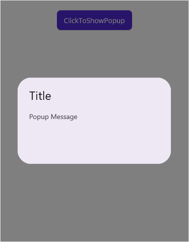
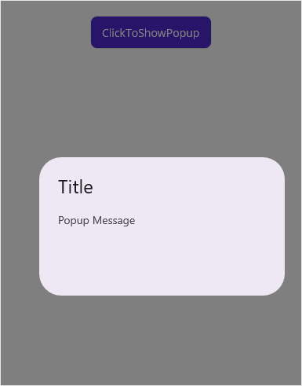
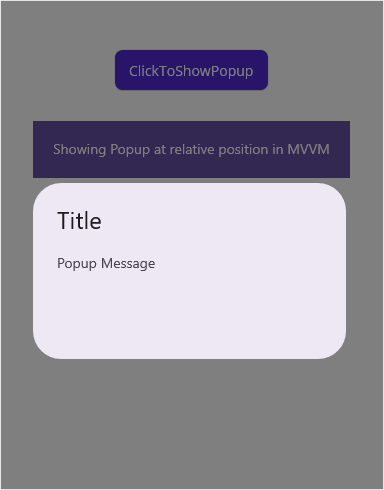

# Popup Positioning in MAUI Popup (SfPopup)

The `SfPopup` allows showing the popup content at various available positions.

Following are the list of options available to show SfPopup at various positions.

<table>
<tr>
<th>Methods / Properties</th>
<th>Description</th></tr>
<tr>
<td>SfPopup.IsOpen</td>
<td>Shows the `SfPopup` at center.</td></tr>
<tr>
<td>SfPopup.Show</td>
<td>Similar as `SfPopup.IsOpen` property.</td></tr>
<tr>
<td>SfPopup.Show(x-position, y-position)</td>
<td>Shows the `SfPopup` at the specified X and y positions.</td></tr>
<tr>
<td>SfPopup.ShowRelativeToView(View, RelativePosition)</td>
<td>Shows the `SfPopup` at the position relative to the specified view.</td></tr>
<tr>
<td>SfPopup.ShowRelativeToView(View, RelativePosition,x-position,y-position)</td>
<td>Shows the `SfPopup` at an absolute x, y coordinate from the relative position of the specified view.</td></tr>
<tr>
<td>SfPopup.IsFullScreen</td>
<td>Shows the `SfPopup` in full width and height of the screen.</td></tr>
<tr>
<td>SfPopu.Show(bool)</td>
<td>Similar as `SfPopup.IsFullScreen` property.</td></tr>
</table>

## Center positioning

`SfPopup` can be shown at the center by using the following options.

 * IsOpen property
 * SfPopupLayout.Show

To open the `SfPopup`, use the `SfPopup.IsOpen` property as in the following code sample.



<ContentPage xmlns="http://schemas.microsoft.com/dotnet/2021/maui"
             xmlns:x="http://schemas.microsoft.com/winfx/2009/xaml"
             xmlns:sfPopup="clr-namespace:Syncfusion.Maui.Popup;assembly=Syncfusion.Maui.Popup"
             x:Class="PopupMauiPositioning.MainPage">
  <ContentPage.Content>
    <StackLayout Padding="20">
      <Button x:Name="clickToShowPopup" Text="ClickToShowPopup" 
              VerticalOptions="Start" HorizontalOptions="Center" 
              Clicked="ClickToShowPopup_Clicked" />
      <sfPopup:SfPopup x:Name="sfPopup">
      </sfPopup:SfPopup>
    </StackLayout>
  </ContentPage.Content>
</ContentPage>


private void ClickToShowPopup_Clicked(object sender, EventArgs e)
{
  // Shows SfPopup at the center of the view.
	sfPopup.IsOpen = true;
}



To open the SfPopup, use the SfPopup.Show method as in the following code sample.



<ContentPage xmlns="http://schemas.microsoft.com/dotnet/2021/maui"
             xmlns:x="http://schemas.microsoft.com/winfx/2009/xaml"
             xmlns:sfPopup="clr-namespace:Syncfusion.Maui.Popup;assembly=Syncfusion.Maui.Popup"
             x:Class="PopupMauiPositioning.MainPage">
  <ContentPage.Content>
    <StackLayout Padding="20">
      <Button x:Name="clickToShowPopup" Text="ClickToShowPopup" 
              VerticalOptions="Start" HorizontalOptions="Center" 
              Clicked="ClickToShowPopup_Clicked" />
      <sfPopup:SfPopup x:Name="sfPopup">
      </sfPopup:SfPopup>
    </StackLayout>
  </ContentPage.Content>
</ContentPage>


private void ClickToShowPopup_Clicked(object sender, EventArgs e)
{
  // Shows SfPopup at the center of the view.
	sfPopup.Show();
}



## Absolute positioning

To open the `SfPopup` in specific X,Y coordinates, use the `SfPopup.Show(x-position, y-position)` method as in the following code sample.



<ContentPage xmlns="http://schemas.microsoft.com/dotnet/2021/maui"
             xmlns:x="http://schemas.microsoft.com/winfx/2009/xaml"
             xmlns:sfPopup="clr-namespace:Syncfusion.Maui.Popup;assembly=Syncfusion.Maui.Popup"
             x:Class="PopupMauiPositioning.MainPage">
  <ContentPage.Content>
    <StackLayout Padding="20">
      <Button x:Name="clickToShowPopup" Text="ClickToShowPopup" 
              VerticalOptions="Start" HorizontalOptions="Center" 
              Clicked="ClickToShowPopup_Clicked" />
      <sfPopup:SfPopup x:Name="sfPopup">
      </sfPopup:SfPopup>
    </StackLayout>
  </ContentPage.Content>
</ContentPage>


private void ClickToShowPopup_Clicked(object sender, EventArgs e)
{
  // Shows SfPopup at x-position 100 and y position 100.
	 sfPopup.Show(50, 200);
}



## Relative positioning

`SfPopup` can be shown at the relative position by using the following method.

### Display popup relative to a view

To open the `SfPopup` relative to a view, use the `SfPopup.ShowRelativeToView(View, RelativePosition,x-position,y-position)` method.



<ContentPage.Content>       
  <StackLayout VerticalOptions="Start" HorizontalOptions="Center" Padding="20">
    <Button x:Name="clickToShowPopup" Text="ClickToShowPopup"
            VerticalOptions="Start" HorizontalOptions="Start"
            Clicked="ClickToShowPopup_Clicked" />   
    <sfPopup:SfPopup x:Name="sfPopup">
    </sfPopup:SfPopup>
  </StackLayout>
</ContentPage.Content>


private void ClickToShowPopup_Clicked(object sender, EventArgs e)
{
  // Shows SfPopup at the bottom of the button.
	sfPopup.ShowRelativeToView(clickToShowPopup, PopupRelativePosition.AlignBottom, 0, 0);
}



### Display popup relatively to a view with absolute coordinates

The `SfPopup` can be displayed at an absolute x, y coordinate from the relative position of the specified view by using the following method.

To open the `SfPopup` in the specific x, y coordinate relative to a view, use the `SfPopup.ShowRelativeToView(View, RelativePosition,x-position,y-position)` method.



<ContentPage.Content>       
  <StackLayout VerticalOptions="Start" HorizontalOptions="Start" Padding="20">
    <Button x:Name="clickToShowPopup" Text="ClickToShowPopup"
            VerticalOptions="Center" HorizontalOptions="Start"
            Clicked="ClickToShowPopup_Clicked" />
    <sfPopup:SfPopup x:Name="sfPopup">
    </sfPopup:SfPopup>
  </StackLayout>
</ContentPage.Content>


private void ClickToShowPopup_Clicked(object sender, EventArgs e)
{
  // Shows SfPopup at the bottom of the button and with absolute relative position.
	sfPopup.ShowRelativeToView(clickToShowPopup, PopupRelativePosition.AlignBottom, 50, 50);
}



You can pass both negative and positive values as parameters to the SfPopup.ShowRelativeToView(View, RelativePosition, x-position, y-position). The popup will be positioned by considering the relative position as (0, 0) the center point. For example, if you have set the RelativePosition as RelativePosition.BottomRight and RelativeView as a button, bottom right corner of the button will be considered as the 0, 0 point and a negative x-position value will place the popup to the left of that point and a positive x-position value will place the popup to the right of that point. The same applies for y-position also.

### Show relative to view in MVVM

To open the SfPopup relative to a view in MVVM assign values to the `SfPopup.RelativeView` and `SfPopup.RelativePosition` properties and use the `SfPopup.IsOpen` property to open or close the popup using binding.



<ContentPage xmlns="http://schemas.microsoft.com/dotnet/2021/maui"
             xmlns:x="http://schemas.microsoft.com/winfx/2009/xaml"
             xmlns:sfPopup="clr-namespace:Syncfusion.Maui.Popup;assembly=Syncfusion.Maui.Popup"
             xmlns:local="clr-namespace:PopupMauiPositioning"
             x:Class="PopupMauiPositioning.MainPage">
  <ContentPage.BindingContext>
    <local:ViewModel/>
  </ContentPage.BindingContext>
  <ContentPage.Content>       
    <StackLayout>
      <Button x:Name="clickToShowPopup" Text="ClickToShowPopup" Margin="0,30,0,30"
              HorizontalOptions="Center"
              Clicked="ClickToShowPopup_Clicked" />
      <Label x:Name="relativeView" Text="Showing Popup at relative position in MVVM" 
             VerticalOptions="StartAndExpand" HorizontalOptions="Center" 
             HorizontalTextAlignment="Center" FontFamily="Roboto" Padding="20"
             LineBreakMode="WordWrap" FontSize="14" BackgroundColor="#6750A4" TextColor="White"/>
      <sfPopup:SfPopup x:Name="sfPopup" IsOpen="{Binding DisplayPopup}"
                       RelativeView="{x:Reference relativeView}" RelativePosition="AlignBottom"
                       AbsoluteX="0" AbsoluteY="5">
      </sfPopup:SfPopup>
    </StackLayout>
  </ContentPage.Content>
</ContentPage>

 
private void ClickToShowPopup_Clicked(object sender, EventArgs e)
{
  // Shows SfPopup at the bottom of the label and with absolute relative position.
  (this.BindingContext as ViewModel).DisplayPopup = true;	
}





public class ViewModel : INotifyPropertyChanged
{
  private bool displayPopup;
  public bool DisplayPopup
  {
      get { return displayPopup; }
      set { displayPopup = value; RaisePropertyChanged("DisplayPopup"); }
  }
  public ViewModel()
  {
      this.DisplayPopup = false;
  }
  public void RaisePropertyChanged(string propName)
  {
      if (this.PropertyChanged != null)
          this.PropertyChanged(this, new PropertyChangedEventArgs(propName));
  }
  public event PropertyChangedEventHandler PropertyChanged;
}



