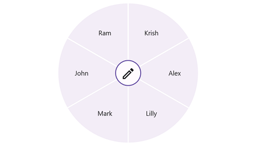
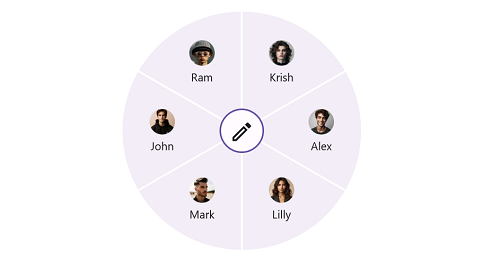
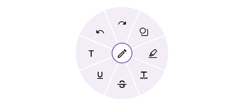
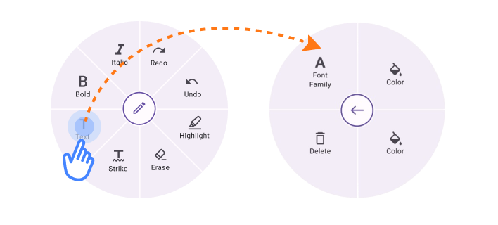

# Populating Items in MAUI Radial Menu (SfRadialMenu)

This section explains the ways about populating items through radial menu item and item source with item template.

## Through radial menu items

By passing a collection of [`SfRadialMenuItem`](https://help.syncfusion.com/cr/maui/Syncfusion.Maui.RadialMenu.SfRadialMenuItem.html), you can get the view of [`SfRadialMenu`](https://help.syncfusion.com/cr/maui/Syncfusion.Maui.RadialMenu.SfRadioButton.html) control. The radial menu item class provides various options to customize the items by giving custom views, font icons, and images. You can add radial menu items by hierarchy.

### Text

The following code snippet demonstrates how to Create a RadialMenu control with Items having the given text.





<?xml version="1.0" encoding="utf-8" ?>
<ContentPage xmlns="http://schemas.microsoft.com/dotnet/2021/maui"
             xmlns:x="http://schemas.microsoft.com/winfx/2009/xaml"
             xmlns:local="clr-namespace:RadialSample"
             xmlns:syncfusion="clr-namespace:Syncfusion.Maui.RadialMenu;assembly=Syncfusion.Maui.RadialMenu"
             x:Class="RadialSample.MainPage">
    <syncfusion:SfRadialMenu>
        <syncfusion:SfRadialMenu.Items>
            <syncfusion:SfRadialMenuItem Text="Bold" FontSize="12"/>
            <syncfusion:SfRadialMenuItem Text="Copy" FontSize="12"/>
            <syncfusion:SfRadialMenuItem Text="Undo" FontSize="12"/>
            <syncfusion:SfRadialMenuItem Text="Paste" FontSize="12"/>
            <syncfusion:SfRadialMenuItem Text="Color" FontSize="12"/>
        </syncfusion:SfRadialMenu.Items>
    </syncfusion:SfRadialMenu>
</ContentPage>





using Syncfusion.Maui.RadialMenu;

namespace RadialSample
{
    public partial class MainPage : ContentPage
    {
        public MainPage()
        {
            InitializeComponent();

            SfRadialMenu radialMenu = new SfRadialMenu();

            RadialMenuItemsCollection itemCollection = new RadialMenuItemsCollection() 
            {
               new SfRadialMenuItem() { Text = "Bold", FontSize = 12 },
               new SfRadialMenuItem() { Text = "Copy", FontSize = 12 },
               new SfRadialMenuItem() { Text = "Paste", FontSize = 12 },
               new SfRadialMenuItem() { Text = "Undo", FontSize = 12 },
               new SfRadialMenuItem() { Text = "Color", FontSize = 12 },
            };
            radialMenu.Items = itemCollection;
            this.Content = radialMenu;
        }
    }
}





N> Instead of using ObservableCollection, use `RadialMenuItemsCollection` for the RadialMenu Items list and `SubMenuItemsCollection` for the list of items within each RadialMenuItem.

### ImageWithText

The following code snippet demonstrates how to Display images and text in the RadialMenu items of the control.





<?xml version="1.0" encoding="utf-8" ?>
<ContentPage xmlns="http://schemas.microsoft.com/dotnet/2021/maui"
             xmlns:x="http://schemas.microsoft.com/winfx/2009/xaml"
             xmlns:local="clr-namespace:RadialSample"
             xmlns:syncfusion="clr-namespace:Syncfusion.Maui.RadialMenu;assembly=Syncfusion.Maui.RadialMenu"
             x:Class="RadialSample.MainPage">
    <syncfusion:SfRadialMenu>
        <syncfusion:SfRadialMenu.Items>
            <syncfusion:SfRadialMenuItem Text="John"  Image="johnson.png"/>
            <syncfusion:SfRadialMenuItem Text="Krish" Image="krish.png"/>
            <syncfusion:SfRadialMenuItem Text="Ram"   Image="ram.png"/>
            <syncfusion:SfRadialMenuItem Text="Kather"  Image="kather.png"/>
            <syncfusion:SfRadialMenuItem Text="Joe"  Image="joe.png"/>
        </syncfusion:SfRadialMenu.Items>
    </syncfusion:SfRadialMenu>
</ContentPage>





using Syncfusion.Maui.RadialMenu;

namespace RadialSample
{
    public partial class MainPage : ContentPage
    {
        public MainPage()
        {
            InitializeComponent();

            SfRadialMenu radialMenu = new SfRadialMenu();
            RadialMenuItemsCollection itemCollection = new RadialMenuItemsCollection()
            {
                new SfRadialMenuItem() { Text = "John", Image = "johnson.png" },
                new SfRadialMenuItem() { Text = "Krish", Image = "krish.png" },
                new SfRadialMenuItem() { Text = "Ram", Image = "ram.png" },
                new SfRadialMenuItem() { Text = "Kather", Image = "kather.png" },
                new SfRadialMenuItem() { Text = "Joe", Image = "joe.png" }
            };

            radialMenu.Items = itemCollection;
            this.Content = radialMenu;
        }
    }
}





## Custom Font with Text

The following code snippet demonstrates how to Display custom font with text in the RadialMenu items of the control.





<?xml version="1.0" encoding="utf-8" ?>
<ContentPage xmlns="http://schemas.microsoft.com/dotnet/2021/maui"
             xmlns:x="http://schemas.microsoft.com/winfx/2009/xaml"
             xmlns:local="clr-namespace:RadialSample"
             xmlns:syncfusion="clr-namespace:Syncfusion.Maui.RadialMenu;assembly=Syncfusion.Maui.RadialMenu"
             x:Class="RadialSample.MainPage">
    <syncfusion:SfRadialMenu x:Name="radialMenu"
                    CenterButtonBackFontFamily="Maui Material Assets"
                    CenterButtonBackFontSize="28"
                    CenterButtonBackText="&#xe72d;"
                    CenterButtonFontFamily="Maui Material Assets"
                    CenterButtonFontSize="28"
                    CenterButtonText="&#xe710;">
        <syncfusion:SfRadialMenu.Items>
            <syncfusion:SfRadialMenuItem FontFamily="Maui Material Assets"
                            FontSize="20"
                            Text="&#xe72e;"/>
            <syncfusion:SfRadialMenuItem  FontFamily="Maui Material Assets"
                            FontSize="20"
                            Text="&#xe744;"/>
            <syncfusion:SfRadialMenuItem FontFamily="Maui Material Assets"
                            FontSize="20"
                            Text="&#xe745;"/>
            <syncfusion:SfRadialMenuItem FontFamily="Maui Material Assets"
                            FontSize="20"
                            Text="&#xe73b;"/>
            <syncfusion:SfRadialMenuItem FontFamily="Maui Material Assets"
                            FontSize="20"
                            Text="&#xe762;"/>
        </syncfusion:SfRadialMenu.Items>
    </syncfusion:SfRadialMenu>
</ContentPage>





using Syncfusion.Maui.RadialMenu;

namespace RadialSample
{
    public partial class MainPage : ContentPage
    {
        public MainPage()
        {
            InitializeComponent();

            SfRadialMenu radialMenu = new SfRadialMenu();
            RadialMenuItemsCollection itemCollection = new RadialMenuItemsCollection()
            {
                new SfRadialMenuItem() { FontFamily="Maui Material Assets" FontSize="20" Text="&#xe72e;" },
                new SfRadialMenuItem() { FontFamily="Maui Material Assets" FontSize="20" Text="&#xe744;" },
                new SfRadialMenuItem() { FontFamily="Maui Material Assets" FontSize="20" Text="&#xe745;" },
                new SfRadialMenuItem() { FontFamily="Maui Material Assets" FontSize="20" Text="&#xe73b;" },
                new SfRadialMenuItem() { FontFamily="Maui Material Assets" FontSize="20" Text="&#xe762;" },
            };
            
            radialMenu.Items = itemCollection;
            this.Content = radialMenu;
        }
    }
}





### Adding nested items of radial menu

You can populate the nested levels of items within a menu to group similar actions based on their result. For example, you can group the clipboard operations by adding a clipboard as a main menu and cut, copy, and paste as its children.

The following code snippet demonstrates how to add the nested items of radial menu.





<?xml version="1.0" encoding="utf-8" ?>
<ContentPage xmlns="http://schemas.microsoft.com/dotnet/2021/maui"
             xmlns:x="http://schemas.microsoft.com/winfx/2009/xaml"
             xmlns:local="clr-namespace:RadialSample"
             xmlns:syncfusion="clr-namespace:Syncfusion.Maui.RadialMenu;assembly=Syncfusion.Maui.RadialMenu"
             x:Class="RadialSample.MainPage">
     <syncfusion:SfRadialMenu CenterButtonText="Edit" 
                             CenterButtonFontSize="12">
        <syncfusion:SfRadialMenu.Items>
            <syncfusion:SfRadialMenuItem Text="Bold" 
                                         FontSize="12"/>
            <syncfusion:SfRadialMenuItem Text="Copy" 
                                         FontSize="12"/>
            <syncfusion:SfRadialMenuItem Text="Undo" 
                                         FontSize="12"/>
            <syncfusion:SfRadialMenuItem Text="Paste" 
                                         FontSize="12"/>
            <syncfusion:SfRadialMenuItem Text="Color" FontSize="12">
                <syncfusion:SfRadialMenuItem.Items>
                    <syncfusion:SfRadialMenuItem Text="Font" 
                                                 FontSize="12" 
                                                 ItemWidth="50"/>
                    <syncfusion:SfRadialMenuItem Text="Gradient" 
                                                 FontSize="12" 
                                                 ItemWidth="50"/>
                    <syncfusion:SfRadialMenuItem Text="Highlight" 
                                                 FontSize="12" 
                                                 ItemWidth="50"/>
                </syncfusion:SfRadialMenuItem.Items>
            </syncfusion:SfRadialMenuItem>
        </syncfusion:SfRadialMenu.Items>
    </syncfusion:SfRadialMenu>
</ContentPage>



 

using Syncfusion.Maui.RadialMenu;

namespace RadialSample
{
    public partial class MainPage : ContentPage
    {
        public MainPage()
        {
            InitializeComponent();
            string[] mainItem = new string[] { "Bold", "Copy", "Paste", "Undo", "Color" };
            string[] colorItem = new string[] { "Font", "Gradient", "Highlight" };

            SfRadialMenu radialMenu = new SfRadialMenu();

            // Adding radial menu outer rim items.

            for (int i = 0; i < 5; i++)
            {
                SfRadialMenuItem mainMenuItems = new SfRadialMenuItem();
                mainMenuItems.Text = mainItem[i];
                mainMenuItems.FontSize = 12;
                radialMenu.Items.Add(mainMenuItems);
            }

            // Adding inner rim items.

            for (int i = 0; i < 3; i++)
            {
                SfRadialMenuItem colorSubMenuItem = new SfRadialMenuItem();
                colorSubMenuItem.Text = colorItem[i];
                colorSubMenuItem.FontSize = 12;
                colorSubMenuItem.ItemWidth = 50;
                radialMenu.Items[4].Items.Add(colorSubMenuItem);
            }

            this.Content = radialMenu;
        }
    }
}





## Through ItemsSource and ItemTemplate

Using [`ItemsSource`](https://help.syncfusion.com/cr/maui/Syncfusion.Maui.SfRadialMenu.html#Syncfusion_Maui_SfRadialMenu_ItemsSource), objects of any class can be given as items for [`SfRadialMenu`]((https://help.syncfusion.com/cr/maui/Syncfusion.Maui.RadialMenu.SfRadioButton.html)). The views corresponding to the objects can be set using the [`ItemTemplate`](https://help.syncfusion.com/cr/maui/Syncfusion.Maui.SfRadialMenu.html#Syncfusion_Maui_SfRadialMenu_ItemTemplate) property. A simple usage of [`ItemTemplate`](https://help.syncfusion.com/cr/maui/Syncfusion.Maui.SfRadialMenu.html#Syncfusion_Maui_SfRadialMenu_ItemTemplate) and [`ItemsSource`](https://help.syncfusion.com/cr/maui/Syncfusion.Maui.SfRadialMenu.html#Syncfusion_Maui_SfRadialMenu_ItemsSource) to display a default image and name of users is shown in the following code.





<?xml version="1.0" encoding="utf-8" ?>
<ContentPage xmlns="http://schemas.microsoft.com/dotnet/2021/maui"
             xmlns:x="http://schemas.microsoft.com/winfx/2009/xaml"
             xmlns:local="clr-namespace:RadialSample"
             xmlns:syncfusion="clr-namespace:Syncfusion.Maui.RadialMenu;assembly=Syncfusion.Maui.RadialMenu"
             x:Class="RadialSample.MainPage">
    <ContentPage.BindingContext>
        <local:EmployeeViewModel/>
    </ContentPage.BindingContext>
    <ContentPage.Content>
        <syncfusion:SfRadialMenu 
            x:Name="radial_Menu" 
            ItemsSource="{Binding EmployeeCollection}">
            <syncfusion:SfRadialMenu.ItemTemplate>
                <DataTemplate>
                    <StackLayout>
                        <Image Source="user.png" 
                               HorizontalOptions="Center" 
                               WidthRequest="15"/>
                        <Label Text="{Binding EmployeeName}" 
                               HorizontalTextAlignment="Center" 
                               VerticalTextAlignment="Center"/>
                    </StackLayout>
                </DataTemplate>
            </syncfusion:SfRadialMenu.ItemTemplate>
        </syncfusion:SfRadialMenu>
    </ContentPage.Content>
</ContentPage>
    




using Syncfusion.Maui.RadialMenu;

namespace RadialSample
{
    public partial class MainPage : ContentPage
    {
        public MainPage()
        {
            InitializeComponent();
        }
    }

    public class EmployeeModel
    {
        private string employeeName;

        public string EmployeeName
        {
            get { return employeeName; }
            set { employeeName = value; }
        }

    }

    public class EmployeeViewModel
    {
        private ObservableCollection<EmployeeModel> employeeCollection = new ObservableCollection<EmployeeModel>();

        public ObservableCollection<EmployeeModel> EmployeeCollection
        {
            get { return employeeCollection; }
            set { employeeCollection = value; }
        }

        public EmployeeViewModel()
        {
            EmployeeCollection.Add(new EmployeeModel() { EmployeeName = "Alex" });
            EmployeeCollection.Add(new EmployeeModel() { EmployeeName = "Lee" });
            EmployeeCollection.Add(new EmployeeModel() { EmployeeName = "Ben" });
            EmployeeCollection.Add(new EmployeeModel() { EmployeeName = "Carl" });
            EmployeeCollection.Add(new EmployeeModel() { EmployeeName = "Yang" });
        }
    }
}





## Animation duration

Duration of animation in radial menu can be changed using the [`AnimationDuration`](https://help.syncfusion.com/cr/xamarin/Syncfusion.SfRadialMenu.XForms.SfRadialMenu.html#Syncfusion_SfRadialMenu_XForms_SfRadialMenu_AnimationDurationProperty) property. It is used to change the speed of opening and closing of radial menu.





<?xml version="1.0" encoding="utf-8" ?>
<ContentPage xmlns="http://schemas.microsoft.com/dotnet/2021/maui"
             xmlns:x="http://schemas.microsoft.com/winfx/2009/xaml"
             xmlns:local="clr-namespace:RadialSample"
             xmlns:syncfusion="clr-namespace:Syncfusion.Maui.RadialMenu;assembly=Syncfusion.Maui.RadialMenu"
             x:Class="RadialSample.MainPage">
    <syncfusion:SfRadialMenu AnimationDuration="800">
        <syncfusion:SfRadialMenu.Items>
            <syncfusion:SfRadialMenuItem Text="Bold" FontSize="12"/>
            <syncfusion:SfRadialMenuItem Text="Copy" FontSize="12"/>
            <syncfusion:SfRadialMenuItem Text="Undo" FontSize="12"/>
            <syncfusion:SfRadialMenuItem Text="Paste" FontSize="12"/>
            <syncfusion:SfRadialMenuItem Text="Color" FontSize="12"/>
        </syncfusion:SfRadialMenu.Items>
    </syncfusion:SfRadialMenu>
</ContentPage>





using Syncfusion.Maui.RadialMenu;

namespace RadialSample
{
    public partial class MainPage : ContentPage
    {
        public MainPage()
        {
            InitializeComponent();
            SfRadialMenu radialMenu = new SfRadialMenu()
            {
                AnimationDuration = 1000
            };

            RadialMenuItemsCollection itemCollection = new RadialMenuItemsCollection()
            {
                new SfRadialMenuItem() { Text = "Bold", FontSize = 12 },
                new SfRadialMenuItem() { Text = "Copy", FontSize = 12 },
                new SfRadialMenuItem() { Text = "Paste", FontSize = 12 },
                new SfRadialMenuItem() { Text = "Undo", FontSize = 12 },
                new SfRadialMenuItem() { Text = "Color", FontSize = 12 },
            };
            radialMenu.Items = itemCollection;
            this.Content = radialMenu;
        }
    }
}




## IsOpen

The [`IsOpen`](https://help.syncfusion.com/cr/maui/Syncfusion.Maui.SfRadialMenu.html#Syncfusion_Maui_SfRadialMenu_IsOpenProperty) property indicates whether the radial menu is in open or close state.





<?xml version="1.0" encoding="utf-8" ?>
<ContentPage xmlns="http://schemas.microsoft.com/dotnet/2021/maui"
             xmlns:x="http://schemas.microsoft.com/winfx/2009/xaml"
             xmlns:local="clr-namespace:RadialSample"
             xmlns:syncfusion="clr-namespace:Syncfusion.Maui.RadialMenu;assembly=Syncfusion.Maui.RadialMenu"
             x:Class="RadialSample.MainPage">
    <syncfusion:SfRadialMenu IsOpen="True">
        <syncfusion:SfRadialMenu.Items>
            <syncfusion:SfRadialMenuItem Text="Bold" FontSize="12"/>
            <syncfusion:SfRadialMenuItem Text="Copy" FontSize="12"/>
            <syncfusion:SfRadialMenuItem Text="Undo" FontSize="12"/>
            <syncfusion:SfRadialMenuItem Text="Paste" FontSize="12"/>
            <syncfusion:SfRadialMenuItem Text="Color" FontSize="12"/>
        </syncfusion:SfRadialMenu.Items>
    </syncfusion:SfRadialMenu>
</ContentPage>





using Syncfusion.Maui.RadialMenu;

namespace RadialSample
{
    public partial class MainPage : ContentPage
    {
        public MainPage()
        {
            InitializeComponent();
            SfRadialMenu radialMenu = new SfRadialMenu()
            {
                IsOpen = true
            };

            RadialMenuItemsCollection itemCollection = new RadialMenuItemsCollection()
            {
                new SfRadialMenuItem() { Text = "Bold", FontSize = 12 },
                new SfRadialMenuItem() { Text = "Copy", FontSize = 12 },
                new SfRadialMenuItem() { Text = "Paste", FontSize = 12 },
                new SfRadialMenuItem() { Text = "Undo", FontSize = 12 },
                new SfRadialMenuItem() { Text = "Color", FontSize = 12 },
            };
            radialMenu.Items = itemCollection;
            this.Content = radialMenu;
        }
    }
}




## Separator thickness and color in radial menu

Thickness of strip between the two items can be changed using the [`SeparatorThickness`](https://help.syncfusion.com/cr/maui/Syncfusion.Maui.SfRadialMenu.html#Syncfusion_Maui_SfRadialMenu_SeparatorThicknessProperty) property and the color of strip can be changed using the [`SeparatorColor`](https://help.syncfusion.com/cr/maui/Syncfusion.Maui.SfRadialMenu.html#Syncfusion_Maui_SfRadialMenu_SeparatorColorProperty) property.





<?xml version="1.0" encoding="utf-8" ?>
<ContentPage xmlns="http://schemas.microsoft.com/dotnet/2021/maui"
             xmlns:x="http://schemas.microsoft.com/winfx/2009/xaml"
             xmlns:local="clr-namespace:RadialSample"
             xmlns:syncfusion="clr-namespace:Syncfusion.Maui.RadialMenu;assembly=Syncfusion.Maui.RadialMenu"
             x:Class="RadialSample.MainPage">
    <syncfusion:SfRadialMenu  SeparatorThickness="5" 
                              SeparatorColor="#FF1493">
        <syncfusion:SfRadialMenu.Items>
            <syncfusion:SfRadialMenuItem Text="Bold" FontSize="12"/>
            <syncfusion:SfRadialMenuItem Text="Copy" FontSize="12"/>
            <syncfusion:SfRadialMenuItem Text="Undo" FontSize="12"/>
            <syncfusion:SfRadialMenuItem Text="Paste" FontSize="12"/>
            <syncfusion:SfRadialMenuItem Text="Color" FontSize="12"/>
        </syncfusion:SfRadialMenu.Items>
    </syncfusion:SfRadialMenu>
</ContentPage>





using Syncfusion.Maui.RadialMenu;

namespace RadialSample
{
    public partial class MainPage : ContentPage
    {
        public MainPage()
        {
            InitializeComponent();
            SfRadialMenu radialMenu = new SfRadialMenu()
            {
                SeparatorThickness = 50,
                SeparatorColor = Color.FromHex("#FF1493")

            };

            RadialMenuItemsCollection itemCollection = new RadialMenuItemsCollection()
            {
                new SfRadialMenuItem() { Text = "Bold", FontSize = 12 },
                new SfRadialMenuItem() { Text = "Copy", FontSize = 12 },
                new SfRadialMenuItem() { Text = "Paste", FontSize = 12 },
                new SfRadialMenuItem() { Text = "Undo", FontSize = 12 },
                new SfRadialMenuItem() { Text = "Color", FontSize = 12 },
            };
            radialMenu.Items = itemCollection;
            this.Content = radialMenu;
        }
    }
}




## Rim color and rim radius in radial menu

The radius of rim can be changed using the [`RimRadius`](https://help.syncfusion.com/cr/maui/Syncfusion.Maui.SfRadialMenu.html#Syncfusion_Maui_SfRadialMenu_RimRadiusProperty) property and the color of rim can be changed using the [`RimColor`](https://help.syncfusion.com/cr/maui/Syncfusion.Maui.SfRadialMenu.html#Syncfusion_Maui_SfRadialMenu_RimColorProperty) property.





<?xml version="1.0" encoding="utf-8" ?>
<ContentPage xmlns="http://schemas.microsoft.com/dotnet/2021/maui"
             xmlns:x="http://schemas.microsoft.com/winfx/2009/xaml"
             xmlns:local="clr-namespace:RadialSample"
             xmlns:syncfusion="clr-namespace:Syncfusion.Maui.RadialMenu;assembly=Syncfusion.Maui.RadialMenu"
             x:Class="RadialSample.MainPage">
    <syncfusion:SfRadialMenu  RimRadius="200" 
                              RimColor="#FF1493">
        <syncfusion:SfRadialMenu.Items>
            <syncfusion:SfRadialMenuItem Text="Bold" FontSize="12"/>
            <syncfusion:SfRadialMenuItem Text="Copy" FontSize="12"/>
            <syncfusion:SfRadialMenuItem Text="Undo" FontSize="12"/>
            <syncfusion:SfRadialMenuItem Text="Paste" FontSize="12"/>
            <syncfusion:SfRadialMenuItem Text="Color" FontSize="12"/>
        </syncfusion:SfRadialMenu.Items>
    </syncfusion:SfRadialMenu>
</ContentPage>





using Syncfusion.Maui.RadialMenu;

namespace RadialSample
{
    public partial class MainPage : ContentPage
    {
        public MainPage()
        {
            InitializeComponent();

            SfRadialMenu radialMenu = new SfRadialMenu()
            {
                RimRadius = 150,
                RimColor = Color.FromHex("#FF1493")
            };

            RadialMenuItemsCollection itemCollection = new RadialMenuItemsCollection()
            {
                new SfRadialMenuItem() { Text = "Bold", FontSize = 12 },
                new SfRadialMenuItem() { Text = "Copy", FontSize = 12 },
                new SfRadialMenuItem() { Text = "Paste", FontSize = 12 },
                new SfRadialMenuItem() { Text = "Undo", FontSize = 12 },
                new SfRadialMenuItem() { Text = "Color", FontSize = 12 },
            };
            radialMenu.Items = itemCollection;
            this.Content = radialMenu;
        }
    }
}




## DisplayMemberPath

The control is populated with a list of employees, and the employee model contains two properties: ID and EmployeeName. So, it is necessary to intimate by which property it should display to the items. The [`DisplayMemberPath`](https://help.syncfusion.com/cr/maui/Syncfusion.Maui.SfRadialMenu.html#Syncfusion_Maui_SfRadialMenu_DisplayMemberPathProperty) property specifies the property path.





<?xml version="1.0" encoding="utf-8" ?>
<ContentPage xmlns="http://schemas.microsoft.com/dotnet/2021/maui"
             xmlns:x="http://schemas.microsoft.com/winfx/2009/xaml"
             xmlns:local="clr-namespace:RadialSample"
             xmlns:syncfusion="clr-namespace:Syncfusion.Maui.RadialMenu;assembly=Syncfusion.Maui.RadialMenu"
             x:Class="RadialSample.MainPage">
    <ContentPage.BindingContext>
        <local:EmployeeViewModel/>
    </ContentPage.BindingContext>
    <syncfusion:SfRadialMenu 
        ItemsSource="{Binding EmployeeCollection}"
        DisplayMemberPath="EmployeeName"/>
</ContentPage>





using Syncfusion.Maui.RadialMenu;

namespace RadialSample
{
    public partial class MainPage : ContentPage
    {
        public MainPage()
        {
            InitializeComponent();
        }
    }

    public class Employee
    {
        private int id;
        public int ID
        {
            get { return id; }
            set { id = value; }
        }
        private string employeeName;
        public string EmployeeName
        {
            get { return employeeName; }
            set { employeeName = value; }
        }
    }

    public class EmployeeViewModel
    {
        private ObservableCollection<Employee> employeeCollection;
        public ObservableCollection<Employee> EmployeeCollection
        {
            get { return employeeCollection; }
            set { employeeCollection = value; }
        }
        public EmployeeViewModel()
        {
            employeeCollection = new ObservableCollection<Employee>();
            employeeCollection.Add(new Employee() { ID = 1, EmployeeName = "Eric" });
            employeeCollection.Add(new Employee() { ID = 2, EmployeeName = "James" });
            employeeCollection.Add(new Employee() { ID = 3, EmployeeName = "Jacob" });
            employeeCollection.Add(new Employee() { ID = 4, EmployeeName = "Lucas" });
        }
    }
}



