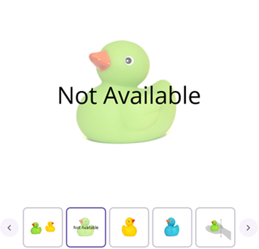

# DataTemplateSelector in .NET MAUI Rotator (SfRotator)

The `SfRotator` supports DataTemplateSelector, from which you can choose a DataTemplate based on the data object.





<ContentPage.Resources>
    <ResourceDictionary>
        <DataTemplate x:Key="DefaultTemplate">
            <Grid>
            <Image Source="{Binding Image}" HorizontalOptions="Center" VerticalOptions="Center"/>
            </Grid>
        </DataTemplate>
        <DataTemplate x:Key="SpecificTemplate">
            <Grid>
            <Label Text="Not Available" FontSize="Large" HorizontalOptions="Center" VerticalOptions="Center" FontAttributes="Italic" FontFamily="Calibri"/>
            <Image Source="{Binding Image}" Opacity="0.5" HorizontalOptions="Center" VerticalOptions="Center"/>
            </Grid>
        </DataTemplate>
    </ResourceDictionary>
</ContentPage.Resources>

<ContentPage.Content>      
    <Grid >
        <syncfusion:SfRotator x:Name="sfRotator" 
                ItemsSource="{Binding ImageCollection}" >
            <syncfusion:SfRotator.ItemTemplate>
            <local:DataTemplateViewModel DefaultTemplate="{StaticResource DefaultTemplate}" SpecificTemplate="{StaticResource SpecificTemplate}"/>
            </syncfusion:SfRotator.ItemTemplate>
        </syncfusion:SfRotator>
    </Grid>
    </ContentPage.Content>
</ContentPage>





public partial class MainPage : ContentPage
    {
    DataTemplate defaultTemplate;
    DataTemplate specifictempalte;

    public MainPage()
    {
        InitializeComponent();
        this.BindingContext = new ViewModel();
        SfRotator rotator = new SfRotator();

        defaultTemplate = new DataTemplate(() =>
        { 
        Grid grid = new Grid();
        Image image = new Image();
        image.SetBinding(Image.SourceProperty, "Image");
        grid.Children.Add(image);
        return grid;
    });

        specifictempalte = new DataTemplate(() =>
        {
            Grid grid = new Grid();
            Image image = new Image();
            Label label = new Label();
            image.SetBinding(Image.SourceProperty, "Image");
            image.Opacity = 0.5;
            label.Text = "Not Available";
            label.FontSize = 50;
            label.HorizontalOptions = LayoutOptions.Center;
            label.VerticalOptions = LayoutOptions.Center;
            grid.Children.Add(image);
            grid.Children.Add(label);
            return grid;
        });
        
        var ImageCollection = new List<Model> {
        new Model ("image1.png"),
        new Model ("image2.png"),
        new Model ("image3.png"),
        new Model ("image4.png"),
        new Model ("image5.png")
        };
        rotator.NavigationDirection = NavigationDirection.Horizontal;
        rotator.NavigationStripMode = NavigationStripMode.Thumbnail;
        rotator.BackgroundColor = Colors.White;
        rotator.ItemsSource = ImageCollection;
        rotator.ItemTemplate = new DataTemplateViewModel { DefaultTemplate = defaultTemplate, SpecificTemplate = specifictempalte};
        this.Content = rotator;
    }
}





### OnSelectTemplate

The OnSelectTemplate is an overridden method to return a particular DataTemplate, which is shown in the following code:




	
public partial class Rotator : ContentPage
{
    DataTemplate defaultTemplate;
    DataTemplate specifictempalte;

    public Rotator()
    {
        InitializeComponent();
        this.BindingContext = new DataTemplateViewModel();
        SfRotator rotator = new SfRotator();

        defaultTemplate = new DataTemplate(() =>
        {
            Grid grid = new Grid();
            Image image = new Image();
            image.SetBinding(Image.SourceProperty, "Image");
            grid.Children.Add(image);
            return grid;
        });

        specifictempalte = new DataTemplate(() =>
        {
            Grid grid = new Grid();
            Image image = new Image();
            Label label = new Label();
            image.SetBinding(Image.SourceProperty, "Image");
            image.Opacity = 0.5;
            label.Text = "Not Available";
            label.FontSize = 50;
            label.HorizontalOptions = LayoutOptions.Center;
            label.VerticalOptions = LayoutOptions.Center;
            grid.Children.Add(image);
            grid.Children.Add(label);
            return grid;
        });

        var ImageCollection = new List<RotatorModel> {
            new RotatorModel ("image1.png"),
            new RotatorModel ("image2.png"),
            new RotatorModel ("image3.png"),
            new RotatorModel ("image4.png"),
            new RotatorModel ("image5.png")
            };
        rotator.HeightRequest = 550;
        rotator.WidthRequest = 550;
        rotator.NavigationDirection = NavigationDirection.Horizontal;
        rotator.NavigationStripMode = NavigationStripMode.Thumbnail;
        rotator.BackgroundColor = Colors.White;
        rotator.ItemsSource = ImageCollection;
        rotator.ItemTemplate = new DataTemplateViewModel { DefaultTemplate = defaultTemplate, SpecificTemplate = specifictempalte };
        this.Content = rotator;
    }
}





The following screenshot illustrates the output of above code.

