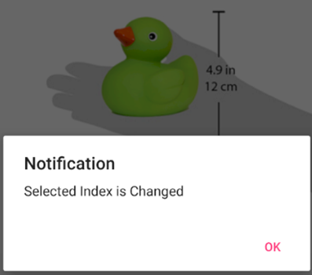
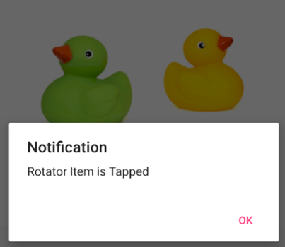

# Events in .NET MAUI Rotator (SfRotator)

## Selection Changed

The SelectionChanged event is used to notify when the selection is changed by swiping or dynamically setting the [`SelectedIndex`](https://help.syncfusion.com/cr/xamarin/Syncfusion.SfRotator.XForms.SfRotator.html#Syncfusion_SfRotator_XForms_SfRotator_SelectedIndex) property of [`SfRotator`](https://help.syncfusion.com/cr/xamarin/Syncfusion.SfRotator.XForms.SfRotator.html).

## ItemTapped

The [`ItemTapped`](https://help.syncfusion.com/cr/xamarin/Syncfusion.SfRotator.XForms.SfRotator.html#Syncfusion_SfRotator_XForms_SfRotator_ItemTapped) event will be triggered whenever tapping the item.





    <?xml version="1.0" encoding="utf-8" ?>
    <ContentPage xmlns="http://schemas.microsoft.com/dotnet/2021/maui"
                xmlns:x="http://schemas.microsoft.com/winfx/2009/xaml"
                xmlns:syncfusion="clr-namespace:Syncfusion.Maui.Rotator;assembly=Syncfusion.Maui.Rotator"
                xmlns:local="clr-namespace:Rotator"
                x:Class="Rotator.Rotator">
        <rotator:SfRotator.BindingContext>
            <local:RotatorViewModel/>
        </rotator:SfRotator.BindingContext>
        <ContentPage.Content>
            <Grid HorizontalOptions="FillAndExpand" VerticalOptions="Fill">
                <rotator:SfRotator x:Name="rotator" 
                                ItemTapped="Rotator_ItemTapped"
                                SelectedIndexChanged="Rotator_SelectedIndexChanged"
                            ItemsSource="{Binding ImageCollection}" 
                            VerticalOptions="Start">
                    <rotator:SfRotator.ItemTemplate>
                        <DataTemplate>
                                <Image Source="{Binding Image}" />
                        </DataTemplate>
                    </rotator:SfRotator.ItemTemplate>
                </rotator:SfRotator>
            </Grid>
        </ContentPage.Content>
    </ContentPage>





    using Syncfusion.Maui.Core.Rotator;

    namespace Rotator
    {
        public partial class Rotator : ContentPage
        {

        RotatorViewModel viewmodel = new RotatorViewModel();
            public MainPage()
            {
                InitializeComponent();
                StackLayout layout = new StackLayout();
                SfRotator rotator = new SfRotator();
                rotator.ItemTapped += Rotator_ItemTapped;
                rotator.SelectedIndexChanged += Rotator_SelectedIndexChanged;
                rotator.ItemsSource = viewmodel.ImageCollection;
                var itemTemplate = new DataTemplate(() =>
                {
                    var grid = new Grid();
                    var nameLabel = new Image();
                    nameLabel.SetBinding(Image.SourceProperty, "Image");
                    grid.Children.Add(nameLabel);
                    return grid;
                });
                rotator.ItemTemplate = itemTemplate;
                layout.Children.Add(rotator);
                this.Content = layout;
                this.BindingContext = viewmodel;

            }

            private void Rotator_ItemTapped(object sender, EventArgs e)
            {
                DisplayAlert("Notification", "Rotator Item is Tapped", "Ok");
            }

            private void Rotator_SelectedIndexChanged(object sender, SelectedIndexChangedEventArgs e)
            {
                DisplayAlert("Notification", "Selected Index is Changed", "Ok");
            }
        }

        public class RotatorModel
        {
            public RotatorModel(string imageString)
            {
                Image = imageString;
            }
            private String _image;
            public String Image
            {
                get { return _image; }
                set { _image = value; }
            }
        }
    }

    RotatorViewModel Class:

    namespace Rotator
    {
        public class RotatorViewModel
        {
            public RotatorViewModel()
            {
                ImageCollection.Add(new RotatorModel("image1.png"));
                ImageCollection.Add(new RotatorModel("image2.png"));
                ImageCollection.Add(new RotatorModel("image3.png"));
                ImageCollection.Add(new RotatorModel("image4.png"));
                ImageCollection.Add(new RotatorModel("image5.png"));
            }

            private ObservableCollection<RotatorModel> imageCollection = new ObservableCollection<RotatorModel>();
            public ObservableCollection<RotatorModel> ImageCollection
            {
                get { return imageCollection; }
                set { imageCollection = value; }
            }
        }
    }





The following screenshot illustrates the output of above code.

   

