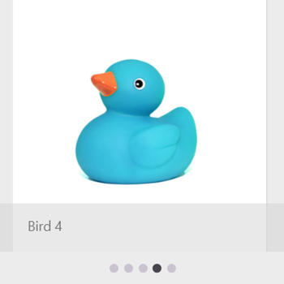

# Header Visibility in .NET MAUI Rotator (SfRotator)

The [`IsTextVisible`](link) property can be used to enable the text area visibility in bottom area of [`SfRotator`](linkl) for providing additional information of items. [`IsTextVisible`](link) property is used to change the visibility of the Text panel that is displayed when [`SfRotatorItem`](link) collection is set and will have no effect when setting Item template.

N> By default, the property value is false.





    <?xml version="1.0" encoding="utf-8" ?>
    <ContentPage xmlns="http://schemas.microsoft.com/dotnet/2021/maui"
                xmlns:x="http://schemas.microsoft.com/winfx/2009/xaml"
                xmlns:syncfusion="clr-namespace:Syncfusion.Maui.Rotator;assembly=Syncfusion.Maui.Rotator"
                xmlns:local="clr-namespace:Rotator"
                x:Class="Rotator.Rotator">
        <ContentPage.BindingContext>
        <local:RotatorViewModel/>
        </ContentPage.BindingContext>
        <ContentPage.Content>
                <syncfusion:SfRotator x:Name="rotator" 
                            BackgroundColor="#ececec"
                            IsTextVisible="True"
                            ItemsSource="{Binding ImageCollection}" 
                            VerticalOptions="Start">
                    <syncfusion:SfRotator.ItemTemplate>
                        <DataTemplate>
                                <Image Source="{Binding Image}" />
                        </DataTemplate>
                    </syncfusion:SfRotator.ItemTemplate>
                </syncfusion:SfRotator>
        </ContentPage.Content>
    </ContentPage>





    using Syncfusion.Maui.Core.Rotator;
    using Syncfusion.Maui.Rotator;

    namespace Rotator
    {
        public partial class Rotator : ContentPage
        {
            SfRotator rotator = new SfRotator();
            StackLayout stackLayout = new StackLayout();
            public Rotator()
            {
                InitializeComponent();
                stackLayout.HeightRequest = 300;
                List<SfRotatorItem> collectionOfItems = new List<SfRotatorItem>();
                collectionOfItems.Add(new SfRotatorItem() { Image = "image1.png", ItemText = "Bird 1" });
                collectionOfItems.Add(new SfRotatorItem() { Image = "image2.png", ItemText = "Bird 2" });
                collectionOfItems.Add(new SfRotatorItem() { Image = "image3.png", ItemText = "Bird 3" });
                collectionOfItems.Add(new SfRotatorItem() { Image = "image4.png", ItemText = "Bird 4" });
                collectionOfItems.Add(new SfRotatorItem() { Image = "image5.png", ItemText = "Bird 5" });
                rotator.ItemsSource = collectionOfItems;
                rotator.IsTextVisible = true;
                rotator.DotPlacement = DotsPlacement.OutSide;
                rotator.HeightRequest = 300;
                rotator.WidthRequest = 300;
                stackLayout.Children.Add(rotator);
                this.Content = stackLayout;
            }
        }
    }





