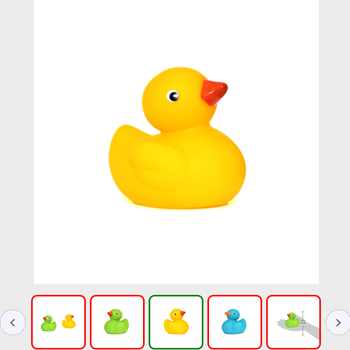

# Navigation Customization in .NET MAUI Rotator (SfRotator)

The Rotator control supports customizing dots, thumbnails and navigation buttons.

## Dots Customization

In Dot Customization we can customise the  dots' stroke, selected and unselected dots' color.




    <?xml version="1.0" encoding="utf-8" ?>
    <ContentPage xmlns="http://schemas.microsoft.com/dotnet/2021/maui"
                xmlns:x="http://schemas.microsoft.com/winfx/2009/xaml"
                xmlns:syncfusion="clr-namespace:Syncfusion.Maui.Rotator;assembly=Syncfusion.Maui.Rotator"
                xmlns:local="clr-namespace:Rotator"
                x:Class="Rotator.Rotator">
        <ContentPage.BindingContext>
            <local:RotatorViewModel/>
        </ContentPage.BindingContext>
        <ContentPage.Content>
            <syncfusion:SfRotator x:Name="rotator" 
                                ItemsSource="{Binding ImageCollection}" 
                                SelectedIndex="2"
                                BackgroundColor="#ececec"
                                NavigationStripPosition="Bottom"
                                DotsStroke="Aqua" 
                                SelectedDotColor="Blue"
                                UnselectedDotColor="Gray"
                                WidthRequest="550"
                                HeightRequest="550">
                <syncfusion:SfRotator.ItemTemplate>
                    <DataTemplate>
                        <Image  Source="{Binding Image}"/>
                    </DataTemplate>
                </syncfusion:SfRotator.ItemTemplate>
            </syncfusion:SfRotator>
        </ContentPage.Content>
    </ContentPage>




    using Syncfusion.Maui.Core.Rotator;
    using Syncfusion.Maui.Rotator;

    namespace Rotator
    {
        public partial class Rotator : ContentPage
        {
            public Rotator()
            {
                InitializeComponent ();
                SfRotator rotator = new SfRotator();
                var ImageCollection = new List<RotatorModel> {
                new RotatorModel ("image1.png"),
                new RotatorModel ("image2.png"),
                new RotatorModel ("image3.png"),
                new RotatorModel ("image4.png"),
                new RotatorModel ("image5.png")
                };
                var itemTemplate = new DataTemplate(() =>
                {
                    var grid = new Grid();
                    var nameLabel = new Image();
                    nameLabel.SetBinding(Image.SourceProperty, "Image");
                    grid.Children.Add(nameLabel);
                    return grid;
                });
                rotator.ItemTemplate = itemTemplate;
                rotator.DotsStroke = Color.Aqua;
                rotator.SelectedDotColor = Color.Blue;
                rotator.UnselectedDotColor = Color.Gray;
                rotator.ItemsSource = ImageCollection;
                rotator.WidthRequest=550;
                rotator.HeightRequest=550;
                this.Content = rotator;
            }
        }
        public class RotatorModel
        {
            public RotatorModel(string imageString)
            {
                Image = imageString;
            }
            private String _image;
            public String Image
            {
                get { return _image; }
                set { _image = value; }
            }
        }
    }




## Thumbnails Customization

In Thumbnail Customization we can customise the  selected and unselected thumbnail's stroke.




    <?xml version="1.0" encoding="utf-8" ?>
    <ContentPage xmlns="http://schemas.microsoft.com/dotnet/2021/maui"
                xmlns:x="http://schemas.microsoft.com/winfx/2009/xaml"
                xmlns:syncfusion="clr-namespace:Syncfusion.Maui.Rotator;assembly=Syncfusion.Maui.Rotator"
                xmlns:local="clr-namespace:Rotator"
                x:Class="Rotator.Rotator">
        <ContentPage.BindingContext>
            <local:RotatorViewModel/>
        </ContentPage.BindingContext>
        <ContentPage.Content>
         <syncfusion:SfRotator x:Name="rotator" 
                     ItemsSource="{Binding ImageCollection}" 
                     SelectedIndex="2"
                     BackgroundColor="#ececec"
                     NavigationStripPosition="Bottom"
                     NavigationStripMode="Thumbnail"
                     SelectedThumbnailStroke="Green"
                     UnselectedThumbnailStroke="Red"
                     WidthRequest="550"
                     HeightRequest="550">
                <syncfusion:SfRotator.ItemTemplate>
                    <DataTemplate>
                        <Image  Source="{Binding Image}"/>
                    </DataTemplate>
                </syncfusion:SfRotator.ItemTemplate>
            </syncfusion:SfRotator>
        </ContentPage.Content>
    </ContentPage>




    using Syncfusion.Maui.Core.Rotator;
    using Syncfusion.Maui.Rotator;

    namespace Rotator
    {
        public partial class Rotator : ContentPage
        {
            public Rotator()
            {
                InitializeComponent ();
                SfRotator rotator = new SfRotator();
                var ImageCollection = new List<RotatorModel> {
                new RotatorModel ("image1.png"),
                new RotatorModel ("image2.png"),
                new RotatorModel ("image3.png"),
                new RotatorModel ("image4.png"),
                new RotatorModel ("image5.png")
                };
                var itemTemplate = new DataTemplate(() =>
                {
                    var grid = new Grid();
                    var nameLabel = new Image();
                    nameLabel.SetBinding(Image.SourceProperty, "Image");
                    grid.Children.Add(nameLabel);
                    return grid;
                });
                rotator.ItemTemplate = itemTemplate;
                rotator.NavigationStripMode = NavigationStripMode.Thumbnail;
                rotator.UnselectedThumbnailStroke = Colors.Red;
                rotator.SelectedThumbnailStroke = Colors.Green;
                rotator.ItemsSource = ImageCollection;
                rotator.WidthRequest=550;
                rotator.HeightRequest=550;
                this.Content = rotator;
            }
        }
        public class RotatorModel
        {
            public RotatorModel(string imageString)
            {
                Image = imageString;
            }
            private String _image;
            public String Image
            {
                get { return _image; }
                set { _image = value; }
            }
        }
    }




## Navigation Button Customization

In Navigation Button Customization we can customise the  navigation button's icon and Background color.




    <ContentPage.Content>
          <syncfusion:SfRotator x:Name="rotator" 
                      ItemsSource="{Binding ImageCollection}" 
                      SelectedIndex="2"
                      BackgroundColor="#ececec"
                       NavigationStripMode="Thumbnail"
                        NavigationButtonBackgroundColor="Pink"
                        NavigationButtonIconColor="Blue"
                      WidthRequest="550"
                      HeightRequest="550">
                <syncfusion:SfRotator.ItemTemplate>
                    <DataTemplate>
                        <Image  Source="{Binding Image}"/>
                    </DataTemplate>
                </syncfusion:SfRotator.ItemTemplate>
            </syncfusion:SfRotator>
        </ContentPage.Content>




    SfRotator rotator = new SfRotator();
    var ImageCollection = new List<RotatorModel> {
    new RotatorModel ("image1.png"),
    new RotatorModel ("image2.png"),
    new RotatorModel ("image3.png"),
    new RotatorModel ("image4.png"),
    new RotatorModel ("image5.png")
    };
    var itemTemplate = new DataTemplate(() =>
    {
        var grid = new Grid();
        var nameLabel = new Image();
        nameLabel.SetBinding(Image.SourceProperty, "Image");
        grid.Children.Add(nameLabel);
        return grid;
    });
    rotator.ItemTemplate = itemTemplate;
    rotator.NavigationStripMode = NavigationStripMode.Thumbnail;
    rotator.NavigationButtonBackgroundColor = Colors.Pink;
    rotator.NavigationButtonIconColor = Colors.Blue;
    rotator.ItemsSource = ImageCollection;
    rotator.WidthRequest=550;
    rotator.HeightRequest=550;
    this.Content = rotator;




## Navigation Visibility

We can show or hide  Navigation Button using `ShowNavigationButton` property.




    <ContentPage.Content>
          <syncfusion:SfRotator x:Name="rotator" 
                      ItemsSource="{Binding ImageCollection}" 
                      SelectedIndex="2"
                      BackgroundColor="#ececec"
                       NavigationStripMode="Thumbnail"
                      ShowNavigationButton="False"
                      WidthRequest="550"
                      HeightRequest="550">
                <syncfusion:SfRotator.ItemTemplate>
                    <DataTemplate>
                        <Image  Source="{Binding Image}"/>
                    </DataTemplate>
                </syncfusion:SfRotator.ItemTemplate>
            </syncfusion:SfRotator>
        </ContentPage.Content>




    SfRotator rotator = new SfRotator();
    var ImageCollection = new List<RotatorModel> {
    new RotatorModel ("image1.png"),
    new RotatorModel ("image2.png"),
    new RotatorModel ("image3.png"),
    new RotatorModel ("image4.png"),
    new RotatorModel ("image5.png")
    };
    var itemTemplate = new DataTemplate(() =>
    {
        var grid = new Grid();
        var nameLabel = new Image();
        nameLabel.SetBinding(Image.SourceProperty, "Image");
        grid.Children.Add(nameLabel);
        return grid;
    });
    rotator.ItemTemplate = itemTemplate;
    rotator.NavigationStripMode = NavigationStripMode.Thumbnail;rotator.ShowNavigationButton = false;
    rotator.ItemsSource = ImageCollection;
    rotator.WidthRequest=550;
    rotator.HeightRequest=550;
    this.Content = rotator;




