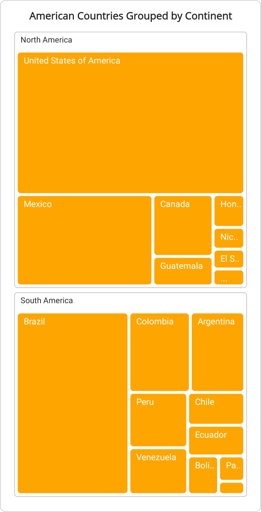
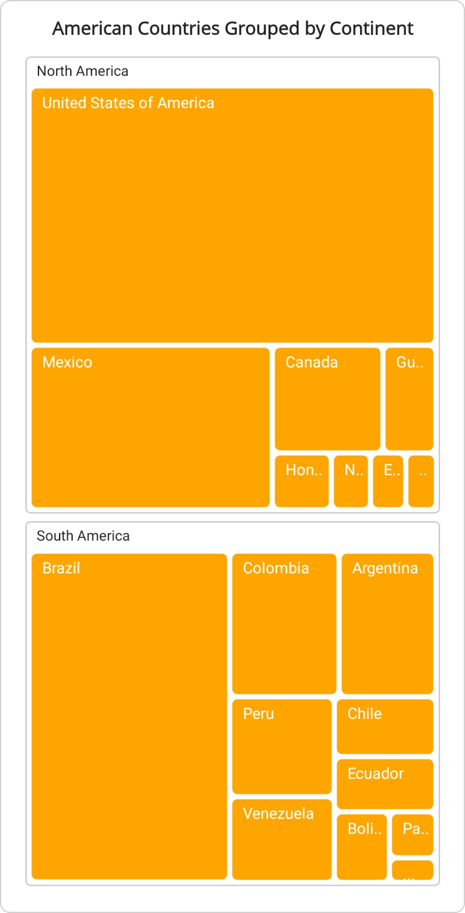
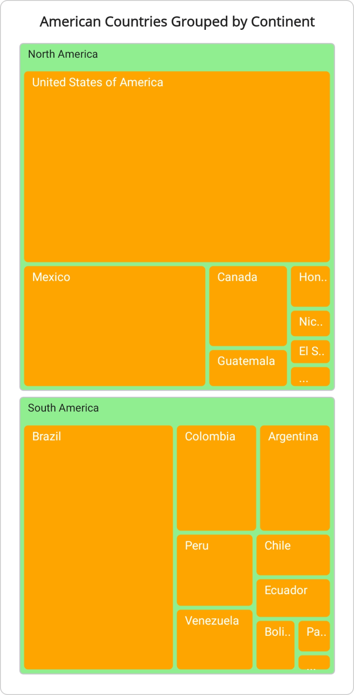
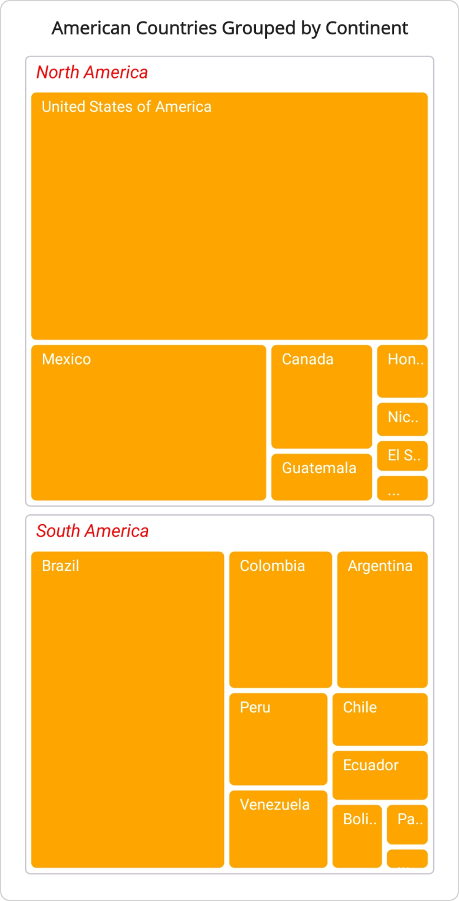

 
# Levels in .NET MAUI TreeMap (SfTreeMap)

Levels in .NET MAUI TreeMap allow for hierarchical data visualization, enabling multi-level categorization and exploration of complex datasets. The TreeMap supports n number of levels and each level is separated using the [GroupPath](https://help.syncfusion.com/cr/maui/Syncfusion.Maui.TreeMap.TreeMapLevel.html#Syncfusion_Maui_TreeMap_TreeMapLevel_GroupPath) property.

## Group path

The [GroupPath](https://help.syncfusion.com/cr/maui/Syncfusion.Maui.TreeMap.TreeMapLevel.html#Syncfusion_Maui_TreeMap_TreeMapLevel_GroupPath) property of [TreeMapLevel](https://help.syncfusion.com/cr/maui/Syncfusion.Maui.TreeMap.TreeMapLevel.html) specifies the name of the property in the data object that determines how items in the tree map are grouped. The grouping is based on the values of this property in the data source, which splits the level into distinct groups.

In the following example shows, how levels are added, and each level is configured using the [GroupPath](https://help.syncfusion.com/cr/maui/Syncfusion.Maui.TreeMap.TreeMapLevel.html#Syncfusion_Maui_TreeMap_TreeMapLevel_GroupPath).




<treemap:SfTreeMap x:Name="treeMap"
                   DataSource="{Binding PopulationDetails}"
                   PrimaryValuePath="Population">
    <treemap:SfTreeMap.BindingContext>
        <local:PopulationViewModel />
    </treemap:SfTreeMap.BindingContext>
    <treemap:SfTreeMap.LeafItemSettings>
        <treemap:TreeMapLeafItemSettings LabelPath="Country">
        </treemap:TreeMapLeafItemSettings>
    </treemap:SfTreeMap.LeafItemSettings>
    <treemap:SfTreeMap.LeafItemBrushSettings>
        <treemap:TreeMapUniformBrushSettings Brush="Orange"/>
    </treemap:SfTreeMap.LeafItemBrushSettings>
    <treemap:SfTreeMap.Levels>
       <treemap:TreeMapLevel GroupPath="Continent"/>
    </treemap:SfTreeMap.Levels>
</treemap:SfTreeMap>





SfTreeMap treeMap = new SfTreeMap();
PopulationViewModel viewModel = new PopulationViewModel();
treeMap.DataSource = viewModel.PopulationDetails;
treeMap.PrimaryValuePath = "Population";
treeMap.LeafItemBrushSettings = new TreeMapUniformBrushSettings() { Brush = Brush.Orange };
treeMap.LeafItemSettings = new TreeMapLeafItemSettings() { LabelPath = "Country" };
treeMap.Levels.Add(new TreeMapLevel() { GroupPath = "Continent"});
this.Content = treeMap;




/// 
    
/// Represents the custom data properties.
/// 

public class PopulationDetails
{
    public string Country { get; set; }
    public string Continent { get; set; }
    public int Population { get; set; }
}




/// 
    
/// Represents demographic information for countries in the Americas for the year 2023.
/// 

public class PopulationViewModel
{
    public PopulationViewModel()
    {
        this.PopulationDetails = new ObservableCollection<PopulationDetails>()
        {
            new PopulationDetails() { Continent ="North America", Country = "United States of America", Population = 339996564 },
            new PopulationDetails() { Continent ="South America", Country = "Brazil", Population = 216422446 },
            new PopulationDetails() { Continent ="North America", Country = "Mexico", Population = 128455567 },
            new PopulationDetails() { Continent ="South America", Country = "Colombia", Population = 52085168 },
            new PopulationDetails() { Continent ="South America", Country = "Argentina", Population = 45773884 },
            new PopulationDetails() { Continent ="North America", Country = "Canada", Population = 38781292 },
            new PopulationDetails() { Continent ="South America", Country = "Peru", Population = 34352719 },
            new PopulationDetails() { Continent ="South America", Country = "Venezuela", Population = 28838499 },
            new PopulationDetails() { Continent ="South America", Country = "Chile", Population = 19629590 },
            new PopulationDetails() { Continent ="South America", Country = "Ecuador", Population = 18190484 },
            new PopulationDetails() { Continent ="North America", Country = "Guatemala", Population = 18092026 },
            new PopulationDetails() { Continent ="South America", Country = "Bolivia", Population = 12388571 },
            new PopulationDetails() { Continent ="North America", Country = "Honduras", Population = 10593798 },
            new PopulationDetails() { Continent ="North America", Country = "Nicaragua", Population = 7046311 },
            new PopulationDetails() { Continent ="South America", Country = "Paraguay", Population = 6861524 },
            new PopulationDetails() { Continent ="North America", Country = "El Salvador", Population = 6364943 },
            new PopulationDetails() { Continent ="North America", Country = "Costa Rica", Population = 5212173 },
            new PopulationDetails() { Continent ="South America", Country = "Uruguay", Population = 3423109 },
        };
    }

    public ObservableCollection<PopulationDetails> PopulationDetails
    {
        get;
        set;
    }
}




 

## Customize level appearance

The level appearance customization can be achieved by using the [Spacing](https://help.syncfusion.com/cr/maui/Syncfusion.Maui.TreeMap.TreeMapLevel.html#Syncfusion_Maui_TreeMap_TreeMapLevel_Spacing), [Stroke](https://help.syncfusion.com/cr/maui/Syncfusion.Maui.TreeMap.TreeMapLevel.html#Syncfusion_Maui_TreeMap_TreeMapLevel_Stroke), [StrokeWidth](https://help.syncfusion.com/cr/maui/Syncfusion.Maui.TreeMap.TreeMapLevel.html#Syncfusion_Maui_TreeMap_TreeMapLevel_StrokeWidth), [TextStyle](https://help.syncfusion.com/cr/maui/Syncfusion.Maui.TreeMap.TreeMapLevel.html#Syncfusion_Maui_TreeMap_TreeMapLevel_TextStyle), and [Background](https://help.syncfusion.com/cr/maui/Syncfusion.Maui.TreeMap.TreeMapLevel.html#Syncfusion_Maui_TreeMap_TreeMapLevel_Background) properties of [TreeMapLevel](https://help.syncfusion.com/cr/maui/Syncfusion.Maui.TreeMap.TreeMapLevel.html) in the [SfTreeMap](https://help.syncfusion.com/cr/maui/Syncfusion.Maui.TreeMap.SfTreeMap.html).

### Customize level appearance using spacing

The [Spacing](https://help.syncfusion.com/cr/maui/Syncfusion.Maui.TreeMap.TreeMapLevel.html#Syncfusion_Maui_TreeMap_TreeMapLevel_Spacing) property of [TreeMapLevel](https://help.syncfusion.com/cr/maui/Syncfusion.Maui.TreeMap.TreeMapLevel.html) can be customized by using the [Levels](https://help.syncfusion.com/cr/maui/Syncfusion.Maui.TreeMap.SfTreeMap.html#Syncfusion_Maui_TreeMap_SfTreeMap_Levels) property in the[SfTreeMap](https://help.syncfusion.com/cr/maui/Syncfusion.Maui.TreeMap.SfTreeMap.html). It is used to customize the spacing between the tree map header items, with a default value of `1.`




<treemap:SfTreeMap x:Name="treeMap"
                   DataSource="{Binding PopulationDetails}"
                   PrimaryValuePath="Population">
    <treemap:SfTreeMap.BindingContext>
        <local:PopulationViewModel />
    </treemap:SfTreeMap.BindingContext>
    <treemap:SfTreeMap.LeafItemSettings>
        <treemap:TreeMapLeafItemSettings LabelPath="Country">
        </treemap:TreeMapLeafItemSettings>
    </treemap:SfTreeMap.LeafItemSettings>
    <treemap:SfTreeMap.LeafItemBrushSettings>
        <treemap:TreeMapUniformBrushSettings Brush="Orange"/>
    </treemap:SfTreeMap.LeafItemBrushSettings>
    <treemap:SfTreeMap.Levels>
        <treemap:TreeMapLevel GroupPath="Continent"
                              Spacing="3"/>
    </treemap:SfTreeMap.Levels>
</treemap:SfTreeMap>





SfTreeMap treeMap = new SfTreeMap();
PopulationViewModel viewModel = new PopulationViewModel();
treeMap.DataSource = viewModel.PopulationDetails;
treeMap.PrimaryValuePath = "Population";
treeMap.LeafItemBrushSettings = new TreeMapUniformBrushSettings() { Brush = Brush.Orange };
treeMap.LeafItemSettings = new TreeMapLeafItemSettings() { LabelPath = "Country" };
treeMap.Levels.Add(new TreeMapLevel() { GroupPath = "Continent", Spacing = 3 });
this.Content = treeMap;




/// 
    
/// Represents the custom data properties.
/// 

public class PopulationDetails
{
    public string Country { get; set; }
    public string Continent { get; set; }
    public int Population { get; set; }
}




/// 
    
/// Represents demographic information for countries in the Americas for the year 2023.
/// 

public class PopulationViewModel
{
    public PopulationViewModel()
    {
        this.PopulationDetails = new ObservableCollection<PopulationDetails>()
        {
            new PopulationDetails() { Continent ="North America", Country = "United States of America", Population = 339996564 },
            new PopulationDetails() { Continent ="South America", Country = "Brazil", Population = 216422446 },
            new PopulationDetails() { Continent ="North America", Country = "Mexico", Population = 128455567 },
            new PopulationDetails() { Continent ="South America", Country = "Colombia", Population = 52085168 },
            new PopulationDetails() { Continent ="South America", Country = "Argentina", Population = 45773884 },
            new PopulationDetails() { Continent ="North America", Country = "Canada", Population = 38781292 },
            new PopulationDetails() { Continent ="South America", Country = "Peru", Population = 34352719 },
            new PopulationDetails() { Continent ="South America", Country = "Venezuela", Population = 28838499 },
            new PopulationDetails() { Continent ="South America", Country = "Chile", Population = 19629590 },
            new PopulationDetails() { Continent ="South America", Country = "Ecuador", Population = 18190484 },
            new PopulationDetails() { Continent ="North America", Country = "Guatemala", Population = 18092026 },
            new PopulationDetails() { Continent ="South America", Country = "Bolivia", Population = 12388571 },
            new PopulationDetails() { Continent ="North America", Country = "Honduras", Population = 10593798 },
            new PopulationDetails() { Continent ="North America", Country = "Nicaragua", Population = 7046311 },
            new PopulationDetails() { Continent ="South America", Country = "Paraguay", Population = 6861524 },
            new PopulationDetails() { Continent ="North America", Country = "El Salvador", Population = 6364943 },
            new PopulationDetails() { Continent ="North America", Country = "Costa Rica", Population = 5212173 },
            new PopulationDetails() { Continent ="South America", Country = "Uruguay", Population = 3423109 },
        };
    }

    public ObservableCollection<PopulationDetails> PopulationDetails
    {
        get;
        set;
    }
}




 

### Customize level appearance using header height

The [HeaderHeight](https://help.syncfusion.com/cr/maui/Syncfusion.Maui.TreeMap.TreeMapLevel.html#Syncfusion_Maui_TreeMap_TreeMapLevel_HeaderHeight) property of [TreeMapLevel](https://help.syncfusion.com/cr/maui/Syncfusion.Maui.TreeMap.TreeMapLevel.html) can be customized using the [Levels](https://help.syncfusion.com/cr/maui/Syncfusion.Maui.TreeMap.SfTreeMap.html#Syncfusion_Maui_TreeMap_SfTreeMap_Levels) property in the [SfTreeMap](https://help.syncfusion.com/cr/maui/Syncfusion.Maui.TreeMap.SfTreeMap.html). This property adjusts the header height for each level in the tree map, with a default value of `24.`




<treemap:SfTreeMap x:Name="treeMap"
                   DataSource="{Binding PopulationDetails}"
                   PrimaryValuePath="Population">
    <treemap:SfTreeMap.BindingContext>
        <local:PopulationViewModel />
    </treemap:SfTreeMap.BindingContext>
    <treemap:SfTreeMap.LeafItemSettings>
        <treemap:TreeMapLeafItemSettings LabelPath="Country">
        </treemap:TreeMapLeafItemSettings>
    </treemap:SfTreeMap.LeafItemSettings>
    <treemap:SfTreeMap.LeafItemBrushSettings>
        <treemap:TreeMapUniformBrushSettings Brush="Orange"/>
    </treemap:SfTreeMap.LeafItemBrushSettings>
    <treemap:SfTreeMap.Levels>
        <treemap:TreeMapLevel GroupPath="Continent"
                              HeaderHeight="20"/>
    </treemap:SfTreeMap.Levels>
</treemap:SfTreeMap>





SfTreeMap treeMap = new SfTreeMap();
PopulationViewModel viewModel = new PopulationViewModel();
treeMap.DataSource = viewModel.PopulationDetails;
treeMap.PrimaryValuePath = "Population";
treeMap.LeafItemBrushSettings = new TreeMapUniformBrushSettings() { Brush = Brush.Orange };
treeMap.LeafItemSettings = new TreeMapLeafItemSettings() { LabelPath = "Country" };
treeMap.Levels.Add(new TreeMapLevel() { GroupPath = "Continent", HeaderHeight = 20 });
this.Content = treeMap;




/// 
    
/// Represents the custom data properties.
/// 

public class PopulationDetails
{
    public string Country { get; set; }
    public string Continent { get; set; }
    public int Population { get; set; }
}




/// 
    
/// Represents demographic information for countries in the Americas for the year 2023.
/// 

public class PopulationViewModel
{
    public PopulationViewModel()
    {
        this.PopulationDetails = new ObservableCollection<PopulationDetails>()
        {
            new PopulationDetails() { Continent ="North America", Country = "United States of America", Population = 339996564 },
            new PopulationDetails() { Continent ="South America", Country = "Brazil", Population = 216422446 },
            new PopulationDetails() { Continent ="North America", Country = "Mexico", Population = 128455567 },
            new PopulationDetails() { Continent ="South America", Country = "Colombia", Population = 52085168 },
            new PopulationDetails() { Continent ="South America", Country = "Argentina", Population = 45773884 },
            new PopulationDetails() { Continent ="North America", Country = "Canada", Population = 38781292 },
            new PopulationDetails() { Continent ="South America", Country = "Peru", Population = 34352719 },
            new PopulationDetails() { Continent ="South America", Country = "Venezuela", Population = 28838499 },
            new PopulationDetails() { Continent ="South America", Country = "Chile", Population = 19629590 },
            new PopulationDetails() { Continent ="South America", Country = "Ecuador", Population = 18190484 },
            new PopulationDetails() { Continent ="North America", Country = "Guatemala", Population = 18092026 },
            new PopulationDetails() { Continent ="South America", Country = "Bolivia", Population = 12388571 },
            new PopulationDetails() { Continent ="North America", Country = "Honduras", Population = 10593798 },
            new PopulationDetails() { Continent ="North America", Country = "Nicaragua", Population = 7046311 },
            new PopulationDetails() { Continent ="South America", Country = "Paraguay", Population = 6861524 },
            new PopulationDetails() { Continent ="North America", Country = "El Salvador", Population = 6364943 },
            new PopulationDetails() { Continent ="North America", Country = "Costa Rica", Population = 5212173 },
            new PopulationDetails() { Continent ="South America", Country = "Uruguay", Population = 3423109 },
        };
    }

    public ObservableCollection<PopulationDetails> PopulationDetails
    {
        get;
        set;
    }
}




 

### Customize level appearance using background

The [Background](https://help.syncfusion.com/cr/maui/Syncfusion.Maui.TreeMap.TreeMapLevel.html#Syncfusion_Maui_TreeMap_TreeMapLevel_Background) property of [TreeMapLevel](https://help.syncfusion.com/cr/maui/Syncfusion.Maui.TreeMap.TreeMapLevel.html) can be customized by using the [Levels](https://help.syncfusion.com/cr/maui/Syncfusion.Maui.TreeMap.SfTreeMap.html#Syncfusion_Maui_TreeMap_SfTreeMap_Levels) property in the[SfTreeMap](https://help.syncfusion.com/cr/maui/Syncfusion.Maui.TreeMap.SfTreeMap.html). It is used to customize the background brush for the tree map header item. The default value of [Background](https://help.syncfusion.com/cr/maui/Syncfusion.Maui.TreeMap.TreeMapLevel.html#Syncfusion_Maui_TreeMap_TreeMapLevel_Background) is `Null.`




<treemap:SfTreeMap x:Name="treeMap"
                   DataSource="{Binding PopulationDetails}"
                   PrimaryValuePath="Population">
    <treemap:SfTreeMap.BindingContext>
        <local:PopulationViewModel />
    </treemap:SfTreeMap.BindingContext>
    <treemap:SfTreeMap.LeafItemSettings>
        <treemap:TreeMapLeafItemSettings LabelPath="Country">
        </treemap:TreeMapLeafItemSettings>
    </treemap:SfTreeMap.LeafItemSettings>
    <treemap:SfTreeMap.LeafItemBrushSettings>
        <treemap:TreeMapUniformBrushSettings Brush="Orange"/>
    </treemap:SfTreeMap.LeafItemBrushSettings>
    <treemap:SfTreeMap.Levels>
        <treemap:TreeMapLevel GroupPath="Continent"
                              Background="LightGreen"/>
    </treemap:SfTreeMap.Levels>
</treemap:SfTreeMap>





SfTreeMap treeMap = new SfTreeMap();
PopulationViewModel viewModel = new PopulationViewModel();
treeMap.DataSource = viewModel.PopulationDetails;
treeMap.PrimaryValuePath = "Population";
treeMap.LeafItemBrushSettings = new TreeMapUniformBrushSettings() { Brush = Brush.Orange };
treeMap.LeafItemSettings = new TreeMapLeafItemSettings() { LabelPath = "Country" };
treeMap.Levels.Add(new TreeMapLevel() { GroupPath = "Continent", Background = Brush.LightGreen });
this.Content = treeMap;




/// 
    
/// Represents the custom data properties.
/// 

public class PopulationDetails
{
    public string Country { get; set; }
    public string Continent { get; set; }
    public int Population { get; set; }
}




/// 
    
/// Represents demographic information for countries in the Americas for the year 2023.
/// 

public class PopulationViewModel
{
    public PopulationViewModel()
    {
        this.PopulationDetails = new ObservableCollection<PopulationDetails>()
        {
            new PopulationDetails() { Continent ="North America", Country = "United States of America", Population = 339996564 },
            new PopulationDetails() { Continent ="South America", Country = "Brazil", Population = 216422446 },
            new PopulationDetails() { Continent ="North America", Country = "Mexico", Population = 128455567 },
            new PopulationDetails() { Continent ="South America", Country = "Colombia", Population = 52085168 },
            new PopulationDetails() { Continent ="South America", Country = "Argentina", Population = 45773884 },
            new PopulationDetails() { Continent ="North America", Country = "Canada", Population = 38781292 },
            new PopulationDetails() { Continent ="South America", Country = "Peru", Population = 34352719 },
            new PopulationDetails() { Continent ="South America", Country = "Venezuela", Population = 28838499 },
            new PopulationDetails() { Continent ="South America", Country = "Chile", Population = 19629590 },
            new PopulationDetails() { Continent ="South America", Country = "Ecuador", Population = 18190484 },
            new PopulationDetails() { Continent ="North America", Country = "Guatemala", Population = 18092026 },
            new PopulationDetails() { Continent ="South America", Country = "Bolivia", Population = 12388571 },
            new PopulationDetails() { Continent ="North America", Country = "Honduras", Population = 10593798 },
            new PopulationDetails() { Continent ="North America", Country = "Nicaragua", Population = 7046311 },
            new PopulationDetails() { Continent ="South America", Country = "Paraguay", Population = 6861524 },
            new PopulationDetails() { Continent ="North America", Country = "El Salvador", Population = 6364943 },
            new PopulationDetails() { Continent ="North America", Country = "Costa Rica", Population = 5212173 },
            new PopulationDetails() { Continent ="South America", Country = "Uruguay", Population = 3423109 },
        };
    }

    public ObservableCollection<PopulationDetails> PopulationDetails
    {
        get;
        set;
    }
}




N> To customize the same background color for both header and leaf items at each level, utilize the [GroupItemBrushSettings](https://help.syncfusion.com/cr/maui/Syncfusion.Maui.TreeMap.SfTreeMap.html#Syncfusion_Maui_TreeMap_SfTreeMap_GroupItemBrushSettings) property.

 

### Customize level appearance using stroke

The [Stroke](https://help.syncfusion.com/cr/maui/Syncfusion.Maui.TreeMap.TreeMapLevel.html#Syncfusion_Maui_TreeMap_TreeMapLevel_Stroke) property of [TreeMapLevel](https://help.syncfusion.com/cr/maui/Syncfusion.Maui.TreeMap.TreeMapLevel.html) can be customized by using the [Levels](https://help.syncfusion.com/cr/maui/Syncfusion.Maui.TreeMap.SfTreeMap.html#Syncfusion_Maui_TreeMap_SfTreeMap_Levels) property in the [SfTreeMap](https://help.syncfusion.com/cr/maui/Syncfusion.Maui.TreeMap.SfTreeMap.html). It is used to customize the stroke color for the tree map header item. The default value of [Stroke](https://help.syncfusion.com/cr/maui/Syncfusion.Maui.TreeMap.TreeMapLevel.html#Syncfusion_Maui_TreeMap_TreeMapLevel_Stroke) is `#CAC4D0.`




<treemap:SfTreeMap x:Name="treeMap"
                   DataSource="{Binding PopulationDetails}"
                   PrimaryValuePath="Population">
    <treemap:SfTreeMap.BindingContext>
        <local:PopulationViewModel />
    </treemap:SfTreeMap.BindingContext>
    <treemap:SfTreeMap.LeafItemSettings>
        <treemap:TreeMapLeafItemSettings LabelPath="Country">
        </treemap:TreeMapLeafItemSettings>
    </treemap:SfTreeMap.LeafItemSettings>
    <treemap:SfTreeMap.LeafItemBrushSettings>
        <treemap:TreeMapUniformBrushSettings Brush="Orange"/>
    </treemap:SfTreeMap.LeafItemBrushSettings>
    <treemap:SfTreeMap.Levels>
        <treemap:TreeMapLevel GroupPath="Continent"
                              Stroke="Red"/>
    </treemap:SfTreeMap.Levels>
</treemap:SfTreeMap>





SfTreeMap treeMap = new SfTreeMap();
PopulationViewModel viewModel = new PopulationViewModel();
treeMap.DataSource = viewModel.PopulationDetails;
treeMap.PrimaryValuePath = "Population";
treeMap.LeafItemBrushSettings = new TreeMapUniformBrushSettings() { Brush = Brush.Orange };
treeMap.LeafItemSettings = new TreeMapLeafItemSettings() { LabelPath = "Country" };
treeMap.Levels.Add(new TreeMapLevel() { GroupPath = "Continent", Stroke = Colors.Red });
this.Content = treeMap;




/// 
    
/// Represents the custom data properties.
/// 

public class PopulationDetails
{
    public string Country { get; set; }
    public string Continent { get; set; }
    public int Population { get; set; }
}




/// 
    
/// Represents demographic information for countries in the Americas for the year 2023.
/// 

public class PopulationViewModel
{
    public PopulationViewModel()
    {
        this.PopulationDetails = new ObservableCollection<PopulationDetails>()
        {
            new PopulationDetails() { Continent ="North America", Country = "United States of America", Population = 339996564 },
            new PopulationDetails() { Continent ="South America", Country = "Brazil", Population = 216422446 },
            new PopulationDetails() { Continent ="North America", Country = "Mexico", Population = 128455567 },
            new PopulationDetails() { Continent ="South America", Country = "Colombia", Population = 52085168 },
            new PopulationDetails() { Continent ="South America", Country = "Argentina", Population = 45773884 },
            new PopulationDetails() { Continent ="North America", Country = "Canada", Population = 38781292 },
            new PopulationDetails() { Continent ="South America", Country = "Peru", Population = 34352719 },
            new PopulationDetails() { Continent ="South America", Country = "Venezuela", Population = 28838499 },
            new PopulationDetails() { Continent ="South America", Country = "Chile", Population = 19629590 },
            new PopulationDetails() { Continent ="South America", Country = "Ecuador", Population = 18190484 },
            new PopulationDetails() { Continent ="North America", Country = "Guatemala", Population = 18092026 },
            new PopulationDetails() { Continent ="South America", Country = "Bolivia", Population = 12388571 },
            new PopulationDetails() { Continent ="North America", Country = "Honduras", Population = 10593798 },
            new PopulationDetails() { Continent ="North America", Country = "Nicaragua", Population = 7046311 },
            new PopulationDetails() { Continent ="South America", Country = "Paraguay", Population = 6861524 },
            new PopulationDetails() { Continent ="North America", Country = "El Salvador", Population = 6364943 },
            new PopulationDetails() { Continent ="North America", Country = "Costa Rica", Population = 5212173 },
            new PopulationDetails() { Continent ="South America", Country = "Uruguay", Population = 3423109 },
        };
    }

    public ObservableCollection<PopulationDetails> PopulationDetails
    {
        get;
        set;
    }
}




 

###  Customize level appearance using stroke width

The [StrokeWidth](https://help.syncfusion.com/cr/maui/Syncfusion.Maui.TreeMap.TreeMapLevel.html#Syncfusion_Maui_TreeMap_TreeMapLevel_StrokeWidth) property of [TreeMapLevel](https://help.syncfusion.com/cr/maui/Syncfusion.Maui.TreeMap.TreeMapLevel.html) can be customized by using the [Levels](https://help.syncfusion.com/cr/maui/Syncfusion.Maui.TreeMap.SfTreeMap.html#Syncfusion_Maui_TreeMap_SfTreeMap_Levels) property in [SfTreeMap](https://help.syncfusion.com/cr/maui/Syncfusion.Maui.TreeMap.SfTreeMap.html). It is used to customize the width of the stroke for the tree map header item. The default value of [StrokeWidth](https://help.syncfusion.com/cr/maui/Syncfusion.Maui.TreeMap.TreeMapLevel.html#Syncfusion_Maui_TreeMap_TreeMapLevel_StrokeWidth) is `1.`




<treemap:SfTreeMap x:Name="treeMap"
                   DataSource="{Binding PopulationDetails}"
                   PrimaryValuePath="Population">
    <treemap:SfTreeMap.BindingContext>
        <local:PopulationViewModel />
    </treemap:SfTreeMap.BindingContext>
    <treemap:SfTreeMap.LeafItemSettings>
        <treemap:TreeMapLeafItemSettings LabelPath="Country">
        </treemap:TreeMapLeafItemSettings>
    </treemap:SfTreeMap.LeafItemSettings>
    <treemap:SfTreeMap.LeafItemBrushSettings>
        <treemap:TreeMapUniformBrushSettings Brush="Orange"/>
    </treemap:SfTreeMap.LeafItemBrushSettings>
    <treemap:SfTreeMap.Levels>
        <treemap:TreeMapLevel GroupPath="Continent"
                              StrokeWidth="3"/>
    </treemap:SfTreeMap.Levels>
</treemap:SfTreeMap>





SfTreeMap treeMap = new SfTreeMap();
PopulationViewModel viewModel = new PopulationViewModel();
treeMap.DataSource = viewModel.PopulationDetails;
treeMap.PrimaryValuePath = "Population";
treeMap.LeafItemBrushSettings = new TreeMapUniformBrushSettings() { Brush = Brush.Orange };
treeMap.LeafItemSettings = new TreeMapLeafItemSettings() { LabelPath = "Country" };
treeMap.Levels.Add(new TreeMapLevel() { GroupPath = "Continent", StrokeWidth = 3 });
this.Content = treeMap;




/// 
    
/// Represents the custom data properties.
/// 

public class PopulationDetails
{
    public string Country { get; set; }
    public string Continent { get; set; }
    public int Population { get; set; }
}




/// 
    
/// Represents demographic information for countries in the Americas for the year 2023.
/// 

public class PopulationViewModel
{
    public PopulationViewModel()
    {
        this.PopulationDetails = new ObservableCollection<PopulationDetails>()
        {
            new PopulationDetails() { Continent ="North America", Country = "United States of America", Population = 339996564 },
            new PopulationDetails() { Continent ="South America", Country = "Brazil", Population = 216422446 },
            new PopulationDetails() { Continent ="North America", Country = "Mexico", Population = 128455567 },
            new PopulationDetails() { Continent ="South America", Country = "Colombia", Population = 52085168 },
            new PopulationDetails() { Continent ="South America", Country = "Argentina", Population = 45773884 },
            new PopulationDetails() { Continent ="North America", Country = "Canada", Population = 38781292 },
            new PopulationDetails() { Continent ="South America", Country = "Peru", Population = 34352719 },
            new PopulationDetails() { Continent ="South America", Country = "Venezuela", Population = 28838499 },
            new PopulationDetails() { Continent ="South America", Country = "Chile", Population = 19629590 },
            new PopulationDetails() { Continent ="South America", Country = "Ecuador", Population = 18190484 },
            new PopulationDetails() { Continent ="North America", Country = "Guatemala", Population = 18092026 },
            new PopulationDetails() { Continent ="South America", Country = "Bolivia", Population = 12388571 },
            new PopulationDetails() { Continent ="North America", Country = "Honduras", Population = 10593798 },
            new PopulationDetails() { Continent ="North America", Country = "Nicaragua", Population = 7046311 },
            new PopulationDetails() { Continent ="South America", Country = "Paraguay", Population = 6861524 },
            new PopulationDetails() { Continent ="North America", Country = "El Salvador", Population = 6364943 },
            new PopulationDetails() { Continent ="North America", Country = "Costa Rica", Population = 5212173 },
            new PopulationDetails() { Continent ="South America", Country = "Uruguay", Population = 3423109 },
        };
    }

    public ObservableCollection<PopulationDetails> PopulationDetails
    {
        get;
        set;
    }
}




### Customize level appearance using text style

The [TextStyle](https://help.syncfusion.com/cr/maui/Syncfusion.Maui.TreeMap.TreeMapLevel.html#Syncfusion_Maui_TreeMap_TreeMapLevel_TextStyle) property of [TreeMapLevel](https://help.syncfusion.com/cr/maui/Syncfusion.Maui.TreeMap.TreeMapLevel.html) can be customized using the [Levels](https://help.syncfusion.com/cr/maui/Syncfusion.Maui.TreeMap.SfTreeMap.html#Syncfusion_Maui_TreeMap_SfTreeMap_Levels) property in the[SfTreeMap](https://help.syncfusion.com/cr/maui/Syncfusion.Maui.TreeMap.SfTreeMap.html). It is used to customize the [TextColor](https://help.syncfusion.com/cr/maui/Syncfusion.Maui.TreeMap.TreeMapTextStyle.html#Syncfusion_Maui_TreeMap_TreeMapTextStyle_TextColor), [FontSize](https://help.syncfusion.com/cr/maui/Syncfusion.Maui.TreeMap.TreeMapTextStyle.html#Syncfusion_Maui_TreeMap_TreeMapTextStyle_FontSize), [FontFamily](https://help.syncfusion.com/cr/maui/Syncfusion.Maui.TreeMap.TreeMapTextStyle.html#Syncfusion_Maui_TreeMap_TreeMapTextStyle_FontFamily), and [FontAttributes](https://help.syncfusion.com/cr/maui/Syncfusion.Maui.TreeMap.TreeMapTextStyle.html#Syncfusion_Maui_TreeMap_TreeMapTextStyle_FontAttributes) of treemap header item text.




<treemap:SfTreeMap x:Name="treeMap"
                   DataSource="{Binding PopulationDetails}"
                   PrimaryValuePath="Population">
    <treemap:SfTreeMap.BindingContext>
        <local:PopulationViewModel />
    </treemap:SfTreeMap.BindingContext>
    <treemap:SfTreeMap.LeafItemSettings>
        <treemap:TreeMapLeafItemSettings LabelPath="Country">
        </treemap:TreeMapLeafItemSettings>
    </treemap:SfTreeMap.LeafItemSettings>
    <treemap:SfTreeMap.LeafItemBrushSettings>
        <treemap:TreeMapUniformBrushSettings Brush="Orange"/>
    </treemap:SfTreeMap.LeafItemBrushSettings>
    <treemap:SfTreeMap.Levels>
        <treemap:TreeMapLevel GroupPath="Continent">
            <treemap:TreeMapLevel.TextStyle>
                <treemap:TreeMapTextStyle TextColor="Red"
                                          FontSize="14"
                                          FontAttributes="Italic"/>
            </treemap:TreeMapLevel.TextStyle>
        </treemap:TreeMapLevel>
    </treemap:SfTreeMap.Levels>
</treemap:SfTreeMap>





SfTreeMap treeMap = new SfTreeMap();
PopulationViewModel viewModel = new PopulationViewModel();
treeMap.DataSource = viewModel.PopulationDetails;
treeMap.PrimaryValuePath = "Population";
treeMap.LeafItemBrushSettings = new TreeMapUniformBrushSettings() { Brush = Brush.Orange };
treeMap.LeafItemSettings = new TreeMapLeafItemSettings() { LabelPath = "Country" };
treeMap.Levels.Add(new TreeMapLevel() 
{ 
    GroupPath = "Continent",
    TextStyle = new TreeMapTextStyle() { TextColor = Colors.Red, FontSize = 14, FontAttributes = FontAttributes.Italic },
});

this.Content = treeMap;




/// 
    
/// Represents the custom data properties.
/// 

public class PopulationDetails
{
    public string Country { get; set; }
    public string Continent { get; set; }
    public int Population { get; set; }
}




/// 
    
/// Represents demographic information for countries in the Americas for the year 2023.
/// 

public class PopulationViewModel
{
    public PopulationViewModel()
    {
        this.PopulationDetails = new ObservableCollection<PopulationDetails>()
        {
            new PopulationDetails() { Continent ="North America", Country = "United States of America", Population = 339996564 },
            new PopulationDetails() { Continent ="South America", Country = "Brazil", Population = 216422446 },
            new PopulationDetails() { Continent ="North America", Country = "Mexico", Population = 128455567 },
            new PopulationDetails() { Continent ="South America", Country = "Colombia", Population = 52085168 },
            new PopulationDetails() { Continent ="South America", Country = "Argentina", Population = 45773884 },
            new PopulationDetails() { Continent ="North America", Country = "Canada", Population = 38781292 },
            new PopulationDetails() { Continent ="South America", Country = "Peru", Population = 34352719 },
            new PopulationDetails() { Continent ="South America", Country = "Venezuela", Population = 28838499 },
            new PopulationDetails() { Continent ="South America", Country = "Chile", Population = 19629590 },
            new PopulationDetails() { Continent ="South America", Country = "Ecuador", Population = 18190484 },
            new PopulationDetails() { Continent ="North America", Country = "Guatemala", Population = 18092026 },
            new PopulationDetails() { Continent ="South America", Country = "Bolivia", Population = 12388571 },
            new PopulationDetails() { Continent ="North America", Country = "Honduras", Population = 10593798 },
            new PopulationDetails() { Continent ="North America", Country = "Nicaragua", Population = 7046311 },
            new PopulationDetails() { Continent ="South America", Country = "Paraguay", Population = 6861524 },
            new PopulationDetails() { Continent ="North America", Country = "El Salvador", Population = 6364943 },
            new PopulationDetails() { Continent ="North America", Country = "Costa Rica", Population = 5212173 },
            new PopulationDetails() { Continent ="South America", Country = "Uruguay", Population = 3423109 },
        };
    }

    public ObservableCollection<PopulationDetails> PopulationDetails
    {
        get;
        set;
    }
}




 