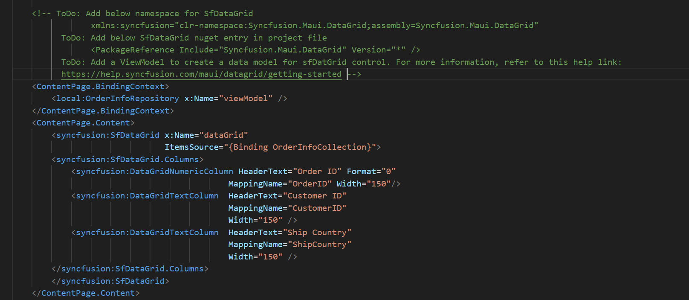
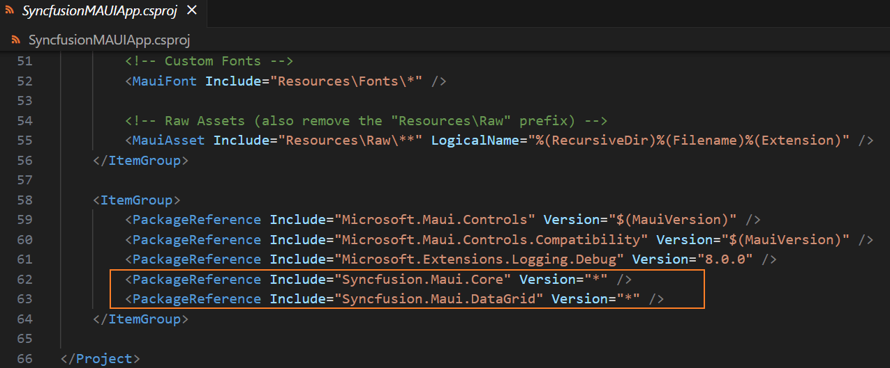

# Add Syncfusion .NET MAUI component in the .NET MAUI application

The Syncfusion .NET MAUI code sample utility for Visual Studio Code provides sample for easily inserting Syncfusion .NET MAUI components with various features into the .NET MAUI Application's XAML code editor.

N> The Syncfusion .NET MAUI code sample is available from Essential Studio 2024 Volume 1 (`v25.1.35`) onwards.

## Add a Syncfusion .NET MAUI component

The following instructions outline the process of using the Syncfusion .NET MAUI code snippet in your .NET MAUI application.

1.	In Visual Studio Code, either open an existing .NET MAUI application or create a new .NET MAUI Application.

2.	Open the XAML file you require and position the cursor where you want to add the Syncfusion component.

3.	To access Syncfusion .NET MAUI components with various features, type the **sf** word in the specified format.

```
sf<Syncfusion component name>-<Syncfusion component feature>
For Example, sf-datagrid-grouping
```

4.	Select the desired Syncfusion component and press the **Enter** or **Tab** key to add the Syncfusion .NET MAUI component to the XAML file. 

      

5.	After adding the Syncfusion .NET MAUI component to the XAML file, I'll provide a commented code sample. This sample will specify whether you should add the component to the ViewModel file, include it in the backend C# code of the XAML file, or if only namespace and NuGet entries are needed. Based on the provided data, you'll need to decide what to add.

     

6.	You can also find a Syncfusion help link at the top of the added sample to learn more about the new Syncfusion .NET MAUI component feature.

     

## Configure .NET MAUI application with Syncfusion

The Syncfusion .NET MAUI snippet inserts code into the XAML file. However, you need to configure the .NET MAUI application with Syncfusion by installing the Syncfusion .NET MAUI NuGet package and adding the appropriate namespace. To configure, follow these steps:

1.	Open the .NET MAUI application file and manually add the necessary Syncfusion .NET MAUI individual NuGet package(s) as a package reference for the Syncfusion .NET MAUI components. I'll provide a commented code sample indicating the corresponding NuGet package entry for each component. Copy the NuGet package entry and paste it into your .NET MAUI application file. This NuGet package will be automatically restored during the build or save process of the application.

   

2.	To integrate Syncfusion components into your application, go to the XAML file and insert the necessary Syncfusion .NET MAUI namespace entries. I'll provide a commented code sample indicating the corresponding namespace entry for each component. Copy the namespace entry and paste it into your XAML file.

    